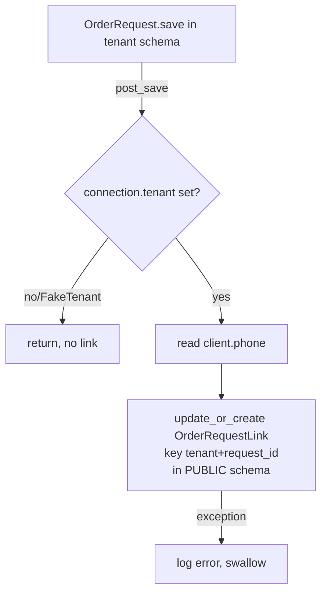
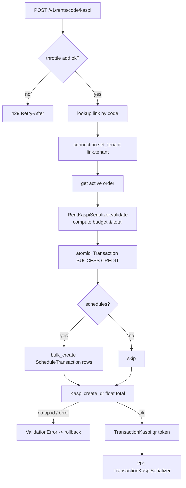

# Rentlink (client payment links)

_Generated: 2026-07-03 - module arg: `rentlink` - glossary human-reviewed_

Rentlink is a public, unauthenticated "rental payment link" feature. Staff generate and send a per-order link (via SMS or Wazzup) from the tenant-scoped CRM; the renter opens the link to view their orders across companies and pay outstanding amounts / schedule installments through a Kaspi Pay QR. The link records live in the public schema (keyed by tenant + request_id and the renter's normalized phone) so one phone can surface orders from multiple tenants.

## Глоссарий

Формат: `текущее_поле` → «Простое название»

### 1. Ссылка на аренду (`OrderRequestLink`) ✅

_Живёт в публичной схеме; уникальна по паре (компания + номер аренды); одна нормализованная телефонная строка объединяет аренды из нескольких компаний_

**Идентификация**
- `code` → «Код ссылки»
- `tenant` → «Компания»
- `request_id` → «Номер аренды»

**Телефон**
- `phone` → «Телефон клиента»
- `phone_normalized` → «Нормализованный телефон»

**Служебные**
- `created_at` → «Дата создания»
- `updated_at` → «Дата обновления»

### 2. Генератор кода ссылки (`gen_link_code`) ✅

_Функция-помощник: создаёт случайный 8-символьный код ссылки_

### 3. Нормализация телефона (`normalize_phone`) ✅

_Функция-помощник: оставляет только цифры и берёт последние 10 — по ним аренды разных компаний привязываются к одному клиенту_

### 4. Сигнал синхронизации ссылки (`update_order_link`) ✅

_post_save на аренде (OrderRequest): создаёт/обновляет ссылку с телефоном клиента; читает текущую компанию из connection.tenant_

### 5. Общая логика выборки аренд (`RentMixin`) ✅

_Базовый класс для публичных представлений: собирает аренды (get_orders) и график платежей (get_schedule) в схеме компании_

- `get_orders` → «Выборка аренд»
- `get_schedule` → «Выборка графика платежей»

### 6. Список аренд по телефону (`RentListView`) ✅

_Публичное представление без авторизации: по телефону собирает аренды из всех компаний, переключая схему для каждой_

- `permission_classes` → «Права доступа (открыто всем)»
- `serializer_class` → «Сериализатор»

### 7. Детали аренды по коду ссылки (`RentDetailView`) ✅

_Публичное представление без авторизации: по коду ссылки переключает схему компании и отдаёт одну аренду с графиком платежей_

- `permission_classes` → «Права доступа (открыто всем)»
- `serializer_class` → «Сериализатор»

### 8. Создание Kaspi-оплаты по ссылке (`RentKaspiView`) ✅

_Публичное представление без авторизации с троттлингом (RENT_KASPI_THROTTLE_SECONDS = 120 сек); по коду ссылки создаёт QR-счёт Kaspi Pay_

- `permission_classes` → «Права доступа (открыто всем)»
- `serializer_class` → «Сериализатор»
- `RENT_KASPI_THROTTLE_SECONDS` → «Интервал троттлинга (сек)»

### 9. Генерация и отправка ссылки (сторона CRM) (`OrderRequestLinkView`) ✅

_Представление CRM для персонала: GET создаёт/возвращает ссылку, POST отправляет её клиенту по SMS или Wazzup_

- `lookup_field` → «Поле поиска (номер аренды)»
- `permission_classes` → «Права доступа»
- `integration` → «Ключ интеграции (rent)»
- `_ensure_link` → «Создание/обновление ссылки»
- `_link_url` → «Сборка URL ссылки»

**НЕ документировать (легаси):** `models`, `serializer_class`

### 10. Отправка ссылки (входные данные) (`OrderRequestLinkSendSerializer`) ✅

_Проверяет телефон и канал доставки при отправке ссылки клиенту_

- `phone` → «Телефон получателя»
- `channel` → «Канал отправки (SMS / Wazzup)»

### 11. Оплата аренды через Kaspi (входные данные) (`RentKaspiSerializer`) ✅

_Валидирует сумму/выбранные дни против остатка долга, создаёт операцию оплаты и QR-транзакцию Kaspi; schedule_amounts и total вычисляются при валидации_

**Вход**
- `schedules` → «Выбранные дни графика»
- `amount` → «Сумма оплаты»

**Вычисляемое**
- `schedule_amounts` → «Распределение по дням (вычисляется)»
- `total` → «Итоговая сумма к оплате (вычисляется)»

### 12. Аренда (для ссылки) (`OrderSerializer`) ✅

_Отдаёт клиенту краткие данные аренды; поле code берётся из link_map по паре компания+аренда_

**Идентификация**
- `id` → «Идентификатор»
- `unique_id` → «Внешний код»
- `code` → «Код ссылки»

**Статус**
- `status` → «Статус аренды»
- `payment_status` → «Статус оплаты»

**Сроки**
- `rent_start` → «Начало аренды»
- `rent_end` → «Окончание аренды»

**Деньги**
- `price` → «Сумма без скидок»
- `price_discount` → «Итоговая сумма к оплате»
- `paid_amount` → «Оплачено»

**Связи**
- `client` → «Клиент»
- `inventories` → «Позиции инвентаря»

**Прочее**
- `autorenewal` → «Автопродление»

### 13. Клиент (для ссылки) (`OrderClientSerializer`) ✅

_Краткие данные клиента, показываемые на публичной странице_

- `id` → «Идентификатор»
- `name` → «Имя»
- `phone` → «Телефон»

### 14. Позиция инвентаря (для ссылки) (`OrderInventorySerializer`) ✅

_Краткая карточка позиции инвентаря/товара в аренде_

**Связи**
- `inventory` → «Единица инвентаря»
- `inventory_group` → «Товар»

**Тариф**
- `tarif` → «Тариф»
- `tarif_price` → «Цена тарифа»
- `tarif_duration` → «Длительность тарифа»

**Данные единицы**
- `inventory_name` → «Название»
- `inventory_unique_id` → «Артикул»
- `inventory_car_number` → «Госномер»
- `inventory_car_tech_passport` → «Техпаспорт»
- `image` → «Фото»

**Состояние**
- `started` → «Выдана»
- `returned` → «Возвращена»

### 15. День графика платежей (для ссылки) (`OrderScheduleSerializer`) ✅

_Одна строка посуточного графика платежей_

- `id` → «Идентификатор»
- `amount` → «Сумма к оплате за день»
- `amount_transaction` → «Уже оплачено за день»
- `date` → «Дата»
- `weekend` → «Нерабочий день»

### 16. Компания (для ссылки) (`TenantSerializer`) ✅

_Брендинг компании, показываемый на публичной странице оплаты_

- `name` → «Название»
- `address` → «Адрес»
- `logo` → «Логотип»
- `background` → «Фон»
- `brand_color` → «Фирменный цвет»
- `extra` → «Доп. данные»
- `type` → «Тип компании»

### 17. Тип компании (для ссылки) (`TenantTypeSerializer`) ✅

- `code` → «Код»
- `name` → «Название»

### 18. Аренды одной компании (обёртка списка) (`OrderListSerializer`) ✅

_Группировка: компания + её аренды по телефону клиента_

- `tenant` → «Компания»
- `orders` → «Аренды»

### 19. Детали аренды (обёртка) (`OrderDetailSerializer`) ✅

_Компания + одна аренда + график платежей_

- `tenant` → «Компания»
- `order` → «Аренда»
- `schedule` → «График платежей»

### Статусы и справочники (перечисления)

- **Направление операции** (`TransactionMethod`): `CREDIT`→«Приход», `DEBIT`→«Расход».
- **Статус операции** (`TransactionStatus`): `PENDING`→«Ожидает оплаты», `SUCCESS`→«Успешно», `FAILED`→«Ошибка», `EXPIRED`→«Истёк срок».

## Логика (Logic)

### What Rentlink is

Rentlink is a standalone Django app (`rentlink`, registered in `SHARED_APPS`, so its single table `orderrequestlink` lives in the **public** schema) that backs a public, unauthenticated "pay your rental" flow.

Two sides:

- **CRM side (tenant-scoped, authenticated staff)**: `OrderRequestLinkView` at `POST/GET /v1/crm/requests/<request_id>/link/` generates a per-order link and optionally delivers it by SMS or Wazzup.
- **Public side (unauthenticated renters)**: `RentListView`, `RentDetailView`, `RentKaspiView`, mounted under `/v1/rents/` (see `rentlink/urls.py`; the mount is `path("v1/rents/", include("rentlink.urls"))` in `rental_tenant_back/urls.py`). The renter opens a link, sees their orders across all tenants that share their phone, and pays via a Kaspi Pay QR.

The link record is the bridge. Because it lives in `public` and is keyed by `(tenant, request_id)` plus the renter's `phone_normalized`, one phone number can surface orders from multiple tenant companies, and each public view switches into the correct tenant schema by looking up the link.

### The `OrderRequestLink` model

Fields (`rentlink/models.py`):
- `code` — `CharField(max_length=8, unique=True, db_index=True, default=gen_link_code)`. This is the opaque public URL token. `gen_link_code()` returns `secrets.token_hex(4)` → an 8-hex-char string.
- `tenant` — FK to `tenant.TenantClient` (public model), `on_delete=CASCADE`.
- `request_id` — `PositiveIntegerField`. **Deliberately NOT a ForeignKey** to `crm.OrderRequest`, because `OrderRequest` lives in per-tenant schemas and this public table cannot FK across into a tenant schema. It's a raw id scoped by `tenant`.
- `phone` — raw phone string as stored on the client (`CharField(max_length=32)`).
- `phone_normalized` — `CharField(max_length=16, db_index=True, blank=True)`, the digits-only last-10 form used for cross-tenant lookup.

The model inherits `common.custom_model.AbstractModel` (so it also has `created_at`/`updated_at`).

`Meta`: `db_table = "orderrequestlink"`, `unique_together = ("tenant", "request_id")` (one link per order per tenant), plus an explicit index `rentlink_phone_idx` on `phone_normalized` (redundant with the field's own `db_index=True`).

`save()` overrides:
1. Always recomputes `phone_normalized = normalize_phone(self.phone)`.
2. If `code` is falsy, assigns a fresh `gen_link_code()`.
3. Loops re-generating `code` while a collision exists (`filter(code=...).exclude(pk=self.pk).exists()`) — collision-safe unique code generation.

`normalize_phone(raw)` = `"".join(ch for ch in (raw or "") if ch.isdigit())[-10:]` — strips everything non-digit and keeps the **last 10 digits**. So `+7 (777) 123-45-67` → `7771234567`. This is the join key across tenants.

### Keeping links in sync — the `post_save` signal

`rentlink/apps.py:RentlinkConfig.ready()` imports `rentlink.signals`, which connects `update_order_link` to `post_save` of `crm.OrderRequest`.

`update_order_link(sender, instance, **kwargs)`:
1. Reads `getattr(connection, "tenant", None)`. If `None` or missing/falsy `.id` (e.g. a `FakeTenant`), returns silently — no link is touched.
2. Pulls `instance.client.phone` (empty string if no client).
3. `OrderRequestLink.objects.update_or_create(tenant=tenant, request_id=instance.id, defaults={"phone": ..., "phone_normalized": <inline digits-only last-10>})`.
4. Any exception is swallowed and logged via `logger.error` (bare `except:`), so an OrderRequest save never fails because of link bookkeeping.

Net effect: **every** `OrderRequest.save()` (any status, active or not) creates or refreshes a link row for that order in the public schema. The public views later filter which of those orders are actually displayable (see below). Note the signal recomputes `phone_normalized` inline in `defaults` rather than calling `normalize_phone`; because `update_or_create` passes `defaults` through `.update(...)` on the update path (bypassing the model's `save()` recomputation of the field from `phone` — the override still runs on the create path), the explicit default keeps `phone_normalized` correct on updates too.

### CRM side — generating and sending the link

`OrderRequestLinkView` (a `GenericAPIView`) runs inside the tenant request context (tenant already resolved by `TenantMiddleware`).

- `permission_classes = [CustomDjangoModelPermissions, IsUserHasRentalPoints, IntegrationPermission]`, `models = [OrderRequest]`, `integration = "rent"`. `IntegrationPermission.has_permission` gates on the tenant's `"rent"` integration: for SAFE methods (GET) it only requires the integration connection to *exist* (`integration_connection is not None`); for non-safe methods (POST) it requires the module to be *active* (not expired).
- `lookup_field = "request_id"`; `get_object()` fetches the `OrderRequest` by `id=kwargs["request_id"]` and runs `check_object_permissions`.
- `_ensure_link(order, phone=None)` calls `OrderRequestLink.objects.update_or_create(tenant=connection.tenant, request_id=order.id, defaults={"phone": phone or client_phone})`. If a caller passes an explicit `phone` (from the POST body) it overrides the client's stored phone on the link row.
- `_link_url(link)` = `settings.RENT_LINK_BASE_URL.rstrip("/") + "/" + link.code + "/"`. `RENT_LINK_BASE_URL` defaults to `"https://yume.kz"` (env-overridable). So the public URL is e.g. `https://yume.kz/<code>/` — note this is the **frontend** base, not the API path `/v1/rents/<code>/`.

`GET`: ensures the link exists and returns `{code, url, phone}`.

`POST`: validated by `OrderRequestLinkSendSerializer` (`crm/serializers/order_request/request_link.py`), which requires `phone` (a `CharField` run through `common.validate_phone.validate_phone` in `validate_phone`) and `channel` (`ChoiceField(choices=["sms","wazzup"])`). Flow:
1. Validate body.
2. `get_integration_connection(connection.tenant, channel)[1]` — the boolean "is this channel integration connected/active". If false → `400 {"channel": "Интеграция не подключена"}`.
3. `_ensure_link(order, phone)` with the posted phone.
4. Build message `f"Оплатите аренду по ссылке: {link_url}"`.
5. Dispatch async: `send_sms.delay(phone=phone, message=message, message_payload={"created_by_id": request.user.id, "type": SMSMessageType.SIMPLE_MESSAGE})` for `"sms"`, or `send_wazzup_message.delay(phone=phone, message_text=message)` for `"wazzup"`.
6. Return `200 {code, url}`.

### Public side — list, detail, kaspi

All three views are `permission_classes = [permissions.AllowAny]` and share `RentMixin`. `RentListView` subclasses `views.APIView`; `RentDetailView` subclasses `generics.RetrieveAPIView`; `RentKaspiView` subclasses `generics.CreateAPIView` (but both `RentDetailView.get` and `RentKaspiView.post` are fully overridden).

#### `RentMixin`
- `get_orders(ids, tenant)` builds the queryset used by every public view. It:
  - Filters `OrderRequest` to `id__in=ids, tenant=tenant, active=True, status__in=[RESERVED, INRENT, DEBTOR]` (via `OrderRequestStatus`). So even though the signal creates links for every order, only active reserved/in-rent/debtor orders are ever returned publicly.
  - Prefetches `inventories` (excluding exchanges, `exchange__isnull=True`) with `Coalesce`/`ExpressionWrapper` annotations: `inventory_name`, `inventory_unique_id`, `inventory_car_number`, `inventory_car_tech_passport`, `image`, `started` (`fact_start_at` not null), `returned` (`fact_end_at` not null); the prefetch queryset also has its own `.only(...)`.
  - Prefetches `services` (`select_related("service")`, `order_by("-created_at")`).
  - `select_related("client")` and a large `.only(...)` projection.
- `get_schedule(request_id, tenant)` = `OrderRequestSchedule.objects.filter(tenant=tenant, request_id=request_id)`.

#### `RentListView` — `GET /v1/rents/?phone=<raw>`
Cross-tenant fan-out keyed by phone:
1. `phone = normalize_phone(request.query_params.get("phone", ""))`.
2. `tenants = TenantClient.objects.select_related("type").filter(Exists(OrderRequestLink.objects.filter(phone_normalized=phone, tenant=OuterRef("id"))))` — every tenant that has at least one link for this phone.
3. Builds `tenant_map = {t.id: {"tenant": t, "orders": []}}`.
4. `link_map = {"<tenant_id>_<request_id>": code}` for all links matching the phone — later injected into serializer context so each order can echo its own `code`.
5. `request_map[tenant_id] = [request_id, ...]` built by iterating a `links = OrderRequestLink.objects.filter(phone_normalized=phone)` queryset (a second full fetch — see notes).
6. For each tenant, `with schema_context(tenant.schema_name):` load `get_orders(request_map[tenant.id], tenant)` into `tenant_map[tenant.id]["orders"]`. **This is the schema-switching step** — the public request has no tenant of its own, so each tenant's orders are read inside an explicit `schema_context`.
7. Serialize `list(tenant_map.values())` with `OrderListSerializer(data, many=True, context={"request", "link_map"})`.

Result shape: a list of `{tenant: <TenantSerializer>, orders: [<OrderSerializer>...]}`.

#### `RentDetailView` — `GET /v1/rents/<code>/`
1. `link = get_object_or_404(OrderRequestLink.objects.select_related("tenant","tenant__type"), code=code)`. **The `code` alone identifies the tenant** — no phone needed here.
2. `link_map = {"<tenant_id>_<request_id>": code}`.
3. `with schema_context(link.tenant.schema_name):` fetch the single order (`get_object_or_404(self.get_orders([link.request_id], link.tenant), id=link.request_id)`), fetch the schedule, and serialize with `OrderDetailSerializer({"order", "tenant", "schedule"}, context={"request", "link_map"})`.

Note: if the order isn't active/reserved/in-rent/debtor, `get_orders` returns nothing and this 404s even though the link exists.

#### `RentKaspiView` — `POST /v1/rents/<code>/kaspi/`
Creates a Kaspi Pay QR transaction for a payment. `generics.CreateAPIView`, but `post()` is fully overridden.

Flow:
1. **Throttle** (per-`code`, cache-based): `throttle_key = f"rentlink:kaspi:throttle:{code}"`. `cache.add(throttle_key, available_at, RENT_KASPI_THROTTLE_SECONDS)` where `RENT_KASPI_THROTTLE_SECONDS = 120` (module-level constant in `rentlink/views.py`) and `available_at = time.time() + RENT_KASPI_THROTTLE_SECONDS`. `cache.add` only succeeds if the key is absent, so a second call within 120s fails the add and returns `429` with body `{detail, retry_after}` and a `Retry-After` header (`retry_after = max(1, math.ceil((cache.get(throttle_key) or available_at) - time.time()))`). The throttle runs before any tenant switch (on the public/`FakeTenant` connection), so the schema-namespaced cache key lands in the public namespace and is effectively global per code.
2. `link = get_object_or_404(OrderRequestLink.objects.select_related("tenant"), code=code)`.
3. `connection.set_tenant(link.tenant)` — **unlike the other two views this does a real, request-lifetime tenant switch** (not a scoped `schema_context`). This is required because `RentKaspiSerializer.create` → `get_client(...)` reads the tenant's Kaspi credentials and Transaction writes all need the tenant schema. There is no explicit reset back to `public` afterward.
4. `order = get_object_or_404(self.get_orders([link.request_id], link.tenant), id=link.request_id)` — same active/status gate.
5. Validate + save `RentKaspiSerializer(data=request.data, context={"request", "order", "tenant"})` (where `tenant` is `link.tenant`).
6. Return `201` with `TransactionKaspiSerializer(kaspi).data`.

### Serializers (`rentlink/serializers.py`)

- `OrderInventorySerializer` extends `crm.serializers.order_request.request.OrderRequestInventoryShortInfoSerializer`, exposing the annotated inventory fields.
- `OrderClientSerializer` → `Client` `(id, name, phone)`.
- `OrderSerializer` → `OrderRequest` core fields (`id, unique_id, code, status, payment_status, rent_start, rent_end, price, price_discount, paid_amount, client, inventories, autorenewal`), where `code` is a `SerializerMethodField` that reads `context["link_map"][f"{obj.tenant_id}_{obj.id}"]`, plus nested `client` and `inventories`.
- `OrderScheduleSerializer` → `OrderRequestSchedule` `(id, amount, amount_transaction, date, weekend)`.
- `TenantSerializer` → `TenantClient` branding fields `(name, address, logo, background, brand_color, extra, type)` with nested `TenantTypeSerializer` `(code, name)`.
- `OrderListSerializer` (plain `Serializer`) = `{tenant, orders[]}`; `OrderDetailSerializer` (plain `Serializer`) = `{tenant, order, schedule[]}`.

#### `RentKaspiSerializer` — payment math and QR creation
Input: optional `schedules` (`ListField` of ints, `allow_empty=True`) and optional `amount` (`DecimalField(max_digits=16, decimal_places=2, min_value=Decimal(0))`).

`validate(attrs)`:
- `order = context["order"]`, `tenant = context["tenant"]`.
- `budget = max(Decimal(0), order.price_discount - order.paid_amount)` — the outstanding balance.
- **Schedule mode** (`schedule_ids = attrs.get("schedules")` non-empty): loads those schedules for this order/tenant ordered by `date`; if `len(schedules) != len(set(schedule_ids))` → `ValidationError`. Then greedily allocates: for each schedule, `due = max(Decimal(0), schedule.amount - schedule.amount_transaction)`, `charge = min(due, budget - total)`, skips non-positive charges, accumulates `(schedule, charge)` into `schedule_amounts` and `total`. So the total is capped by the remaining budget and distributed installment-by-installment in date order.
- **Amount mode** (no `schedules`): requires `amount` (else `ValidationError`), `total = min(budget, amount)`.
- If `total <= 0` → `ValidationError`. Stashes `schedule_amounts` and `total` into `attrs`.

`create(validated_data)` — inside `db_transaction.atomic()`:
1. Create a `Transaction(request=order, method=TransactionMethod.CREDIT, amount=total, status=TransactionStatus.SUCCESS)`. **Note the transaction is marked SUCCESS immediately, before the QR is actually paid** (see notes).
2. If `schedule_amounts`, `bulk_create` `OrderRequestScheduleTransaction(schedule, transaction, amount=charge)` rows linking each installment to the transaction.
3. `get_client(with_session=True).create_qr(float(total))`. `KaspiPayNotConnected` → `ValidationError {"kaspi_pay": "Интеграция Kaspi Pay не подключена"}`; `KaspiPayError` → `ValidationError {"kaspi_pay": str(e)}`.
4. Parse `res.get("Data")` → `QrToken`, `QrOperationId`. If no `operation_id` → `ValidationError` with `res.get("Message")` fallback.
5. Create `TransactionKaspi(transaction=..., method="qr", payment_id=str(operation_id), phone=None, qr_token=qr_token)` and return it.

## Notes

### 🔴 Major

- RentKaspiSerializer.create marks the Transaction as status=TransactionStatus.SUCCESS at creation time, BEFORE the Kaspi QR is scanned/paid. The QR (TransactionKaspi with payment_id/qr_token) is created afterward in the same atomic block. So paid_amount-affecting logic may treat an unpaid QR as already-successful unless a separate reconciliation (qr_status polling / webhook) corrects it. Verify how Transaction SUCCESS is consumed before trusting this is intentional. `rentlink/serializers.py:130-135`
- RentKaspiView.post calls connection.set_tenant(link.tenant) for the whole request and never resets to public. Under gunicorn+uvicorn the connection is reused across requests; other views rely on TenantMiddleware to set the schema per request, but a public endpoint that leaves the connection on a tenant schema could leak schema state if middleware ordering ever changes. The other two public views correctly use scoped `with schema_context(...)` instead. `rentlink/views.py:138`

### 🟠 Minor

- The post_save signal creates/updates an OrderRequestLink for EVERY OrderRequest save regardless of status, but get_orders only ever returns orders with active=True and status in {RESERVED, INRENT, DEBTOR}. So links exist for orders that will 404 in RentDetailView / return empty in RentListView. Not a bug, but surprising: a valid code can still 404. `rentlink/signals.py:24-28`
- Bare `except:` in the signal swallows ALL exceptions and only logs. Intentional to keep OrderRequest saves from failing, but it hides real DB errors when links silently stop syncing. `rentlink/signals.py:29-30`
- OrderRequestLink.code is only 8 hex chars (secrets.token_hex(4) = 32 bits of entropy). Since RentDetailView and RentKaspiView authorize purely by knowing the code (no phone / OTP), a determined attacker could brute-force codes to view others' order data and generate Kaspi QR charges. RentKaspiView has a 120s per-code throttle but RentDetailView has none. `rentlink/models.py:9-10`
- phone_normalized is computed two different ways: model.save() calls normalize_phone(), but the signal inlines the same expression `"".join(ch for ch in (phone or "") if ch.isdigit())[-10:]` in `defaults` instead of calling normalize_phone. They match today, but duplicated logic can drift. Prefer calling normalize_phone in the signal. `rentlink/signals.py:27`
- RentListView fetches OrderRequestLink.objects.filter(phone_normalized=phone) TWICE as full querysets — once at line 84 to build link_map and again at line 87 (`links`) to build request_map — plus a third `Exists(...)` subquery on the same filter inside the tenants query at line 81. The `links` queryset IS used (iterated at 89-90), but the line-87 fetch is redundant with line 84 and could be reused. Minor query redundancy. `rentlink/views.py:81-90`

### 🟡 Info

- RENT_LINK_BASE_URL defaults to https://yume.kz (settings.py:466) and is the FRONTEND base. The generated public URL is `{RENT_LINK_BASE_URL}/{code}/`, which is NOT the API path — the API path is `/v1/rents/{code}/`. The frontend at yume.kz consumes the API. Don't assume the emitted `url` hits the DRF views directly. `crm/views/order_requests/requests_link.py:43-45`
- OrderRequestLink.request_id is a PositiveIntegerField, NOT a ForeignKey to crm.OrderRequest — deliberate, because the link table is in the public schema and OrderRequest lives per-tenant. Uniqueness is (tenant, request_id). Do not 'fix' this to a FK. `rentlink/models.py:20,27`
- Meta.indexes adds rentlink_phone_idx on phone_normalized while the field already declares db_index=True. That's a duplicate index; harmless but redundant (two indexes on the same column). `rentlink/models.py:23,28`
- rentlink/views.py imports OrderRequest twice (lines 10 and 14) and imports several symbols that are unused in the view module (OrderRequestScheduleTransaction, KaspiPayError, KaspiPayNotConnected, get_client, Transaction/TransactionKaspi, Decimal/InvalidOperation, TransactionMethod/TransactionStatus, F/Coalesce) — most Kaspi/transaction logic actually lives in the serializer. Dead imports. `rentlink/views.py:10-28`
- The CRM link endpoint requires the tenant's 'rent' integration/module via IntegrationPermission (integration='rent'). Note the gate differs by method: GET only requires the connection to exist, POST requires it to be active (not expired). Delivery POST adds a SECOND gate: the chosen channel ('sms'/'wazzup') must be connected via get_integration_connection. `crm/views/order_requests/requests_link.py:21,24,60`
- RentKaspiView throttle uses cache.add with a wall-clock `available_at` value; the throttle runs BEFORE set_tenant (on public/FakeTenant), so the django-tenants schema-namespaced cache key lands in the public namespace and is effectively global per code. If set_tenant were moved before the throttle, the namespace (and thus throttle isolation) would change. `rentlink/views.py:124-138`

## Links

### Key files

| Path | Description |
| --- | --- |
| `crm/serializers/order_request/request_link.py` | OrderRequestLinkSendSerializer: validates phone (CharField via common.validate_phone.validate_phone) and channel choice ('sms'/'wazzup') for the delivery POST. |
| `crm/views/order_requests/requests_link.py` | CRM-side OrderRequestLinkView (auth + 'rent' integration gated) at /v1/crm/requests/<request_id>/link/: GET returns/creates link, POST creates link and dispatches SMS/Wazzup delivery; builds URL from RENT_LINK_BASE_URL (frontend base). |
| `rentlink/apps.py` | RentlinkConfig; ready() imports rentlink.signals to connect the post_save signal. |
| `rentlink/models.py` | Public-schema OrderRequestLink model (inherits AbstractModel) plus gen_link_code (secrets.token_hex(4)) and normalize_phone (digits-only, last 10) helpers; save() ensures unique code and recomputes phone_normalized. Meta: db_table orderrequestlink, unique_together (tenant, request_id), duplicate rentlink_phone_idx index. |
| `rentlink/serializers.py` | Order/Client/Inventory/Schedule/Tenant serializers for cross-tenant display, and RentKaspiSerializer that computes budget/total (schedule vs amount mode) and creates Transaction (SUCCESS at creation) + OrderRequestScheduleTransaction + Kaspi QR TransactionKaspi in an atomic block. |
| `rentlink/signals.py` | post_save receiver update_order_link on crm.OrderRequest that upserts the link row (keyed tenant+request_id) with the client's phone; returns early if no real tenant; swallows/logs errors via bare except. |
| `rentlink/urls.py` | Public routes mounted at /v1/rents/: '' -> RentListView, '<str:code>/' -> RentDetailView, '<str:code>/kaspi/' -> RentKaspiView. |
| `rentlink/views.py` | Public AllowAny views: RentMixin (get_orders/get_schedule), RentListView (phone fan-out across tenants via schema_context), RentDetailView (code->tenant via schema_context), RentKaspiView (120s per-code cache throttle, connection.set_tenant, create Kaspi QR via serializer). Contains duplicate/dead imports. |

### URL mounts

- `/v1/rents/` -> rentlink.urls
- `/v1/crm/` requests/<int:request_id>/link/ -> crm.views.order_requests.requests_link.OrderRequestLinkView (crm.urls.orders)

### Related

- [rent-lifecycle](../../ru/logic/rent-lifecycle.mdx) — the OrderRequest (аренда), its statuses, and the payment schedule that Rentlink surfaces read-only and pays against.
- [deposits-penalties](../../ru/logic/deposits-penalties.mdx) — Transaction/payment accounting; the Kaspi flow here creates a CREDIT Transaction and schedule-transaction rows described there.
