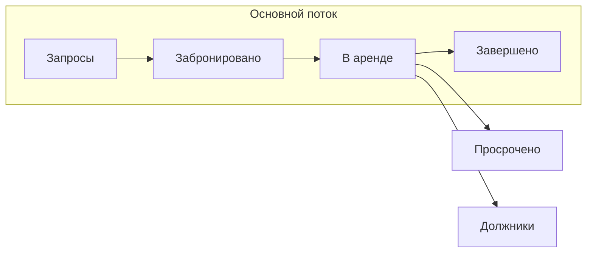

Добро пожаловать в обучение работе с системой. Ниже — обзор основных экранов и сценариев: от списка аренд до аналитики и настроек. Используйте оглавление слева, чтобы перейти к нужному разделу.

## Раздел «Аренды»

Главная рабочая область — **«Аренды»**. Здесь отображаются все аренды, сгруппированные по статусам.

### Поиск и фильтры

- **Вкладка «Все»** — все аренды независимо от статуса.
- **Поиск** (вверху страницы) — фамилия, имя, отчество клиента, название или артикул инвентаря, номер телефона.
- **Мини-календарь** — быстрый выбор периода: текущий год, месяц, прошлый месяц, всё время или произвольный диапазон (например, с 8 по 9 число).
- **Пункт проката** — если у вас несколько точек в разных городах или в одном городе: выберите локацию, чтобы видеть аренды только по ней.
- **Статус оплаты** — см. таблицу ниже.

### Вид списка и отчёты

- Переключение **карточный / табличный** вид — удобно при большом объёме данных.
- Кнопка **статистики** — сумма аренд, сумма оплат, задолженность.
- **Экспорт в Excel** — выгрузка данных.

### Статусы оплаты

| Статус | Что означает |
|--------|----------------|
| **Ожидает оплату** | По аренде ещё не было ни одной оплаты. |
| **Оплачено** | Оплата полная или за выбранный период. |
| **Частично оплачено** | Предоплата или часть суммы внесена, остаток не оплачен. |

### Статусы аренды

| Статус | Описание |
|--------|----------|
| **Запросы** | До бронирования: черновик; можно забронировать или выдать позже. |
| **Забронировано** | Товар на брони; видны дата и время начала. |
| **В аренде** | Клиент забрал инвентарь, аренда активна. |
| **Завершено** | Возврат и полная оплата; подсветка зелёным, действий не требуется. |
| **Просрочено** | Товар не возвращён в срок (после планового времени возврата). |
| **Должники** | Инвентарь возвращён, но оплата неполная — осталась задолженность. |

<Note>
  **Просрочено** выставляется автоматически после времени возврата, если товар ещё не принят. **Должники** — когда возврат оформлен, но долг по оплате остаётся.
</Note>

## Создание аренды

Нажмите **«Плюс — новая аренда»** и пройдите шаги.

<Steps>
  <Step title="Шаг 1: клиент">
    Найдите клиента через поиск или создайте нового (**«Новый клиент»**).

    Заполните **ФИО** и **телефон** (обязательно). Остальное — по желанию: фото, ИИН, дата рождения, документы, e-mail.

    Поле **«Договор подписан»** — только при отдельном долгосрочном договоре; чаще можно пропустить.

    Дополнительно: **канал привлечения** (Instagram, WhatsApp, рекомендации и др.), **постоянная скидка**, **рейтинг** (настраивается в системе).

    Затем **«Создать и сохранить»**.
  </Step>

  <Step title="Шаг 2: продукт">
    **«Добавить»** — выберите инвентарь. При необходимости включите **«Только свободные»** и фильтры по типу или категории.

    Цена может подставиться автоматически или вводиться вручную (например, 4500 за сутки).
  </Step>

  <Step title="Шаг 3: даты">
    Укажите **дату и время начала** и **окончания** аренды.

    <Warning>
      Если аренда длится 3 полных дня и **хотя бы одну минуту** сверху, система посчитает **4 дня** тарификации.
    </Warning>
  </Step>

  <Step title="Бронь и выдача">
    Нажмите **«Забронировать»** — аренда в статусе брони. Когда клиент приходит за товаром: **«Выдать в аренду»** и подтвердите — статус **«В аренде»**.
  </Step>

  <Step title="Оплата, залог, штрафы">
    **«Принять оплату»** — сумма, тип оплаты, чек с датой и сотрудником. Оплату можно разбить на несколько вводов.

    При необходимости: **печать договора**, **залог** (внесение и **«Вернуть»** при возврате клиенту), **штрафы** (в т.ч. почасовой за просрочку), **заметки и файлы**.
  </Step>

  <Step title="Возврат и завершение">
    **«Принять»** при возврате — укажите **состояние** инвентаря (исправен / сломан; при «сломан» единица блокируется для выдачи до исправления в инвентаризации).

    **«Завершить»**. Неполная оплата после возврата переведёт аренду в **«Должники»**. После полной оплаты аренда отображается **зелёным** как завершённая.
  </Step>
</Steps>

## Каталог

Раздел **«Каталог»**: полный перечень оборудования и товаров для аренды, продажи и услуг.

- **Где открыть:** инвентарь → вкладка **«Продукты»**.
- **Поиск** по названию; фильтры: **пункт проката**, **категория**, **тип продуктов**, переключатели **«Только свободные»** и **«Только субаренда»** (если используется).
- **Сводка:** количество продуктов, единиц инвентаря, сколько свободно, в аренде, забронировано, неисправно, на ремонте.
- **Таблица:** название, категория, артикул, доступность (цвет: зелёный — есть свободные, красный — нет), неисправные единицы, число аренд, цены.
- **Карточка товара:** артикул, пункт проката, цена, штрихкод; аналитика (доход, аренды); вкладки **«Аренды»**, **«Индивидуальный тариф»**, **«Амортизация»**, **«Медиа-файлы»**.

## Клиенты

Раздел **«Клиенты»** в меню — единая база: аренды, активность, история.

- **Поиск:** имя, телефон, компания.
- **Фильтры:** тип клиента (физ / юр), **канал привлечения**, **рейтинг**.
- **Сводка:** число клиентов, повторные аренды, просрочки, средний чек.
- **Таблица:** имя / компания, тип, суммы и количество аренд, канал, дата последней аренды, рейтинг, бонусы (если включена бонусная система).
- **Карточка клиента** — история аренд, платежей, взаимодействий.
- Кнопки **«Добавить»** и **«Экспорт таблицы»**.

## Аналитика и финансы

### Общее («Общее» в финансовом разделе)

Фильтры: **период**, **пункты проката**. **График выручки** с переключением периода агрегирования (например, недельный / дневной). Блок **общей статистики:** заказы, план, средний чек, оплаченное / неоплаченное, разбивка по категориям (аренда, услуги, мастерская, продажа, доставка). Блок **«Сегодня»:** план, чек, заказы, состояние парка (свободно / в аренде / неисправно). Таблица **«Аналитика по дням»** — детализация по дням; переключатель **«Скрыть пустые дни»**, кнопка **«Экспорт»**.

### Транзакции

Поиск, период, **способ оплаты**, пункт проката, **ответственный**, **клиент**. Сводка: количество операций, суммы, возвраты, распределение по способам оплаты. Категории: **Все**, **Аренда**, **Магазин**, **Мастерская**; опция **«Только возвраты»**. Таблица с переходом по номеру аренды. **Экспорт**.

### Штрафы

Сводка по количеству и суммам (оплачено / не оплачено). Фильтры: период, вид штрафа, пользователь, пункт проката, клиент, поиск. Вкладки: **Все**, **Оплачено**, **Частично оплачено**, **Неоплачено**. Таблица со ссылкой на аренду. **Экспорт**.

### Залоги

Поиск, период, **тип залога** (денежный / неденежный), пункт проката. Блоки **«Денежные залоги»** и **«Неденежные залоги»** с суммами внесено, возвращено, в оплате, к возврату. Вкладки: **Всего внесено**, **Возвращено**, **К возврату**. Таблица, ссылка на аренду. **Экспорт**.

### Скидки

Поиск, период, **тип скидки**, **акция**, **клиент**. Сводка по суммам аренд и скидок. Вкладки **«История»** и **«Журнал скидок»**. Таблица с переходом в аренду. **Экспорт**.

## Настройки

Откройте **иконку шестерёнки** в левом нижнем углу.

| Блок | Назначение |
|------|------------|
| **Общее** | Базовые параметры системы |
| **Аренда** | Настройки, связанные с арендой |
| **Документы** | Шаблоны (**«Все документы»**), **«История документов»** |
| **Конфигурации** | Статусы аренды, состояние инвентаря, дополнительные поля, пункты проката, сроки аренды, акции, рейтинги клиентов, категории, виды оплат, виды привлечения |
| **Пользователи** | Сотрудники и доступ |
| **Роли** | Какие разделы видит каждый пользователь |

<Tip>
  Каналы привлечения, рейтинги, категории и способы оплаты можно настраивать под процессы вашей компании — это же отражается в карточках клиентов и аренд.
</Tip>

## Документация API

Интеграции и автоматизация — через REST API. Ниже — быстрые ссылки на технические разделы.

| Свойство | Значение |
|----------|----------|
| Протокол | REST по HTTPS |
| Формат | JSON |
| Префикс путей | **`/v1/`** |
| Аутентификация | JWT: **access** / **refresh** после `POST /v1/auth/login/`; обновление — `POST /v1/auth/refresh/` |
| Базовый URL | `https://api.yume.cloud` |

В защищённых запросах передавайте **`Authorization: Bearer <access>`**. Подробнее — в разделе [Аутентификация](/ru/authentication).

<CardGroup cols={2}>
  <Card title="Аутентификация" icon="lock" href="/ru/authentication">
    Логин, JWT и заголовки запросов
  </Card>
  <Card title="Быстрый старт" icon="rocket" href="/ru/quickstart">
    Пример входа и запроса к API
  </Card>
  <Card title="Справочник API" icon="code" href="/ru/api-reference/overview">
    Базовый URL, пагинация и ошибки
  </Card>
  <Card title="Руководства" icon="book-open" href="/ru/guides/managing-rentals">
    Типовые сценарии работы с API
  </Card>
</CardGroup>
