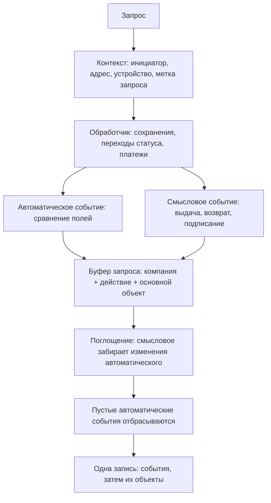

Полный перечень понятий — в [глоссарии записи событий](/ru/logic/audit/recording-glossary).

События не пишутся в журнал по одному в момент, когда что-то изменилось. Система сначала **собирает их за весь запрос**,
затем схлопывает лишнее и лишь в конце сохраняет всё одной операцией. Это даёт три полезных свойства: одна строка на
одно осмысленное действие вместо россыпи технических записей, единые реквизиты у всех событий обращения и отсутствие
следа у отменённой транзакции.

## Контекст запроса

На каждый запрос система один раз собирает контекст и держит его до конца обработки. В него входит инициатор, его тип,
подпись, адрес, устройство и идентификатор запроса. Любое событие, записанное во время этого запроса, наследует контекст
целиком — отдельным событиям не нужно ничего знать о том, кто и откуда пришёл.

Контекст собирается **после** определения компании и проверки того, что пользователь действительно в ней работает, и
**до** выполнения самого обработчика. Поэтому инициатор в журнале — это тот пользователь, чей токен предъявлен запросу,
а компания — та, в которой запрос был допущен работать.

Тип инициатора определяется по правам пользователя в строгом порядке:

1. Пользователь не авторизован — **Анонимно**.
2. Пользователь является глобальным администратором платформы — **Платформа**.
3. У пользователя есть действующее место работы в компании — **Пользователь**.
4. Иначе это **Клиент**, и рядом запоминается его карточка клиента в этой компании.

<Note>
Порядок важен: сотрудник платформы, который одновременно работает в этой компании, всё равно будет помечен как
«Платформа». Если определить место работы не удалось из-за технической ошибки, инициатор считается сотрудником — то
есть система предпочитает ошибиться в сторону более узкой трактовки, а не пометить сотрудника клиентом.
</Note>

## Накопление и склейка

Пока запрос обрабатывается, события складываются в буфер. Ключ буфера — тройка **«компания, действие, основной
объект»**. Второе событие с тем же ключом не создаёт новую строку, а сливается с уже накопленным:

- изменения полей объединяются, причём у поля, которое правили дважды, остаётся **самое раннее «было»** и **самое
  позднее «стало»** — промежуточные значения не сохраняются;
- дополнительные данные и списки объектов дополняют друг друга, роль объекта при этом закрепляется за первым
  упоминанием;
- подпись объекта заменяется на последнюю непустую.

Если запись происходит внутри транзакции, событие попадает в буфер **только после её успешного завершения**. Откат
транзакции не оставляет в журнале ничего — журнал не может рассказать о правке, которой в итоге не случилось.

## Смысловое событие поглощает автоматическое

Одно действие пользователя почти всегда порождает два события: автоматическое — потому что поля объекта изменились, и
смысловое — потому что код бизнес-процесса записал, что именно произошло. В журнале должна остаться одна строка, и
разрешается это так: перед сохранением все смысловые события индексируются по **основному объекту**, а каждое
автоматическое ищет себе среди них хозяина. Нашло — отдаёт ему свои изменения и исчезает; не нашло — сохраняется само.

Поэтому выдача аренды выглядит как «Аренда выдана» со списком изменившихся полей внутри, а не как «Аренда выдана» плюс
«Аренда изменена» рядом. И наоборот: правка аренды из карточки, за которой не стоит никакого бизнес-события, остаётся
автоматической строкой «Аренда изменена».

Автоматическое событие, у которого после всех слияний не осталось ни изменений, ни дополнительных данных, до журнала не
доходит вовсе. Так отсекаются сохранения, не изменившие ни одного отслеживаемого поля, — например пересчёт итоговых сумм.

<Warning>
Хозяин ищется **только по основному объекту**, действие при этом не учитывается. Если в одном запросе над одним объектом
произошло два разных смысловых события, изменения полей достанутся тому, которое было записано первым, а второе
останется без них.
</Warning>

## Запись вне запроса

Фоновые задачи, обработка уведомлений от платёжных сервисов, срабатывание правил воронок и импорт работают без контекста
запроса. В этом случае накопления нет: событие пишется сразу, по одному. Инициатора у него нет, тип — **Система** (либо
тот, который код указал явно), реквизиты запроса пустые. Смысл склейки в таком режиме исчезает, поэтому каждое действие
фоновой обработки видно отдельной строкой.

## Привязка к компании

Компания у события обязательна, и берётся она из текущего подключения. Отсюда три правила:

- **Обычный запрос компании** — компания уже определена по адресу, заголовку или токену, событие пишется в её журнал.
- **Явно переданная компания** — некоторые сценарии работают вне компании и указывают её сами: например оплата аренды по
  публичной ссылке берёт компанию из самой ссылки.
- **Страницы без компании** — сброс пароля, коды подтверждения, вход через Google, личный кабинет клиента. Для них
  компания выводится из **единственного** места работы пользователя. Если мест работы ноль или больше одного, честно
  определить компанию нечем, и событие не записывается.

## Сбой записи не ломает операцию

Ведение журнала полностью изолировано от основной работы: любая ошибка при записи события перехватывается, попадает в
технический лог и на этом заканчивается. Пользователь не получит ошибку из-за журнала, но и строки в журнале не увидит.
То же относится к сбою при сохранении накопленного буфера — теряется весь буфер запроса, а не одно событие.

<Note>
Из этого следует главное правило чтения журнала: **наличие строки доказывает, что действие было, а отсутствие строки не
доказывает обратного.** Список известных случаев, когда строки не будет, собран в
[«Проблемах и логических ошибках»](/ru/logic/audit/issues).
</Note>
