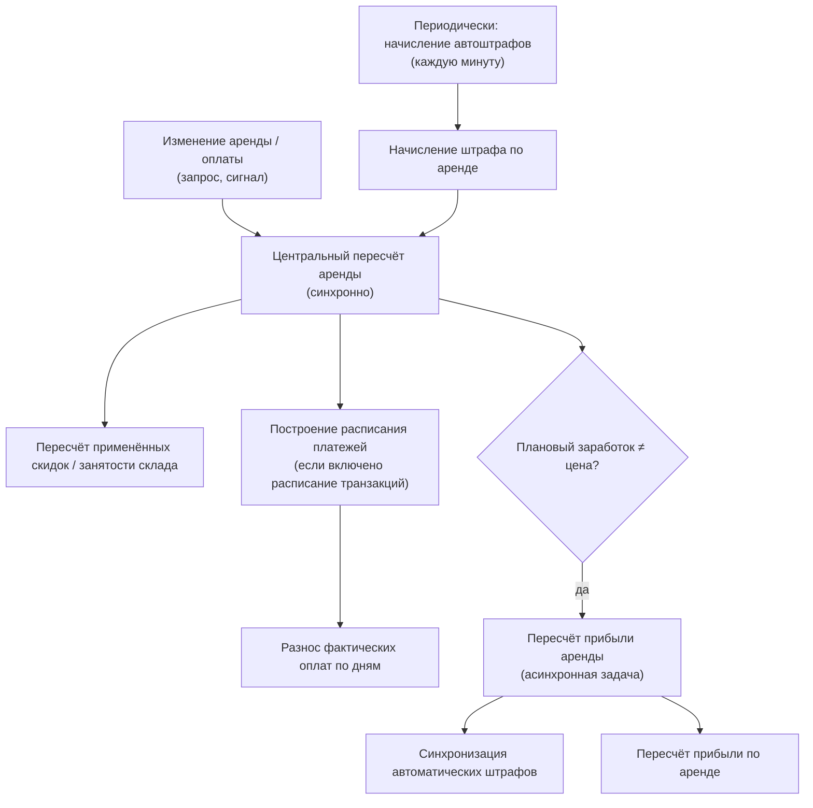

CRM полагается на очередь фоновых задач для двух типов работы: **периодические задачи** (запускаются по расписанию)
и **пересчёты по требованию** (запускаются при изменении аренды, продажи или оплаты). Часть работы выполняется
асинхронно в отдельном воркере, часть — синхронно прямо во время обработки запроса. Ниже разбираемся, что и когда
исполняется.

<Warning>
Важная особенность: **многие тяжёлые функции пересчёта — это не фоновые задачи, а обычный синхронный код**. Например,
центральный пересчёт аренды, пересчёт оплаты аренды, пересчёт продажи, посев штрафов и построение расписания платежей
вызываются **синхронно** внутри обработки HTTP-запроса. «Задачами» в терминах очереди являются только те пункты, что
отмечены как асинхронные (см. таблицу ниже). Не предполагайте, что любой такой пересчёт уходит в очередь — часто он
выполняется прямо в веб-воркере и увеличивает время ответа.
</Warning>

## Задачи и компании

Каждая фоновая задача всегда выполняется в данных нужной компании — система сама определяет, какой компании она
принадлежит, автоматически, без ручной настройки. Пара задач — начисление автоштрафов и массовый пересчёт прибыли —
устроены иначе: они не привязаны к одной компании, а сами проходят по очереди по всем компаниям сразу.

## Расписание периодических задач

Расписание хранится в базе данных и редактируется в том числе из админки. Планировщик берёт задания
из базы. Из статического конфига к CRM относятся две задачи (остальные — интеграции):

| Задача | Периодичность | Компания |
| --- | --- | --- |
| Начисление автоштрафов | Каждую минуту | по всем компаниям (перебор внутри) |
| Синхронизация трекеров | Каждые 5 минут | не CRM |
| Удаление дубликатов справочника авто | Ежедневно 00:00 | не CRM |

<Info>
Помимо статического конфига, во время работы приложения в базе динамически создаются записи расписания:
одноразовые/периодические уведомления о ТО, одноразовые алерты «просрочка близко» и записи для начисления
автоштрафов (по ним итерирует задача начисления автоштрафов). Они не видны в статическом конфиге, но исполняются тем
же планировщиком.
</Info>

## Каталог фоновых процессов CRM

Легенда столбца «Тип»: **периодическая** — запускается по расписанию; **задача** — асинхронная задача из очереди;
**функция** — обычный синхронный код (вызывается прямо в запросе, несмотря на расположение среди задач).

| Процесс | Тип | Триггер | Что делает | Связано с |
| --- | --- | --- | --- | --- |
| Начисление автоштрафов | периодическая | Каждую минуту | Находит просроченные аренды и начисляет автоматический штраф + шлёт уведомление | [Депозиты и штрафы](/ru/logic/rent/deposits-penalties) |
| Посев штрафов и алертов | функция | При оформлении аренды (обычной или Yume Plus) | Создаёт/обновляет записи для начисления штрафов и записи расписания для алертов о просрочке | [Аренда: жизненный цикл](/ru/logic/rent/lifecycle) |
| Центральный пересчёт аренды | функция | Почти любое изменение аренды | Главный пересчёт аренды: цены, скидки, штрафы, расписание, налог; ставит задачу пересчёта прибыли | [Тарифы](/ru/logic/rent/pricing), [Скидки](/ru/logic/rent/pricing) |
| Построение расписания платежей | функция | Внутри центрального пересчёта аренды | Строит дневное расписание платежей, распределяет оплаты | [Депозиты и штрафы](/ru/logic/rent/deposits-penalties) |
| Пересчёт оплаты аренды | функция | При изменении оплаты | Пересчитывает поле «Оплачено» аренды и ставит задачу пересчёта прибыли | [Прибыль](/ru/logic/profit-payback) |
| Синхронизация автоштрафов | задача | Внутри пересчёта прибыли (когда нужно) | Синхронизирует автоматические штрафы с рассчитанными суммами по инвентарю | [Депозиты и штрафы](/ru/logic/rent/deposits-penalties) |
| Пересчёт прибыли аренды | задача | Асинхронно из центрального пересчёта аренды / пересчёта оплаты | Обновляет автоматические штрафы и пересчитывает прибыль по аренде | [Прибыль](/ru/logic/profit-payback), [Метрики](/ru/logic/metrics) |
| Пересчёт продажи | функция | При изменении продажи или её оплаты | Пересчёт продажи: цены, статус, склад; ставит задачу пересчёта прибыли по продаже | [Прибыль](/ru/logic/profit-payback) |
| Пересчёт прибыли продажи | задача | Асинхронно из пересчёта продажи | Пересчитывает прибыль по продаже | [Прибыль](/ru/logic/profit-payback) |
| Массовый пересчёт прибыли | задача | По требованию (без расписания) | Массово пересчитывает прибыль по всем или одной компании, где плановый заработок разошёлся с ценой | [Прибыль](/ru/logic/profit-payback) |
| Наполнение аренды (обычной) | функция | Оформление аренды из корзины | Создаёт аренду, подбирает свободный инвентарь, генерирует комментарии | [Аренда: жизненный цикл](/ru/logic/rent/lifecycle) |
| Наполнение аренды (Yume Plus) | задача | Асинхронно из счёта Yume Plus (и синхронно из заказа) | Наполняет аренду инвентарём и комплектами по корзине Yume Plus | [Товары](/ru/logic/inventory/inventory-groups), [Комплекты](/ru/logic/inventory/inventory-sets) |
| Пересчёт занятости инвентаря | задача | Синхронно при сохранении аренды | Пересчитывает занятость инвентаря | [Инвентарь](/ru/logic/inventory) |
| Триггеры по статусу аренды | задача | Асинхронно при смене статуса аренды | Отправляет триггеры сообщений по переходу статуса | [Аренда: жизненный цикл](/ru/logic/rent/lifecycle) |
| Алерт «скоро просрочка» | задача | Из одноразовой записи расписания (близко к просрочке) | Готовит контекст и отправляет триггер о приближении просрочки | [Аренда: жизненный цикл](/ru/logic/rent/lifecycle) |
| Уведомление о ТО | задача | Расписание, одноразовая запись или сигнал пробега | Пуш + WhatsApp о необходимости ТО инвентаря | [Инвентарь](/ru/logic/inventory) |
| Отчёт по закрытию смены | задача | Асинхронно при закрытии смены | Собирает статистику смены и шлёт отчёт в Telegram кассиру | [Метрики](/ru/logic/metrics) |

## Как это работает

### Центральный пересчёт аренды

Это самая тяжёлая функция модуля: она заново считает **всю финансовую картину аренды** одним проходом по инвентарю и
услугам и сохраняет аренду. Вызывается синхронно из десятка мест (изменение аренды, статуса, инвентаря, скидок,
залога, доставки, бонусов, а также из начисления штрафа).

Основные шаги:

<Steps>
<Step title="Ранний выход по удалённой аренде">
Если аренда помечена как удалённая — снимаются запланированные списания, и функция завершается.
</Step>
<Step title="Расписание и режим подсчёта">
Если у компании включена функция расписания транзакций, строится список дат аренды, оставшихся дат и оставшейся
длительности, и подсчёт ведётся **по дням**; иначе — **по длительности**.
</Step>
<Step title="Расчёт по каждой позиции: цена, штраф, скидка">
Для каждой строки инвентаря считаются стоимость позиции, сумма автоматического штрафа и скидки. Формула штрафа
зависит от настройки округления периода просрочки (вверх/вниз), шага начисления штрафа, буфера просрочки и шага
округления суммы штрафа — см. ниже.
</Step>
<Step title="Агрегация и запись позиций">
Суммы сворачиваются в «Сумму за инвентарь», «Инвентарь со скидкой», сумму штрафов и т.д., затем строки инвентаря и
услуг обновляются пакетно, если значения изменились.
</Step>
<Step title="Итоговые поля аренды и налог">
Считаются «Сумма без скидок», «Итоговая сумма к оплате», «Сумма налога», «Сумма штрафов» (= автоматический штраф +
ручной штраф), «Размер скидки»; по периоду просрочки статус переводится между «В аренде» и «Просрочена», и аренда сохраняется.
</Step>
<Step title="Скидки, склад, расписание, прибыль">
Пересчитываются применённые скидки и занятость склада; при включённой функции строится расписание платежей; и, если
плановый заработок разошёлся с фактической ценой, ставится асинхронная задача пересчёта прибыли по аренде.
</Step>
</Steps>

Ключевые формулы:

**Стоимость одной позиции инвентаря (аренда):**

Число тарифных периодов округляется **вверх**, затем умножается на цену за период:

```
Стоимость позиции = Цена за период × округление_вверх(Длительность ÷ длительность тарифного периода)
```

**Автоматический штраф за просрочку:**

```
Период просрочки = (Фактический возврат или «сейчас») − Плановое окончание − время паузы

Если Плановое окончание > «сейчас» − буфер просрочки → штраф = 0 (ещё не просрочено)

Число шагов просрочки = округление((Период просрочки − буфер просрочки) ÷ Шаг начисления штрафа)
    (округление вверх, если период просрочки округляется вверх; иначе вниз)

Штраф за позицию = Цена за период × Число шагов просрочки ÷ округление_вверх(длительность тарифного периода ÷ Шаг начисления штрафа)
    (значение не меньше нуля, затем приводится к шагу округления суммы штрафа)
```

**Итоговая цена аренды с налогом:**

```
Сумма налога = округление((Итоговая сумма к оплате + Сумма штрафов) × Ставка налога)

Если налог включён в цену:
    Итоговая сумма к оплате = округление(Итоговая сумма к оплате + Сумма штрафов + Стоимость доставки)
Иначе:
    Итоговая сумма к оплате = округление((Итоговая сумма к оплате + Сумма штрафов) × (1 + Ставка налога) + Стоимость доставки)
```

<Note>
Центральный пересчёт аренды поддерживает **автопродление** через ограниченный цикл повторов: если срок аренды истёк
(«сейчас» позже планового окончания) и аренда в статусе «В аренде» или «Просрочена», плановое окончание сдвигается на новый
период, а пересчёт запускается заново. Число повторов жёстко ограничено (до 15 проходов); если за это число проходов
расчёт не сошёлся (например, при некорректных данных, когда длительность автопродления равна нулю и окончание не
продвигается), в журнал пишется предупреждение и процедура завершается с последним результатом — бесконечный цикл
исключён.
</Note>

### Начисление автоштрафов по расписанию

Запускается **каждую минуту**. Работает партиями до 100 записей за раз, отсортированных по времени последнего запуска
(сначала те, что ещё ни разу не запускались).

<Steps>
<Step title="Отбор просроченных">
Выбираются записи штрафов, где подключена интеграция аренды, начисление включено, наступил срок, и с момента прошлого
запуска прошло не меньше заданного интервала.
</Step>
<Step title="Группировка по компаниям">
Записи группируются по компаниям — задача обрабатывает каждую компанию по очереди.
</Step>
<Step title="Начисление или очистка">
Для каждой аренды: если она удалена или не в статусе «В аренде» — удаляются все её записи для начисления штрафов;
иначе выполняется начисление штрафа, которое запускает центральный пересчёт аренды и, если аренда просрочена, ставит
уведомление о просрочке.
</Step>
<Step title="Отметка о запуске">
У обработанных записей проставляется время последнего запуска.
</Step>
</Steps>

<Note>
Посев штрафов — это «посевная» функция: при создании аренды она создаёт/обновляет записи для начисления штрафов (по
одной на каждый уникальный срок окончания у инвентаря) и, отдельно, регистрирует одноразовые записи
расписания для алерта «скоро просрочка», если у компании настроены триггеры перехода из статуса «В аренде» в состояние
близкой просрочки с задержкой больше одной минуты.
</Note>

### Расписание платежей

Работает только при включённой функции расписания транзакций. Три уровня:

- **Построение расписания** — строит список дат аренды и вычисляет **выходные дни** по правилам цикла рабочих и
  выходных дней и по кастомным пометкам расписания. Первый день по умолчанию считается выходным (не оплачивается),
  если не включена функция платы за первый день.
- **Раскладка по дням** — раскладывает цену инвентаря и скидки **по дням** пропорционально (цена дня = стоимость
  позиции ÷ число дней аренды), распределяет оплату, добавляет штрафы к дню их создания и синхронизирует записи
  расписания (создание/обновление/удаление).
- **Разнос фактических оплат** — «жадно» разносит фактические оплаты по дням расписания с переносом переплаты на
  предыдущие дни, ограничивая каждый день его плановой суммой.

**Логика разноса переплаты по дням расписания:**

```
Повторять (не более чем число дней + 1 раз):
    переплата = 0
    Для каждого дня, начиная с последнего к первому:
        всего = оплачено в дне + переплата
        оплачено в дне = min(всего, плановая сумма дня)   // не больше плановой суммы дня
        переплата = всего − оплачено в дне
    Если переплата ≤ 0 — остановиться
    Иначе остаток переплаты добавить к последнему дню
```

### Прибыль: пересчёт по аренде, по продаже и массовый

**Пересчёт прибыли по аренде** — тонкая обёртка: при необходимости сперва синхронизирует автоматические штрафы под
пересчитанные суммы, затем пересчитывает прибыль по аренде с полным набором цен. **Пересчёт прибыли по продаже** просто
пересчитывает прибыль по конкретной продаже.

**Массовый пересчёт прибыли** — ремонтная задача: перебирает все компании (кроме служебных) и пересчитывает прибыль по
продажам, задачам мастерской и арендам, где расхождение между плановым заработком и ценой больше единицы (для продаж и
аренд сравнивается с итоговой суммой к оплате, для задач мастерской — с ценой). Может фильтроваться по конкретной
компании или конкретной аренде.

Диаграмма зависимостей пересчёта аренды:



<Tip>
При отладке «почему сумма аренды не пересчиталась» первым делом проверяйте, дошёл ли вызов до центрального пересчёта
аренды (он синхронный) и поставилась ли из него задача пересчёта прибыли — постановка происходит только при
расхождении планового заработка и фактической цены. Если фоновый воркер не запущен, синхронные пересчёты всё равно
отработают, а асинхронная часть (прибыль, автоматические штрафы через очередь) — нет.
</Tip>
