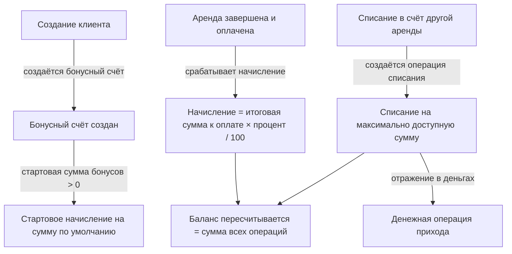

## Что это и зачем

Модуль отвечает за всё, что связано с **клиентом** арендной компании: карточку клиента, его документы (KYC), рейтинги/чёрный список, накопленные **бонусы**, привязку к **программе лояльности** и учёт **реферальных агентов**, приводящих заявки.

Центральная сущность — **Клиент**. Она принадлежит конкретной компании (изолирована в её схеме), но ссылается на **Пользователя** и через него — на **программу лояльности**, которые хранятся в общей (публичной) части системы (см. [архитектуру мультитенантности](/ru/logic/rent-lifecycle)). Такие ссылки из данных компании на общие справочники в проекте допустимы.

Важно с самого начала различать три независимых механизма «награды/скидки», которые легко перепутать:

<CardGroup cols={3}>
  <Card title="Бонусы" icon="coins">
    Накопительный баланс клиента (баланс бонусов). Начисляются процентом от оплаченной аренды, списываются в счёт оплаты следующей.
  </Card>
  <Card title="Скидки" icon="percent">
    Уменьшают стоимость конкретной аренды. Отдельная сущность — см. [Скидки](/ru/logic/discounts).
  </Card>
  <Card title="Рефералы" icon="handshake">
    Вознаграждение агенту, приведшему клиента/заявку. Отдельная строка «Реферальное вознаграждение» в аренде.
  </Card>
</CardGroup>

<Info>
Бонусы, скидки и реферальные выплаты считаются **разными** строками расчёта аренды и не смешиваются между собой. Бонус — это баланс клиента, скидка — уменьшение цены, реферал — расход в пользу агента.
</Info>

## Модель данных

### Клиент

| Поле | Назначение |
|------|-----------|
| UUID | Неизменяемый внешний идентификатор |
| Имя / название | Имя клиента или название организации |
| Тип клиента | Физлицо или Юрлицо |
| Форма юрлица | Для юрлиц: ИП, ТОО, АО или ПК |
| Пол | Мужской или Женский |
| Телефон | Телефон (индексируется) |
| Email | Электронная почта |
| Аватар | Изображение клиента; при смене генерируется превью |
| Документ юрлица | KYC юрлица; при удалении документа ссылка обнуляется |
| Документ физлица | KYC физлица; при удалении документа ссылка обнуляется |
| Способ привлечения | Как клиент привлечён; при удалении справочного значения ссылка обнуляется |
| Персональная скидка | Постоянная скидка клиента; удалить такую скидку, пока она привязана, нельзя |
| Пользователь | Ссылка на общий аккаунт пользователя; через него — программа лояльности |
| Рейтинги | Рейтинги / метки / чёрный список (присваиваются через отдельную связь) |
| Номер договора | Генерируется автоматически |
| Договор подписан / Дата подписания / Действует до | Статус подписания договора |
| Архивация | Мягкое удаление / архивация клиента: единая связанная запись «Архивация» со способом, автором и причиной (см. [Инвентарь](/ru/logic/inventory#архивация-вместо-жёсткого-удаления)) |
| Доп. данные | Произвольные дополнительные поля |

<Note>
Номер договора присваивается **лениво** — при первом сохранении уже существующего клиента. Берётся общий на компанию счётчик (с блокировкой строки, чтобы номера не пересекались), формат — `№YY-NNNN` (две последние цифры года + 4-значный номер). У только что созданного клиента номер не присваивается — он появится при следующем сохранении.
</Note>

### Паспорта (KYC)

Разделены на две модели — для физлиц и юрлиц.

| Модель | Ключевые поля |
|--------|--------------|
| Документ физлица | ИИН (12–14 символов), Номер документа, Кем выдан, Дата выдачи, Действует до, Дата рождения, Адрес |
| Документ юрлица | БИН (ровно 12 символов), Директор, IBAN, БИК, Банк, Адрес |

<Warning>
Валидатор ИИН допускает длину **12–14** символов, хотя казахстанский ИИН всегда 12 цифр. При массовом импорте значение дополнительно обрезается до 14 символов.
</Warning>

### Рейтинги и чёрный список

Рейтинг клиента — это цветная метка, назначаемая клиенту через присвоение рейтинга.

| Поле | Назначение |
|------|-----------|
| Название | Название метки |
| Цвет | HEX-цвет (проверяется по формату вида `#RRGGBB` или `#RGB`) |
| Чёрный список | Если включено — клиенты с этой меткой синхронизируются в общий чёрный список |
| Порог по числу аренд | Авто-назначить метку при достижении заданного числа завершённых аренд |
| Порог по обороту | Порог по сумме завершённых аренд |
| Лимит долга | Описательное поле |

### Бонусы

Бонусный счёт и бонусные операции.

| Модель / поле | Назначение |
|---------------|-----------|
| Бонусный счёт → Клиент | Один бонусный счёт на клиента |
| Бонусный счёт → Баланс бонусов | Текущий баланс (пересчитывается, см. ниже); не может быть отрицательным |
| Бонусная операция → Бонусный счёт | Счёт, к которому относится операция |
| Бонусная операция → Сумма | Сумма движения (**положительная** — начисление, **отрицательная** — списание) |
| Бонусная операция → Тип | Начисление или Списание |
| Бонусная операция → Аренда | Аренда, породившая движение |
| Бонусная операция → Кем создана | Кто провёл движение |

<Note>
На бонусные операции наложено ограничение: для одной аренды может существовать **только одна** операция типа «Начисление». Списаний на аренду может быть несколько.
</Note>

### Программа лояльности

Программа лояльности хранится в общей (публичной) части системы — на аккаунте пользователя, но управляется из CRM.

| Поле | Назначение |
|------|-----------|
| Название уровня | Название уровня лояльности |
| Процент кэшбэка | Процент начисления бонусов (по умолчанию 3%) |
| Порог/цена уровня | Используется для сортировки уровней |
| Лимит начисления | По умолчанию 200 000 |

Связь с клиентом: уровень лояльности привязан к аккаунту пользователя; при удалении уровня ссылка обнуляется. Новый пользователь при регистрации получает **самый дешёвый** уровень.

<Warning>
Уровень лояльности привязан к **аккаунту пользователя**, а не к клиенту. Начисление бонусов использует процент уровня лояльности только если у клиента заполнен аккаунт пользователя. У большинства оффлайн-клиентов аккаунт не заполнен, поэтому фактически применяется процент кэшбэка по умолчанию из настроек компании.
</Warning>

### Дизайн Wallet-карт

Для программы лояльности хранится оформление карт для Apple Wallet и Google Wallet (цвета, логотипы, изображения) — по одной записи дизайна на уровень лояльности. Дизайн редактируется в CRM, а для Apple и Google доступны отдельные предпросмотры готовой карты.

### Реферальные агенты

| Модель | Ключевые поля |
|--------|--------------|
| Реферальный агент | Имя, Телефон, Доп. данные |
| Реферал по аренде | Аренда, Агент, Сумма (не отрицательная), Статус, Когда изменён статус, Кем изменён статус |
| Способ привлечения | Название — справочник каналов привлечения |

Статус реферала: **Выплачен** или **Ожидает**. Реферал по умолчанию создаётся в статусе «Ожидает».

## Как это работает

### Жизненный цикл бонусов



<Steps>
  <Step title="Создание бонусного счёта">
    При создании клиента автоматически создаётся бонусный счёт. Если в настройках компании стартовая сумма бонусов больше нуля, сразу пишется приветственная операция «Начисление» на эту сумму.
  </Step>
  <Step title="Начисление за аренду">
    Начисление за аренду срабатывает **только** если аренда «Завершена» **и** имеет статус оплаты «Оплачена». Сумма начисления:

    > Начисление = итоговая сумма к оплате × процент кэшбэка / 100

    где процент кэшбэка берётся из уровня лояльности клиента, если у клиента заполнен аккаунт пользователя, иначе — из процента по умолчанию в настройках компании. Если по аренде уже есть списание бонусов, начисление **пропускается**.
  </Step>
  <Step title="Списание в счёт оплаты">
    Списание запускает менеджер вручную. Максимум к списанию — это наименьшее из трёх значений:

    > Максимум к списанию = минимум из:
    > 1. остаток к оплате (итоговая сумма к оплате − оплачено);
    > 2. процент от суммы, разрешённый к оплате бонусами (итоговая сумма к оплате × разрешённый процент / 100);
    > 3. доступный баланс бонусов.

    Пишется операция «Списание» на эту сумму (в бонусной операции она отражается отрицательным числом).
  </Step>
  <Step title="Пересчёт баланса">
    Каждое сохранение бонусного счёта пересчитывает баланс как сумму всех бонусных операций по нему.

    После каждой операции и после её удаления счёт пересохраняется, а также обновляется Wallet-карта клиента.
  </Step>
  <Step title="Отражение в деньгах">
    Каждое **списание** бонусов создаёт (или обновляет) денежную операцию прихода на списанную сумму. Так списанные бонусы попадают в финансовый учёт аренды. Начисления в деньги не транслируются.
  </Step>
</Steps>

#### Числовой пример начисления и списания

```text
Настройки компании: процент кэшбэка по умолчанию = 5, разрешённый процент оплаты бонусами = 30

1) Клиент завершил и оплатил аренду на 20 000 (итоговая сумма к оплате).
   У клиента не заполнен аккаунт пользователя → процент = 5 (из настроек).
   Начисление = 20 000 × 5 / 100 = 1 000 бонусов.
   Баланс бонусов = 1 000.

2) Новая аренда: итоговая сумма к оплате = 10 000, оплачено = 0.
   Максимум к списанию = минимум(10 000 − 0,  10 000 × 30/100,  1 000)
                       = минимум(10 000, 3 000, 1 000) = 1 000.
   Списание = 1 000  →  Баланс бонусов = 0.
   Денежная операция прихода на 1 000 (оплата бонусами).
```

<Warning>
Стартовое начисление создаётся **двумя разными путями**: при создании клиента и повторно при первом списании бонусов, когда бонусный счёт создаётся впервые. Второй путь срабатывает только если бонусного счёта ещё не было, поэтому дублирования на практике обычно нет — но логика продублирована в двух местах.
</Warning>

### Значения «максимум к списанию» и «использовано бонусов» в карточке аренды

В детальной выдаче аренды те же величины считаются в базе данных: «использовано бонусов» — это сумма всех бонусных операций по данной аренде (со знаком плюс), а «максимум к списанию» — наименьшее из тех же трёх значений: остаток к оплате, разрешённый процент от суммы и доступный баланс. Это поля только для чтения, синхронные с формулой из шага «Списание в счёт оплаты».

### Синхронизация с чёрным списком

Метка с включённым признаком «Чёрный список» при назначении клиенту автоматически заводит запись в межтенантном чёрном списке:

- при добавлении клиенту метки чёрного списка запускается синхронизация клиента в общий чёрный список;
- запись создаётся только если чёрный список **расшарен** для компании; в неё попадают имя, телефон, ИИН, БИН и текст комментариев;
- снятие признака «Чёрный список» у метки удаляет записи (если они не используются другими компаниями); удаление самой связи метки с клиентом тоже очищает список.

### Авто-назначение меток по порогам

При сохранении метки с заполненным порогом по числу аренд или по обороту метка автоматически навешивается на всех клиентов, у которых число завершённых аренд достигло порога.

<Warning>
Для порога «по обороту» на самом деле сравнивается **количество** оплаченных аренд, а не их суммарная стоимость. Это выглядит как ошибка: поле называется «оборот/сумма», но сравнивается с числом заявок. См. [Известные особенности и ограничения](/ru/logic/known-issues).
</Warning>

### Реферальная программа

<Steps>
  <Step title="Справочник агентов">
    Реферальный агент — простой справочник (Имя, Телефон, Доп. данные). Агенты создаются и редактируются в отдельном разделе.
  </Step>
  <Step title="Привязка к аренде">
    Менеджер создаёт реферал для конкретной заявки, указывая агента и сумму вознаграждения. Для завершённых/отменённых аренд создание запрещено без права на изменение завершённых аренд.
  </Step>
  <Step title="Отметка о выплате">
    Реферал переводится в статус «Выплачен» с фиксацией момента и автора изменения статуса.
  </Step>
  <Step title="Аналитика">
    Метрики по рефералам: общий счёт / сумма / среднее, история и агрегаты по агентам (общая сумма вознаграждений и выплаченная сумма, с фильтрацией по плановому окончанию аренды в заданном диапазоне).
  </Step>
</Steps>

<Info>
Реферальное вознаграждение хранится и как отдельная сущность (Реферал по аренде с его суммой), и как денежная строка аренды «Реферальное вознаграждение». Первое — учёт по агентам, второе — влияние на расчёт прибыли аренды. Связь между ними см. в разделе [Прибыль и окупаемость](/ru/logic/profit-payback).
</Info>

### Как клиент связан с арендами

У каждой аренды есть ссылка на клиента, а у клиента — обратный список его аренд. Карточка клиента в списке аннотирует агрегаты по арендам:

| Аннотация | Что считает |
|-----------|-------------|
| Количество аренд | Число аренд в статусах «В аренде» / «Завершена» / «Должник» |
| Сумма аренд | Сумма итоговых сумм к оплате по этим статусам |
| Оплачено | Сумма оплаченного по этим арендам |
| Долг | Долг: max(Σ(итоговая сумма к оплате − оплачено), 0) по статусам «В аренде» / «Должник» |
| Долг по просроченным | Долг по арендам с признаком «Просрочено» |
| Дата последней аренды | Максимальное плановое начало по завершённым |
| Суммарное время | Суммарная длительность аренд |
| ИИН / БИН | Прокинутые из паспортов |

В детальной карточке клиента дополнительно отдаётся текущий выданный клиенту инвентарь.

## Связанные разделы

- [Скидки](/ru/logic/discounts) — как уменьшается стоимость аренды (не путать с бонусами).
- [Аренда: заявка и жизненный цикл](/ru/logic/rent-lifecycle) — статусы аренды, при которых начисляются бонусы.
- [Депозиты, штрафы и транзакции](/ru/logic/deposits-penalties) — денежные операции, куда попадают списанные бонусы.
- [Прибыль и окупаемость](/ru/logic/profit-payback) — где учитывается реферальное вознаграждение.
- [Метрики и аналитика](/ru/logic/metrics) — бонусные и реферальные метрики.
- [Фоновые процессы](/ru/logic/background-tasks) — пересчёт аренды.
