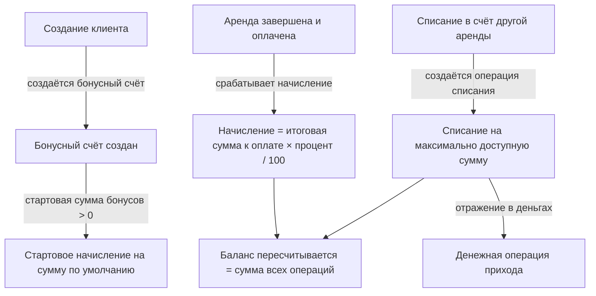

**Бонусы** — это накопительный баланс клиента: начисляются процентом от оплаченной аренды и списываются в счёт оплаты
следующей. Это отдельный механизм от [скидок](/ru/logic/rent/pricing) (уменьшают цену конкретной аренды) и
[реферального вознаграждения](/ru/logic/clients-loyalty/referrals) (расход в пользу приведшего агента) — все три
считаются разными строками расчёта аренды и не смешиваются между собой.

Полный перечень полей — в таблице ниже; отдельного глоссария у этой страницы нет.

## Модель данных

### Бонусы

| Модель / поле | Назначение |
|---------------|-----------|
| Бонусный счёт → Клиент | Один бонусный счёт на клиента |
| Бонусный счёт → Баланс бонусов | Текущий баланс (пересчитывается, см. ниже); не может быть отрицательным |
| Бонусная операция → Бонусный счёт | Счёт, к которому относится операция |
| Бонусная операция → Сумма | Сумма движения (**положительная** — начисление, **отрицательная** — списание) |
| Бонусная операция → Тип | Начисление или Списание |
| Бонусная операция → Аренда | Аренда, породившая движение |
| Бонусная операция → Кем создана | Кто провёл движение |

<Note>
На бонусные операции наложено ограничение: для одной аренды может существовать **только одна** операция типа «Начисление». Списаний на аренду может быть несколько.
</Note>

## Как это работает

### Жизненный цикл бонусов



<Steps>
  <Step title="Создание бонусного счёта">
    При создании клиента автоматически создаётся бонусный счёт. Если в настройках компании стартовая сумма бонусов больше нуля, сразу пишется приветственная операция «Начисление» на эту сумму.
  </Step>
  <Step title="Начисление за аренду">
    Начисление за аренду срабатывает **только** если аренда «Завершена» **и** имеет статус оплаты «Оплачена». Сумма начисления:

    > Начисление = итоговая сумма к оплате × процент кэшбэка / 100

    где процент кэшбэка берётся из уровня [лояльности](/ru/logic/clients-loyalty/loyalty-program) клиента, если у клиента заполнен аккаунт пользователя, иначе — из процента по умолчанию в настройках компании. Если по аренде уже есть списание бонусов, начисление **пропускается**.
  </Step>
  <Step title="Списание в счёт оплаты">
    Списание запускает менеджер вручную. Максимум к списанию — это наименьшее из трёх значений:

    > Максимум к списанию = минимум из:
    > 1. остаток к оплате (итоговая сумма к оплате − оплачено);
    > 2. процент от суммы, разрешённый к оплате бонусами (итоговая сумма к оплате × разрешённый процент / 100);
    > 3. доступный баланс бонусов,
    >
    > но **не меньше нуля**.

    Пишется операция «Списание» на эту сумму (в бонусной операции она отражается отрицательным числом).

    Нижняя граница нуля важна для случая переплаты: если клиент внёс больше итоговой суммы к оплате, остаток к оплате
    отрицательный, и максимум к списанию равен нулю — списывать нечего. Без этой границы списание превратилось бы в
    начисление и увеличивало бы бонусный баланс клиента.
  </Step>
  <Step title="Пересчёт баланса">
    Каждое сохранение бонусного счёта пересчитывает баланс как сумму всех бонусных операций по нему.

    После каждой операции и после её удаления счёт пересохраняется, а также обновляется Wallet-карта клиента.
  </Step>
  <Step title="Отражение в деньгах">
    Каждое **списание** бонусов создаёт (или обновляет) денежную операцию прихода на списанную сумму. Так списанные бонусы попадают в финансовый учёт аренды. Начисления в деньги не транслируются.
  </Step>
</Steps>

#### Числовой пример начисления и списания

```text
Настройки компании: процент кэшбэка по умолчанию = 5, разрешённый процент оплаты бонусами = 30

1) Клиент завершил и оплатил аренду на 20 000 (итоговая сумма к оплате).
   У клиента не заполнен аккаунт пользователя → процент = 5 (из настроек).
   Начисление = 20 000 × 5 / 100 = 1 000 бонусов.
   Баланс бонусов = 1 000.

2) Новая аренда: итоговая сумма к оплате = 10 000, оплачено = 0.
   Максимум к списанию = минимум(10 000 − 0,  10 000 × 30/100,  1 000)
                       = минимум(10 000, 3 000, 1 000) = 1 000.
   Списание = 1 000  →  Баланс бонусов = 0.
   Денежная операция прихода на 1 000 (оплата бонусами).
```

<Warning>
Стартовое начисление создаётся **двумя разными путями**: при создании клиента и повторно при первом списании бонусов, когда бонусный счёт создаётся впервые. Второй путь срабатывает только если бонусного счёта ещё не было, поэтому дублирования на практике обычно нет — но логика продублирована в двух местах.
</Warning>

### Значения «максимум к списанию» и «использовано бонусов» в карточке аренды

В детальной выдаче аренды те же величины считаются в базе данных: «использовано бонусов» — это сумма всех бонусных операций по данной аренде (со знаком плюс), а «максимум к списанию» — наименьшее из тех же трёх значений: остаток к оплате, разрешённый процент от суммы и доступный баланс, и так же не меньше нуля. Это поля только для чтения, синхронные с формулой из шага «Списание в счёт оплаты», поэтому по переплаченной аренде они показывают ноль, а не отрицательное число. То же правило действует и в клиентской части (личный кабинет клиента).

## Связанные страницы

<CardGroup cols={2}>
  <Card title="Карточка клиента" icon="id-card" href="/ru/logic/clients-loyalty/client">
    Профиль клиента, документы и чёрный список.
  </Card>
  <Card title="Программа лояльности" icon="gem" href="/ru/logic/clients-loyalty/loyalty-program">
    Откуда берётся процент кэшбэка для начислений.
  </Card>
  <Card title="Реферальные агенты" icon="handshake" href="/ru/logic/clients-loyalty/referrals">
    Агенты, приводящие клиентов, и их вознаграждение.
  </Card>
  <Card title="Клиенты, бонусы и рефералы" icon="users" href="/ru/logic/clients-loyalty">
    Общий обзор модуля.
  </Card>
</CardGroup>
