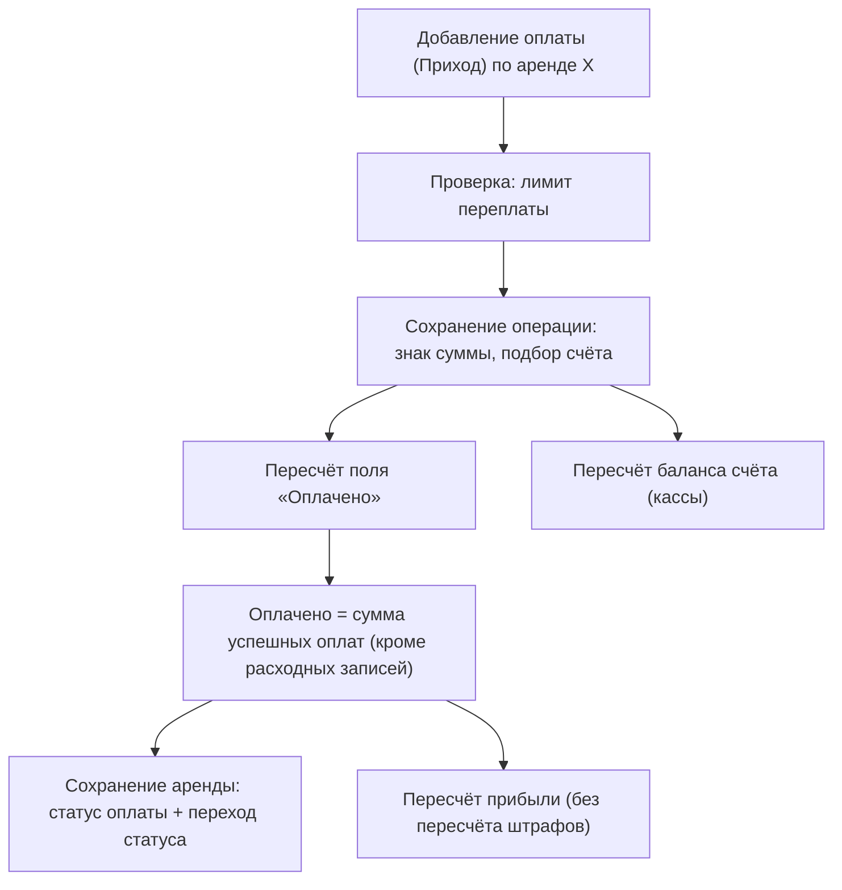

Этот модуль описывает всё движение денег вокруг одной аренды: залог, который берут при выдаче инвентаря и возвращают при приёме; штрафы (ручные и автоматические за просрочку); и единую **ленту операций (оплат)**, в которой фиксируются приходы и расходы, привязанные к аренде, продаже, задаче мастерской или ТО.

Ключевая идея: операция (оплата) — это универсальный журнал учёта. Любая оплата, возврат, обмен между счетами и списание проходят через одну сущность, а сводные денежные поля на аренде (Оплачено, Итоговая сумма к оплате, Сумма штрафов) пересчитываются автоматически при каждом изменении и фоновыми задачами.

<Info>
Модуль тесно связан с [Арендой и жизненным циклом](/ru/logic/rent-lifecycle), [Тарифами и расчётом стоимости](/ru/logic/tariffs-pricing), [Скидками](/ru/logic/discounts) и [Прибылью и окупаемостью](/ru/logic/profit-payback). Автоначисление штрафов входит в [Фоновые процессы (Celery)](/ru/logic/background-tasks).
</Info>

## Модель данных

| Сущность | Назначение / ключевые поля |
| --- | --- |
| Залог | Залог по аренде. Тип залога («Описание (документ)» / «Сумма»), статус («Не принят» / «Принят» / «Возвращён»), сумма, описание залога (что взяли в залог), вид оплаты, дата возврата. |
| Штраф | Штраф. Тип («Автоматический» / «Ручной»), сумма, оплачено, привязка к аренде, клиенту и опционально к строке инвентаря; причина, ссылка на дорожный штраф (ЕРАП, гос. система). |
| Операция (оплата) | Лента приходов и расходов. Направление («Приход» / «Расход»), сумма (знаковая), вид оплаты, счёт, категория, ссылки на аренду / продажу / мастерскую / ТО / залог / штраф, статус, обмен. |
| Счёт (касса) | Счёт (касса/карта). Начальный остаток, текущий баланс (пересчитывается), виды оплаты, признак «По умолчанию». |
| Категория операции | Статья доходов/расходов. Тип («Приход» / «Расход»), дерево через родительскую категорию. |
| Вид оплаты | Вид оплаты (наличные, карта и т. д.). |
| Распределение оплаты | Разбивка одной операции по позициям аренды (инвентарь / услуга / доставка / штраф / залог). |
| Статья прихода/расхода | «Расходная» запись (закупки, обмены счетов), привязка к единице инвентаря / контрагенту. |
| Возврат оплаты | Возврат оплаты (создаёт расходную операцию). |
| Kaspi-оплата | QR/инвойс Kaspi Pay, привязанный к операции. |
| Планировщик автоштрафов | Планировщик автоначисления штрафов: момент запуска, интервал, время последнего запуска, признак активности, ключ группировки. |

<Note>
Залог, штраф, лента операций, счета, категории и виды оплаты — это данные конкретной компании, видны только ей. А планировщик автоштрафов — общий механизм, который одной фоновой задачей обслуживает сразу все компании в системе.
</Note>

## Как это работает

### Знак суммы и балансы счетов

Каждая операция при сохранении нормализует знак суммы по направлению — приход положительный, расход отрицательный:

- расход всегда сохраняется как отрицательное число (по модулю суммы);
- приход всегда сохраняется как положительное число (по модулю суммы).

Если у операции задан вид оплаты, счёт подбирается автоматически: берётся первый счёт (касса), в списке видов оплаты которого есть этот вид.

Баланс счёта пересчитывается автоматически при каждом сохранении или удалении операции по правилу:

**Баланс счёта = начальный остаток + сумма всех операций по этому счёту** (при отсутствии операций сумма считается равной нулю).

### Залог: удержание и возврат

<Steps>
<Step title="Создание залога">
При создании залог привязывается к аренде и отмечается, кем он принят. Для залога типа «Описание (документ)» (нематериальный залог — документ, паспорт) сумма принудительно обнуляется. Для залога типа «Сумма» поле суммы обязательно.
</Step>
<Step title="Оплата залога">
Залог может «наполняться» операциями (оплатами), привязанными к нему. В списке залогов сумма собранных денег показывается как итог всех привязанных к залогу операций (при отсутствии операций — ноль).
</Step>
<Step title="Возврат">
При возврате залог получает статус «Возвращён» и фиксируется дата возврата, после чего запускается пересчёт по аренде. Обратите внимание: **сам возврат денег отдельной расходной операцией здесь не создаётся** — меняется только статус залога.
</Step>
</Steps>

<Warning severity="info">
Статус залога «Принят» объявлен, но система нигде не проставляет его автоматически — перейти в него можно только вручную, отредактировав залог. Возврат сразу переводит залог в статус «Возвращён» из любого состояния.
</Warning>

### Штрафы: ручные и автоматические

Штрафы бывают двух типов:

- **Ручной** — создаёт менеджер вручную. Может иметь график начислений, суммарный размер которого обязан совпадать с общей суммой штрафа.
- **Автоматический** — создаётся системой за просрочку возврата инвентаря. Разбит на два подвида: привязанный к конкретной строке инвентаря и «сводный» на всю аренду (без привязки к строке).

Сводные денежные показатели на аренде держатся в трёх полях: «Ручной штраф» (сумма ручных штрафов), «Автоматический штраф» (сумма авто-штрафов) и «Сумма штрафов» = «Автоматический штраф» + «Ручной штраф». Их пересчёт для ручных штрафов выполняется автоматически при сохранении или удалении штрафа:

- **Ручной штраф** = сумма штрафов типа «Ручной» по данной аренде;
- **Автоматический штраф** = сумма штрафов типа «Автоматический» по данной аренде, у которых нет привязки к строке инвентаря (сводные);
- **Сумма штрафов** = «Автоматический штраф» + «Ручной штраф».

<Warning severity="minor">
При прямом создании или удалении автоматического штрафа сводное поле «Автоматический штраф» на аренде этим автоматическим пересчётом **не** обновляется — для авто-штрафов пересчёт останавливается заранее. «Автоматический штраф» пересчитывается другим путём — через центральный пересчёт по аренде (см. ниже). Из-за двух источников одного значения его легко рассинхронизировать.
</Warning>

#### Формула авто-штрафа за просрочку

Основной расчёт выполняется в центральном пересчёте по аренде — отдельно для каждой строки инвентаря. Штраф начисляется, только если позиция уже была выдана (есть фактическая выдача), это аренда (не продажа), и фактическое время возврата превысило плановое окончание больше, чем на буфер (грейс-период):

```text
Период просрочки = (фактический возврат или, если его нет, текущий момент)
                   − плановое окончание − время пауз

# штраф = 0, если:
#   позиция ещё не выдана, либо это продажа,
#   либо плановое окончание позже «текущий момент − буфер»
#   (то есть просрочка ещё в пределах грейс-периода)

Штраф =
    шаг округления суммы ×
    ОКРУГЛ_ДО_ЦЕЛОГО(                             ← округление к ближайшему целому
        МАКСИМУМ(
            цена тарифа ×
            ОКРУГЛ_ШАГОВ( (Период просрочки − буфер) ÷ шаг начисления штрафа )
            ÷ округл_вверх( длительность тарифа ÷ шаг начисления штрафа )
            ÷ шаг округления суммы,
            0
        )
    )
```

где:

- **шаг начисления штрафа** — берётся из настройки аренды «Шаг начисления штрафа», а если не задан — 1 час;
- **буфер (грейс-период)** — по умолчанию 1 час;
- **шаг округления суммы** — по умолчанию 1;
- **ОКРУГЛ_ШАГОВ** — округление вверх, если включена настройка «штраф вперёд», иначе округление вниз. Обратите внимание: округление вверх/вниз применяется **только к числу просроченных шагов** во внутреннем выражении «(Период просрочки − буфер) ÷ шаг начисления штрафа». Внешнее приведение к целому округляет итог к ближайшему целому и **не** зависит от настройки «штраф вперёд». То есть настройка «штраф вперёд / по факту» управляет округлением количества шагов, а не итоговой суммы.

Сводная сумма авто-штрафа по аренде — это сумма штрафов по всем строкам инвентаря; она записывается в поле «Автоматический штраф» (обнуляется, если штрафы по аренде отключены).

<Tip>
Числовой пример. Тариф — 3000 ₸ / сутки (цена тарифа 3000, длительность тарифа 24 ч), шаг начисления штрафа 1 ч, буфер 1 ч, настройка «штраф вперёд» выключена (округление вниз), шаг округления суммы 1. Инвентарь вернули с просрочкой 5 ч 30 мин.

```text
шагов сверх буфера = округл_вниз((5,5 ч − 1 ч) ÷ 1 ч) = округл_вниз(4,5) = 4   ← здесь работает «штраф вперёд/по факту»
цена за шаг        = 3000 ÷ округл_вверх(24 ч ÷ 1 ч) = 3000 ÷ 24 = 125 ₸/час
штраф              = 1 × округл_до_целого(3000 × 4 ÷ 24 ÷ 1) = округл_до_целого(500) = 500 ₸
```

<Note>
Внешнее округление в примере — это округление итога к ближайшему целому, а не вверх/вниз. Здесь результат уже целый (500), поэтому разницы не видно, но на дробных суммах штрафа округление итога происходит к ближайшему целому независимо от настройки «штраф вперёд».
</Note>
</Tip>

<AccordionGroup>
<Accordion title="Синхронизация авто-штрафов со строками инвентаря">
После пересчёта строк инвентаря фоновая задача синхронизирует записи автоматических штрафов, привязанных к строке, с суммой штрафа по каждой строке:

- если по строке сумма штрафа равна нулю, а запись штрафа есть → **удаляет** её;
- если сумма изменилась и не равна нулю → **обновляет** запись;
- если записи штрафа нет, а сумма штрафа по строке не равна нулю → **создаёт** запись.

Эта синхронизация запускается из пересчёта прибыли по аренде (когда явно запрошен пересчёт штрафов), а тот, в свою очередь, вызывается из центрального пересчёта по аренде.
</Accordion>
<Accordion title="Планировщик автоначисления штрафов">
При смене статуса или создании аренды система формирует служебные записи планировщика автоштрафов — по одной на каждое уникальное плановое окончание строк аренды. У каждой записи: момент запуска равен плановому окончанию, интервал равен шагу начисления штрафа, признак активности включён, если аренда находится в статусе «В аренде» и не удалена.

Периодическая задача (запускается каждую минуту) выбирает «созревшие» планировщики (у компаний с активной интеграцией аренды), обрабатывает их пачками до 100 штук за раз, переключается на нужную компанию и для каждой аренды запускает автоначисление штрафа с последующим центральным пересчётом. Если аренда удалена или уже не находится в статусе «В аренде», соответствующие записи планировщика удаляются.
</Accordion>
</AccordionGroup>

### Платежи как операции и расчёт долга

Оплата аренды — это операция с направлением «Приход», привязанная к аренде. При создании проверяется следующее:

- нельзя привязать операцию к нескольким объектам одновременно; нужен ровно один из: аренда, продажа, мастерская, ТО;
- для аренды, если **не** включена настройка «Разрешить переплату», проверяется лимит переплаты: сумма новой оплаты не должна превышать остаток к оплате, который считается как:

**Итоговая сумма к оплате + Сумма штрафов − Оплачено**

- если платёж привязан к залогу, дополнительно проверяется, что сумма не превышает «недобранный» остаток по залогу (сумма залога минус уже собранные по нему операции).

После сохранения или удаления операции запускается пересчёт поля «Оплачено» по аренде:

**Оплачено = сумма всех операций по аренде, у которых статус «Успешно» и которые не являются расходными записями ленты (чистые оплаты)**, округлённая до целого.

<Note>
В поле «Оплачено» попадают только операции со статусом «Успешно» и **без** привязки к расходной статье (то есть чистые оплаты, а не расходные записи ленты). Поскольку сумма знаковая, возврат (расход, отрицательное число) автоматически уменьшает «Оплачено».
</Note>

Отсюда выводятся статус оплаты и долг. При сохранении аренды:

```text
Оплачено ≥ Итоговая сумма к оплате           → статус оплаты «Оплачена»
0 < Оплачено < Итоговая сумма к оплате       → «Частично оплачена»
Оплачено ≤ 0                                 → «Ожидает оплаты»
```

<Note>
Ветка «Ожидает оплаты» срабатывает при значении «Оплачено» меньше или равном нулю, то есть отрицательное «Оплачено» (например, после возврата на бо́льшую сумму, чем было оплачено) тоже даёт статус «Ожидает оплаты».
</Note>

А агрегированный долг по списку аренд считается как разница цены и оплаты:

**Долг = сумма по всем арендам от (Итоговая сумма к оплате − Оплачено)**

<Warning severity="minor">
Долг по списку аренд использует «Итоговую сумму к оплате», в которую сумма штрафов уже включена, тогда как лимит переплаты при добавлении оплаты считает «Итоговая сумма к оплате + Сумма штрафов». То есть определения «полной суммы к оплате» в двух местах не идентичны — штраф фактически учитывается дважды в лимите переплаты. Это стоит держать в голове при сверке цифр.
</Warning>



### Возвраты, обмены и выписка

- **Возврат** создаёт операцию с направлением «Расход» и отрицательной суммой, а затем запись возврата оплаты с указанием причины. Отрицательная сумма уменьшает «Оплачено» и баланс счёта через те же автоматические пересчёты.
- **Обмен между счетами** создаёт пару связанных операций: расход со счёта-источника и приход на счёт-получатель, связанные между собой признаком обмена.
- **Выписка / отчёт** показывает расходные записи (статьи прихода/расхода), а сводка по ним даёт количество, сумму и среднее с инверсией знака (расходы показываются положительными).
- **Итог по кассе**: приход = сумма всех приходов (кроме операций обмена); расход = сумма всех расходов (кроме обеих сторон обмена); прибыль = приход + расход (расход хранится отрицательным, поэтому сложение равно вычитанию). В ответе расход отдаётся по модулю, дополнительно возвращается отдельная сумма по обменам.

### Настройки, влияющие на модуль

| Настройка | Значение по умолчанию | Влияние |
| --- | --- | --- |
| Разрешить переплату | Выключено | Разрешить оплату сверх суммы аренды (отключает проверку лимита). |
| Штраф вперёд | Выключено | Округление числа просроченных шагов вверх вместо вниз. |
| Буфер (грейс-период) штрафа | 1 час | Период без штрафа после планового окончания. |
| Шаг округления суммы штрафа | 1 | Шаг округления итоговой суммы штрафа. |
| Посуточный график оплат | Выключено | Посуточный график вместо длительности. |
