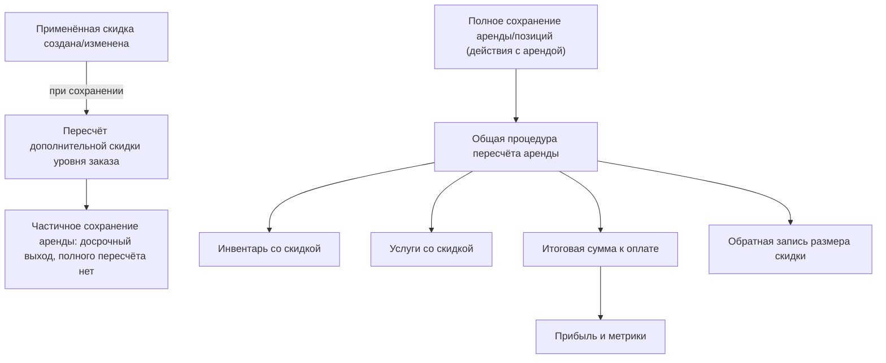

## Что это и зачем

Модуль «Скидки» отвечает за уменьшение стоимости конкретной аренды. Здесь есть две разные сущности, которые легко перепутать:

1. **Скидка (промокод)** — *справочник* скидок и промокодов на уровне компании (название, процент или сумма, период действия, лимит использования). Это шаблон.
2. **Применённая скидка** — скидка, привязанная *к конкретной аренде*. Именно она участвует в расчёте итога. Может ссылаться на скидку из справочника, а может быть «ручной» скидкой без справочника.

<Info>
Фактический пересчёт стоимости аренды с учётом скидок выполняется **не** при сохранении самой скидки, а в общей процедуре пересчёта аренды — там сосредоточена вся арифметика. Создание или редактирование применённой скидки только записывает её данные и **не запускает** полный пересчёт. Единственное, что происходит при сохранении скидки, — пересчитывается лишь суммарная дополнительная скидка уровня заказа, и аренда сохраняется частично (только это поле), из-за чего полный пересчёт стоимости не выполняется. Итоговая сумма к оплате, суммарный размер скидки и размеры отдельных применённых скидок обновятся при следующем «полном» сохранении аренды (изменение позиции, услуги, статуса и т. п.), где пересчёт вызывается явно.
</Info>

Тесно связано с разделом [Тарифы и расчёт стоимости](/ru/logic/tariffs-pricing) (скидка применяется поверх посчитанной по тарифу базовой цены) и с [Клиенты, бонусы и рефералы](/ru/logic/clients-loyalty) (бонусы и рефералы считаются **отдельными** строками, а не скидками).

## Модель данных

### Справочник скидок — «Скидка (промокод)»

| Поле | Назначение |
|------|-----------|
| Название | Название скидки или промокода |
| Величина скидки | Значение: **проценты** или **абсолютная сумма** в зависимости от способа расчёта |
| Тип скидки | Категория: «Скидка», «Промокод» или «Сумма» |
| Способ расчёта | «Процент» или «Фиксированная сумма» |
| Действует с / Действует до | Период действия |
| Промокод | Код промокода |
| Лимит использований | Лимит использований |
| Автор | Автор |
| Активна / Удалена | Флаги; удаление мягкое |

<Warning>
Поля «Действует с» / «Действует до», «Лимит использований», «Активна» и «Промокод» **нигде не проверяются** в момент применения скидки к аренде. Это чисто описательные поля справочника (см. [Известные особенности и ограничения](/ru/logic/known-issues)).
</Warning>

### Применённая скидка

| Поле | Назначение |
|------|-----------|
| Аренда | К какой аренде привязана |
| Строка инвентаря | Скидка на конкретную позицию инвентаря |
| Строка услуги | Скидка на конкретную услугу |
| Тип (из справочника / ручная) | «Из справочника» или «Ручная» |
| Скидка (промокод) | Ссылка на справочную скидку (для типа «Из справочника») |
| Размер скидки | **Вычисленная** сумма скидки в валюте (заполняется расчётом) |
| Куда применяется | «Весь заказ», «Инвентарь», «Услуга» или «Доставка» — на что распространяется скидка уровня заказа |
| По расписанию / Сумма по расписанию | Скидка-график: фиксированная сумма за каждый оплачиваемый день |
| Действует с / Действует до | Период действия внутри аренды (для по-дневного расчёта) |
| Кем добавлена | Кто применил |
| Причина | Причина скидки |

<Note>
Ключевое различие уровней: если задана «Строка инвентаря» или «Строка услуги» — скидка **позиционная** (только на эту позицию или услугу). Если оба поля пустые — скидка **на весь заказ**, и её область определяется полем «Куда применяется» (весь заказ / только инвентарь / только услуги / доставка).
</Note>

## Как это работает

### Типы скидок

<AccordionGroup>
<Accordion title="Процентная из справочника">
Тип «Из справочника», способ расчёта «Процент». Скидка = процент от базовой цены позиции, **пропорционально числу дней** её действия. См. формулу процентного расчёта ниже.
</Accordion>
<Accordion title="Фиксированная сумма из справочника">
Тип «Из справочника», способ расчёта «Фиксированная сумма». Для позиционной скидки берётся ровно величина скидки из справочника (в валюте). Для скидки уровня заказа сумма попадает в дополнительную скидку аренды.
</Accordion>
<Accordion title="Ручная скидка">
Тип «Ручная». Оператор задаёт размер скидки вручную. На уровне заказа берётся как есть; на уровне позиции ограничивается сверху пропорцией дней (см. формулы).
</Accordion>
<Accordion title="Скидка-график (по расписанию)">
Тип «Ручная», признак «По расписанию» включён. Фиксированная сумма по расписанию за каждый оплачиваемый день периода между датами «Действует с» и «Действует до» (выходные из графика исключаются).
</Accordion>
</AccordionGroup>

### Жизненный цикл

<Steps>
<Step title="Создание или редактирование записи">
Через эндпоинты применения скидок к аренде. При сохранении проставляется автор, а для скидок-графиков сразу считаются сумма по расписанию и размер скидки.
</Step>
<Step title="Пересчёт дополнительной скидки при сохранении">
Срабатывает автоматический пересчёт **только** суммарной дополнительной скидки у аренды (сумма всех ручных и фиксированных скидок уровня заказа), и она сохраняется частично. Полный пересчёт цен на этом шаге **не** происходит: при частичном сохранении аренда завершает сохранение досрочно.
</Step>
<Step title="Пересчёт стоимости аренды">
При «полном» сохранении аренды или её позиций вызывается общая процедура пересчёта — здесь скидки применяются к базовым ценам и формируется итоговая сумма к оплате. Она вызывается явно при изменении позиций, услуг, статуса, залога и т. д., **но не** при сохранении самой применённой скидки. То есть эффект применённой скидки на итоговую сумму проявляется при следующем сохранении самой аренды, а не в момент создания записи скидки.
</Step>
<Step title="Обратная запись сумм">
Отдельный шаг пересчёта записывает финальный размер скидки в каждую применённую скидку — эти суммы потом использует отчёт по скидкам и расчёт прибыли.
</Step>
</Steps>



### Область применения: до или после услуг? По позиции или на весь заказ?

Скидки считаются **раздельно по трём корзинам** и потом складываются:

- **Инвентарь** → уменьшает «Сумму за инвентарь» до «Инвентаря со скидкой».
- **Услуги** → уменьшает «Сумму за услуги» до «Услуг со скидкой».
- **Заказ целиком** → сумма фиксированных и ручных скидок уровня заказа собирается в дополнительную скидку и вычитается из общей суммы после услуг.

Доставка в базовую скидку не входит и добавляется отдельно в конце.

### Точные формулы

Расчёт суммы одной скидки для позиции инвентаря:

```text
дней_скидки  = число оплачиваемых дней действия скидки (выходные исключены)
дней_аренды  = число оплачиваемых дней самой позиции инвентаря
цена         = базовая цена позиции

# Процентная скидка (из справочника, способ расчёта «Процент»):
сумма = min( цена, (дней_скидки × цена × величина скидки) / (100 × дней_аренды) )

# Фиксированная сумма на позицию (из справочника, «Фиксированная сумма», задана строка инвентаря):
сумма = min( цена, величина скидки )

# Ручная на позицию (ручная, задана строка инвентаря):
сумма = min( цена, размер скидки, дней_скидки × цена / дней_аренды )

# Ручная на уровне заказа (ручная, строка инвентаря не задана):
сумма = размер скидки          # (в подсчёте по инвентарю обнуляется, учитывается через дополнительную скидку)
```

Скидка на услугу — только процентная, без пропорции дней:

```text
сумма = min( стоимость услуги позиции, (сумма за услуги × величина скидки) / 100 )
```

Итоговая сумма аренды:

```text
дополнительная_скидка = max(дополнительная скидка аренды, 0)

база_к_оплате = округление(
    инвентарь со скидкой + услуги со скидкой − дополнительная_скидка,
    до целого
)

сумма_налога = округление((база_к_оплате + сумма штрафов) × ставка налога, до целого)

# Налог включён в цену:
итоговая_сумма = округление(база_к_оплате + сумма штрафов + стоимость доставки, до целого)
# Налог не включён в цену:
итоговая_сумма = округление((база_к_оплате + сумма штрафов) × (1 + ставка налога) + стоимость доставки, до целого)

# Итоговая «скидка» для отображения:
скидка на инвентарь = сумма за инвентарь − инвентарь со скидкой
скидка на услуги    = сумма за услуги   − услуги со скидкой
размер скидки       = скидка на инвентарь + скидка на услуги + дополнительная_скидка
```

Здесь итоговая сумма — это финальная сумма аренды **к оплате** (с учётом скидок, штрафов, налога и доставки), а размер скидки — суммарный размер предоставленной скидки.

### Правила комбинирования (стекинг)

Признак «Суммировать скидки» аренды (по умолчанию включён) — флаг **на уровне всей аренды**, а не отдельной позиции — управляет способом суммирования:

- **«Суммировать скидки» включено** (актуальный путь): все применимые скидки к позиции суммируются вместе, и результат вычитается из цены с отсечкой снизу нулём: итоговая цена позиции = max(цена − сумма всех скидок, 0).
- **«Суммировать скидки» выключено** — устаревший путь; отдельно считает процентные (позиционные) и суммовые скидки.

<Tip>
Каждая отдельная скидка ограничена сверху ценой позиции, а итог по позиции — ограничен снизу нулём. Поэтому даже при стекинге стоимость позиции не уйдёт в минус.
</Tip>

### Взаимодействие с бонусами и рефералами

Это **не** скидки и в итоговую сумму через механизм скидок не попадают:

- **Бонусы лояльности** начисляются постфактум как процент от уже посчитанной итоговой суммы: бонус = итоговая сумма × процент бонуса / 100. Списание бонусов — отдельные операции, см. [Клиенты, бонусы и рефералы](/ru/logic/clients-loyalty).
- **Рефералы** живут в отдельном поле «Реферальное вознаграждение» и своей отдельной логике; в формулу скидки не входят.

### Числовой пример

<Note>
Аренда на 10 дней, позиция стоит `10 000` (базовая цена по тарифу за весь период), процентная скидка 20% из справочника на всю аренду, услуг и доставки нет, налог 0%.
</Note>

```text
дней_скидки = 10, дней_аренды = 10, цена = 10 000, величина скидки = 20
сумма = min(10000, (10 × 10000 × 20) / (100 × 10)) = min(10000, 2000) = 2000

сумма за инвентарь   = 10 000
инвентарь со скидкой = 10 000 − 2000 = 8 000
дополнительная скидка = 0
итоговая сумма        = округление(8000 + 0 − 0) = 8 000   (налога и доставки нет)
размер скидки         = (10000 − 8000) + 0 + 0 = 2 000
```
