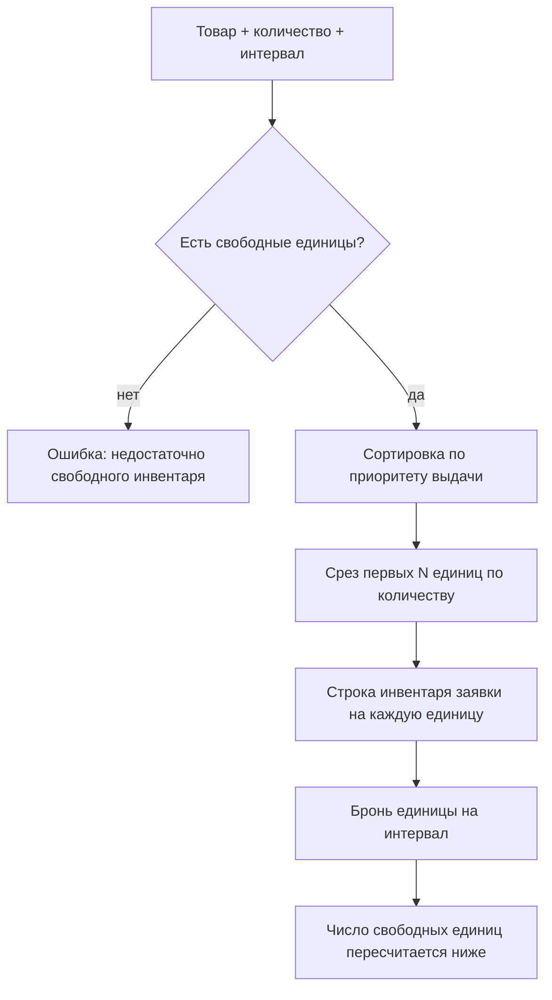

**Товар** — это пул одинаковых, взаимозаменяемых единиц инвентаря. Например «10 одинаковых перфораторов». При аренде клиенту выдаётся *любая* свободная единица из пула, а не конкретная заранее выбранная.

<Note>
Товар отвечает на вопрос «сколько одинаковых штук у меня есть». Отдельные физические экземпляры — это [Единицы инвентаря](/ru/logic/inventory), привязанные к товару. Именно единица, а не товар, имеет статус (свободна / в аренде / сломана и т. д.). Сам товар «остаток» не хранит — доступность вычисляется на лету из связанных единиц. Наборы из *разных* товаров — это [Комплекты](/ru/logic/inventory-sets).
</Note>

Смежные страницы: [Инвентарь](/ru/logic/inventory), [Комплекты](/ru/logic/inventory-sets), [Тарифы и расчёт стоимости](/ru/logic/tariffs-pricing), [Аренда: заявка и жизненный цикл](/ru/logic/rent-lifecycle).

## Модель данных

| Поле | Назначение |
| --- | --- |
| Название, Артикул, Штрихкод | Идентификация товара |
| Тип (аренда/продажа) | «Аренда» или «Продажа» |
| Категория, Скидка (промокод), Точка проката | Категория, привязанная скидка, точка проката |
| Единица измерения / Цена за единицу / Кол-во единиц / Сумма по единицам | Учёт «наливного» инвентаря (литры, кг и т. д.). Сумма по единицам пересчитывается при сохранении |
| Срок службы, мес. | Ожидаемый срок эксплуатации |
| Опубликован | Видимость в витрине магазина |
| Архивация | Мягкое удаление / архивация / списание товара (единая запись «Архивация», см. [Инвентарь](/ru/logic/inventory#архивация-вместо-жёсткого-удаления)) |

Отдельные единицы — это «Единица инвентаря», привязанная к товару через поле «Группа». Тарифы товара хранятся в общей таблице тарифов (одна и та же сущность обслуживает и одиночную единицу, и товар, и позицию комплекта); детали ценообразования — в разделе [Тарифы и расчёт стоимости](/ru/logic/tariffs-pricing).

## Как это работает

### Доступность товара

Товар сам по себе не хранит «остаток» — он вычисляется на лету из связанных единиц инвентаря. Два ключевых показателя рассчитываются в списке товаров:

- **сколько единиц всего** принадлежит товару (не проданы, не в архиве, не на складе);
- **сколько единиц свободно** на заданный интервал (плановое начало — плановое окончание).

Свободность считается так: из всех единиц товара исключаются те, у которых есть пересекающаяся бронь со статусом «В аренде» или «Забронирована», а также проданные, на складе, сломанные, заархивированные и удалённые.

<Info>
Интервал пересечения расширяется буфером (в минутах) на левом краю: бронь считается пересекающейся, если её окончание позже, чем «плановое начало минус буфер». Это «зазор» между арендами на подготовку единицы. Размер буфера задаётся в настройках компании (см. [Флаги функций](/ru/logic/feature-flags)).
</Info>

### Выдача единицы при аренде товара

Когда товар добавляют в заявку, конкретная единица выбирается автоматически.

<Steps>
<Step title="Подбор тарифа">
По товару (или конкретной единице) и периоду тарификации выбирается тариф. Для аренды берётся тариф товара без привязки к комплекту; для продажи — тариф без периода тарификации.
</Step>
<Step title="Фильтр свободных единиц">
Отбираются единицы товара со статусом «Свободна» на заданный интервал, с учётом точки проката и условий подбора по доп. данным. Если свободных меньше, чем запрошено, возникает ошибка «Недостаточно свободного инвентаря».
</Step>
<Step title="Приоритет выдачи">
Порядок сортировки зависит от настройки приоритета выдачи: случайный, «сначала свои» (собственные единицы прежде субарендных) или «сначала субаренда».
</Step>
<Step title="Срез по количеству">
Из отсортированного набора берутся первые нужные по количеству единицы; каждой проставляются тариф, цена тарифа и длительность тарифа.
</Step>
</Steps>

Результат — список «строк аренды», из которых далее создаются строки инвентаря заявки (по одной на каждую физическую единицу). Резервирование единицы **не** уменьшает счётчик у товара напрямую — оно создаёт бронь, и следующий расчёт свободных единиц уже учтёт занятость.

<Tip>
Дальше: как из товаров собираются наборы — [Комплекты](/ru/logic/inventory-sets).
</Tip>
