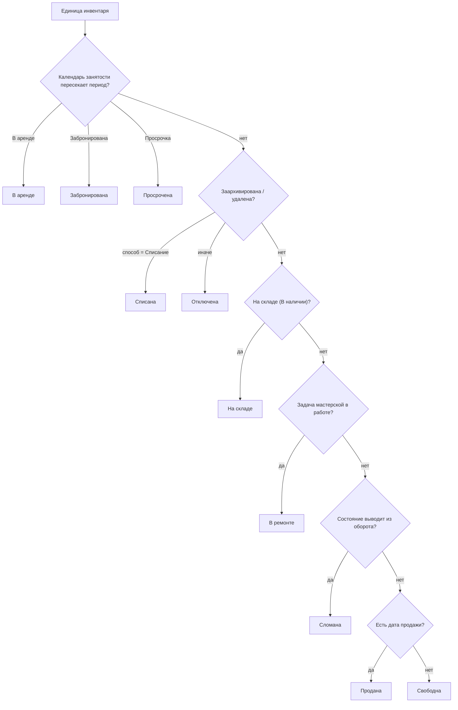

## Что это и зачем

**Единица инвентаря** — это единица учёта, вокруг которой построена вся аренда. Это конкретный физический экземпляр (одна лодка, один самокат, одна дрель с серийным номером), а не абстрактный товар. Абстрактный «товар с количеством» — это [Товар](/ru/logic/inventory-groups), внутри которого лежат конкретные единицы инвентаря.

Ключевая особенность: у самой единицы инвентаря **нет сохранённого статуса**. Статус (свободна / в аренде / сломана / на складе и т. д.) вычисляется динамически в момент запроса, исходя из связанных данных: календаря занятости, задач мастерской, склада, архивации и состояния. Это центральная логика модуля — см. раздел [«Как это работает»](#kak-eto-rabotaet).

<Note>
Единица инвентаря относится к конкретной компании и хранится в её собственных данных. При этом она может ссылаться на общий аккаунт пользователя (владельца субаренды) — это допустимая в проекте связь между данными компании и общими данными.
</Note>

## Модель данных

### Единица инвентаря — основная сущность

| Поле | Назначение |
|------|-----------|
| Название | Название экземпляра. |
| Артикул | Артикул / инвентарный номер. Уникальность проверяется при сохранении, только если у компании включена проверка уникальности артикула. |
| ID устройства | Идентификатор устройства (только для чтения). |
| Тип (аренда/продажа) | «Аренда» или «Продажа»; по умолчанию «Аренда». |
| Закупочная цена / Дата закупки | Закупочная цена и дата покупки. |
| Цена продажи / Дата продажи | Цена и дата продажи. Заполненная дата продажи → статус «Продана». |
| Срок службы, мес. | Срок службы (для амортизации, см. [Прибыль и окупаемость](/ru/logic/profit-payback)). |
| Рыночная стоимость | Складская/остаточная стоимость. |
| Категория | Категория. |
| Товар | Товар, к которому относится экземпляр. |
| Точка проката | Точка проката, где физически находится экземпляр. |
| Состояние | Ручное состояние; если состояние помечено как выводящее из оборота → статус «Сломана». |
| Владелец субаренды | Владелец субарендованного экземпляра (см. [Субаренда](#subarenda)). |
| Процент субаренды | Доля прибыли (0–100), которая уходит владельцу. |
| Заработок до подключения в систему | Накопленный доход из прежней системы учёта (для окупаемости). |
| Доп. данные | Дополнительные поля; используется, например, для хранения пробега. |

<Info>
Склад, архивация, авто, страховка, замеры пробега, тарифы и доступность **не являются собственными полями** единицы инвентаря — это связанные записи из других сущностей. Например, складская запись и архивация привязываются к единице инвентаря «один к одному» из соответствующих справочников.
</Info>

### Расширения инвентаря

| Расширение | Связь | Назначение |
|--------|-------|-----------|
| Авто/самокат/мотоцикл | Один к одному | Транспорт: госномер, техпаспорт, VIN, марка, модель, серийный номер. Тип — авто / самокат / мотоцикл. |
| Страховка | Один к одному | Страховка: тип (КАСКО/ОГПО), страховая компания, номер полиса, сумма, срок действия. |
| Замеры пробега | Много к одному | Точки замера пробега; каждая запись может запускать уведомление о ТО. |
| Периоды субаренды | Много к одному | Периоды субаренды с процентом (историческая сущность, см. [известные особенности](#izvestnye-osobennosti-i-ogranicheniya)). |
| Тариф инвентаря | Много к одному | Тарифы, привязанные к экземпляру (детали ценообразования — в [Тарифы](/ru/logic/tariffs-pricing)). |
| Календарь занятости | Много к одному | Занятые периоды: календарь брони/аренды. |
| Архивация | Один к одному | Архивация: удаление / архив / списание с указанием способа. |
| Справочник состояний | Много к одному | Справочник ручных состояний (выводит из оборота, отправляет в мастерскую, задаёт этап и цвет). |

### Транспорт (авто, самокат, мотоцикл)

Для транспортного проката единица инвентаря дополняется **карточкой транспорта** — отдельной связанной записью «один к одному». Она хранит регистрационные и технические данные экземпляра:

| Поле | Назначение |
|------|-----------|
| Тип транспорта | «Машина», «Электросамокат» или «Мотоцикл/Мопед»; по умолчанию «Машина». |
| Госномер | Государственный регистрационный номер. |
| Техпаспорт | Номер техпаспорта. |
| Серийный номер | Серийный номер экземпляра. |
| VIN | VIN-код (до 18 символов). |
| Марка | Марка (например, Toyota). |
| Модель | Модель (например, Camry). |
| Доп. данные | Дополнительные поля карточки транспорта. |

<Note>
Карточка транспорта подмешивается в [список инвентаря](#spisok-inventarya) только если у компании включён учёт транспорта. Пробег хранится не в карточке транспорта, а в доп. данных самой единицы инвентаря и обновляется замерами пробега (см. [«Пробег и уведомления о ТО»](#probeg-i-uvedomleniya-o-to)).
</Note>

### Календарь занятости

Каждая запись календаря — это интервал занятости конкретной единицы инвентаря в рамках одной аренды. Ключевые данные записи:

- Статус аренды в момент интервала («Забронирована», «В аренде» и т. д.).
- Признак выдачи: ещё не выдана / уже выдана (после фактической выдачи).
- Признак просрочки (аренда затянулась дольше плана).

Календарь занятости — это денормализованная (заранее подготовленная) проекция позиций аренды. Он синхронизируется отдельной процедурой обновления: в рамках одной транзакции текущие записи сравниваются с актуальным состоянием аренды и приводятся к нему (лишние удаляются, изменившиеся обновляются, новые создаются).

## Как это работает

### Вычисление статуса и доступности

Статус экземпляра не хранится, а собирается «на лету» тремя способами.

<Steps>
<Step title="Статус с учётом периода">
Каждой единице инвентаря присваивается статус, исходя из пересечения с календарём занятости на заданном окне времени. Приоритет условий — первое сработавшее выигрывает:

```text
В аренде     ← есть запись календаря со статусом аренды «В аренде», пересекающая период
Забронирована ← есть запись календаря со статусом аренды «Забронирована», пересекающая период
Просрочена    ← есть запись календаря с признаком просрочки
Списана       ← архивация со способом «Списание»
Отключена     ← есть архивация ИЛИ экземпляр удалён
На складе     ← есть складская запись со статусом «В наличии»
В ремонте     ← есть задача мастерской в работе (новая или в процессе)
Сломана       ← состояние помечено как выводящее из оборота
Продана       ← заполнена дата продажи
по умолчанию → Свободна
```
</Step>
<Step title="Буфер между арендами">
При проверке пересечения нижняя граница окна сдвигается назад на настраиваемое число минут — буфер между арендами:

> Экземпляр считается занятым по формуле: конец интервала занятости > (начало запрашиваемого окна − буфер в минутах).

То есть экземпляр считается занятым ещё какое-то время после возврата — это интервал на обслуживание/уборку между арендами. По умолчанию буфер равен 0 минут.
</Step>
<Step title="Статус без учёта периода">
Упрощённая версия для случаев, когда период не важен (складской/сервисный контекст). Она не учитывает календарь аренды и не различает «В аренде» / «Забронирована» / «Просрочена». Задачи мастерской здесь дают статус «Сломана», а не «В ремонте».
</Step>
<Step title="Только реально свободные">
Возвращает экземпляры, доступные для брони на окне: исключает всё, что имеет пересекающийся интервал занятости (в статусах «В аренде» / «Забронирована» или с признаком просрочки), продано, на складе, сломано, заархивировано или удалено.
</Step>
</Steps>

Порядок веток на диаграмме соответствует порядку проверок при расчёте статуса с учётом периода (календарь занятости проверяется **раньше** архивации):



<Warning>
Порядок условий важен и не совпадает между расчётом статуса с учётом периода и расчётом без учёта периода. При расчёте с учётом периода задача мастерской даёт статус «В ремонте», а при расчёте без периода — «Сломана». Кроме того, есть жёстко зашитое исключение для одной конкретной компании, у которой задачи мастерской вообще не влияют на статус.
</Warning>

### Архивация вместо жёсткого удаления

Удаление экземпляра не стирает запись, а создаёт архивацию со способом «Удаление». Способы архивации:

| Способ | Смысл | Влияние на статус |
|-------|-------|-------------------|
| Удаление | Удалён | Отключена |
| Архив | В архиве | Отключена |
| Списание | Списан | Списана |

После создания архивации пересчитываются лимиты компании.

<Note>
Запись «Архивация» — единственный источник истины для удаления/архивации/списания единицы инвентаря: отдельных флагов «Удалён»/«Дата удаления» на самой единице инвентаря больше нет. Архивация хранит способ (Удаление/Архив/Списание), автора, дату и причину, и только она даёт отдельный статус «Списана». Тот же механизм используется для товаров, комплектов, клиентов и большинства справочников — см. [Известные особенности и ограничения](/ru/logic/known-issues).
</Note>

### Субаренда

Субаренда — это когда компания сдаёт чужой инвентарь и делит выручку с владельцем. Реализована **двумя полями прямо на единице инвентаря**: владелец субаренды и процент субаренды (его доля). В метриках доход делится так:

> Доход владельца = прибыль × процент субаренды ÷ 100
>
> Доход компании = прибыль × (100 − процент субаренды) ÷ 100

Пример: аренда принесла прибыль 10 000, процент субаренды 30 → владельцу 3 000, компании 7 000.

В сводке по инвентарю счётчики разбиваются на «свои» (без владельца субаренды) и «субаренда» (с указанным владельцем субаренды).

### Пробег и уведомления о ТО

Каждый замер пробега при сохранении:

1. Обновляет сохранённый в доп. данных экземпляра текущий пробег.
2. Проверяет активные записи ТО, у которых периодичность задана по пробегу, и считает порог срабатывания:

> Для периодического ТО: остаток до срабатывания = целевой пробег ТО − текущий пробег + накопленный пробег ТО.
>
> Для остальных случаев: остаток до срабатывания = целевой пробег ТО − текущий пробег.
>
> Если остаток до срабатывания не больше порога → отправляется уведомление о ТО.

<Note>
Проверка срабатывает только если у компании подключена интеграция ТО.
</Note>

### Перенос между точками проката

Массовая операция переноса меняет точку проката сразу у списка экземпляров: все выбранные экземпляры получают одну и ту же новую точку проката. Операция доступна только суперпользователю.

### Массовые операции и импорт

- **Массовое переназначение товара**: выбранные экземпляры переносятся в другой товар одним обновлением.
- **Импорт экземпляров**: создаёт недостающие категории, товары и точки проката «на лету» и массово создаёт инвентарь. Ошибки собираются построчно, но при любой ошибке транзакция откатывается и возвращается только первая.
- **Импорт товаров с генерацией экземпляров**: создаёт товары и разворачивает заданное количество экземпляров с артикулами вида «артикул товара — номер», а также заводит тариф по умолчанию на 1 день.

### Список инвентаря

Список инвентаря отдаёт экземпляры с вычисленным статусом на окне времени (по умолчанию — «сейчас ± 1 минута»). Особенности:

- Фильтр по дополнительным полям: любые параметры запроса, относящиеся к доп. данным, превращаются в условия поиска по пользовательским полям.
- Если у компании включён учёт транспорта, к экземплярам подмешиваются данные авто, а также заранее подгружаются активные аренды — чтобы вычислить текущего клиента экземпляра.
- Сортировка по умолчанию — сначала по статусу, затем по дате создания (сначала новые).

<Tip>
Связанные страницы: [Товары (группы единиц)](/ru/logic/inventory-groups), [Комплекты](/ru/logic/inventory-sets), [Тарифы и расчёт стоимости](/ru/logic/tariffs-pricing), [Аренда: заявка и жизненный цикл](/ru/logic/rent-lifecycle), [Прибыль и окупаемость](/ru/logic/profit-payback), [Фоновые процессы (Celery)](/ru/logic/background-tasks).
</Tip>
