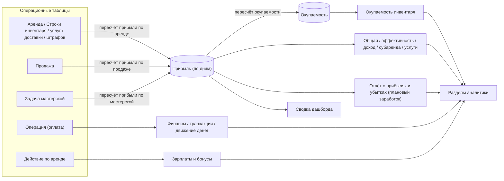

Подсистема «Метрики и аналитика» — это набор аналитических разделов (плюс сводка дашборда), которые превращают операционные данные (аренды, операции оплаты, инвентарь, доставки, воронки) в бизнес-показатели: выручку, окупаемость, эффективность, зарплатные бонусы, отток клиентов и т.д. Все эти разделы работают только на чтение — они не меняют данные, а лишь агрегируют их.

Почти вся денежная аналитика строится поверх денормализованной таблицы «Прибыль (по дням)» — это дневная разбивка прибыли по каждой позиции аренды, продажи или задачи мастерской. Логика её пересчёта и таблица «Окупаемость» вынесены на отдельную страницу — см. [Прибыль и окупаемость](/ru/logic/profit-payback). Здесь мы описываем, как метрики *читают* эти данные.

## Модель данных

Метрики не имеют собственных «толстых» таблиц — они читают операционные данные. Есть один служебный объект для прав доступа и две денормализованные таблицы аналитики.

| Сущность | Роль в метриках |
| --- | --- |
| Права доступа к метрикам | Служебный объект без собственной таблицы; хранит только набор разрешений (продажи, финансы, отчёт о прибылях и убытках, доход инвентаря, зарплаты, субаренда и др.). Через него проверяется, какие разделы аналитики доступны сотруднику. |
| Прибыль (по дням) | Дневная разбивка прибыли: «Плановый заработок (со скидкой)» (начисленный/ожидаемый) и «Фактическая прибыль» (оплаченный), привязанная к строке инвентаря, строке услуги, строке доставки, штрафу, позиции продажи или задаче мастерской. Основной источник всех денежных метрик. |
| Окупаемость | Агрегированная окупаемость по единицам инвентаря (плановый заработок, фактический заработок, окупаемость в процентах, срок окупаемости). Одна запись на каждую единицу инвентаря. |
| Операция (оплата) | Фактические платежи (приход/расход, обмен, статья прихода/расхода, категория). Источник для финансов, транзакций, движения денег. |
| Действие по аренде | Действия сотрудников над арендой (создание, бронирование, сборка, выдача, приём) — база для расчёта зарплатных бонусов. |

<Info>
Ключевое разделение внутри таблицы «Прибыль (по дням)»: **«Плановый заработок (со скидкой)»** — сколько *должно* быть начислено за день (за вычетом скидок и выходных); **«Фактическая прибыль»** — сколько из этого реально *оплачено* клиентом (ограничено суммой «Оплачено» по аренде). Разница «плановый заработок минус фактическая прибыль» трактуется как долг. Метрики выручки и отчёта о прибылях и убытках опираются на плановый заработок, метрики фактической оплаты — на фактическую прибыль.
</Info>

### Общий фильтр прибыли

Почти каждый денежный запрос применяет общий фильтр прибыли, чтобы исключить «мусорные» позиции (черновики, отменённые без оплаты). В выборку попадают строки прибыли, относящиеся к арендам, услугам, доставкам, штрафам, задачам мастерской и продажам, при следующих условиях:

- **Аренда, услуга, доставка, штраф** — аренда не удалена и её статус «В аренде», «Завершена» или «Должник»; либо аренда «Отменена», но по ней есть оплата (оплачено больше нуля).
- **Задача мастерской** — задача в статусе «Выполнена» или «В работе».
- **Продажа** — продажа в статусе «Продано».

<Warning>
Общий фильтр прибыли **не включает** обслуживание (ТО): оно считается расходом и в «выручку по общему фильтру» не попадает. При этом отдельные разделы всё же считают обслуживание через явные аннотации (например, общая дневная сводка).
</Warning>

## Как это работает

### Общий фильтр периода

Даты диапазона — самый переиспользуемый кусок логики. Есть два независимых механизма.

<AccordionGroup>
<Accordion title="Диапазон дат">
Базовый механизм, от которого наследуется большинство разделов метрик. Читает из запроса параметры «начало», «конец» и «сегодня». Значения по умолчанию:

- начало → первое число текущего месяца;
- конец → первое число следующего месяца.

Поле даты принимает как формат «ГГГГ-ММ-ДД», так и «ГГГГ-ММ-ДД ЧЧ:ММ:СС».

<Warning>
Дефолтный «конец» — это начало *следующего* месяца, поэтому фильтры «дата не позже конца периода» захватывают весь текущий месяц. Но некоторые разделы считают длительность как «конец минус начало», из-за чего последний день может «недобираться» на графиках (см. замечания).
</Warning>
</Accordion>

<Accordion title="Гранулярность (шаг агрегации)">
Отдельный механизм, определяющий *шаг* агрегации по параметру запроса: год, квартал, месяц, неделя, час (по умолчанию — день). В зависимости от выбранного шага результаты группируются по соответствующему периоду.
</Accordion>

<Accordion title="Заполнение пропусков">
Механизм берёт разреженный результат агрегации (набор точек «дата → количество, сумма») и достраивает недостающие точки нулями, чтобы график был непрерывным:

- шаг «день» → одна точка на каждый день диапазона;
- шаг «неделя» → каждые 7 дней;
- шаг «час» → 24 точки по часам суток.

Пропущенные значения заполняются нулями.
</Accordion>
</AccordionGroup>

### Каталог групп метрик

Ниже — сводная таблица. Все денежные суммы, если не сказано иного, агрегируются из таблицы «Прибыль (по дням)» с применением общего фильтра прибыли.

| Группа | На какой вопрос отвечает |
| --- | --- |
| Общая (дневная) | Дневная сводка: сколько аренд/услуг/доставок/штрафов/продаж и на какой плановый и фактический заработок |
| Финансы (реестр) | Реестр всех операций оплаты с клиентом и статусом |
| Отчёт о прибылях и убытках | Прибыль/расходы по месяцам плюс прогноз (плановый заработок) по типам |
| Движение денег (cashflow) | Приход/расход/сальдо и остатки по месяцам |
| Транзакции | Фактические платежи: по дням, по типам, реестр |
| Штрафы | Начисленные/оплаченные/непогашенные штрафы |
| Скидки | Сводка по видам скидок и история их применения |
| Депозиты | Полученные/возвращённые залоги |
| Услуги | Прибыль по услугам, по исполнителям, история |
| Зарплаты | Оклад плюс бонусы сотрудников за действия над арендами |
| Субаренда | Доход владельцев переданного в субаренду инвентаря |
| Амортизация | Износ и остаточная стоимость инвентаря |
| Доход инвентаря | Заработок и окупаемость по единицам инвентаря и товарам |
| Эффективность | Дни загрузки, упущенная выручка, конверсия |
| Рефералы | Начисления реферальным агентам |
| Клиенты | Пожизненная ценность клиента, отток, повторные заявки, топ-клиенты, демография |
| Смены | Рабочие смены сотрудников |
| Модули | Доставки, мастерская, воронка продаж, магазин, инвентаризация |
| Бонусы | Баланс и история бонусных баллов клиентов |
| Дашборд | Единый экран: выручка, загрузка, долги, категории |

### Ключевые формулы

<Steps>
<Step title="Общая дневная сводка">
Раздел общей сводки группирует записи прибыли по дате и считает по каждому типу количество (по уникальным значениям) и сумму планового заработка с соответствующим под-фильтром. Пагинированный ответ добавляет агрегаты по всему диапазону.

Детализация дополнительно подтягивает сумму платежей клиента за тот же день (из операций оплаты).
</Step>

<Step title="Отчёт о прибылях и убытках по месяцам">
Раздел собирает три набора данных:
- фактические расходы и прибыль из операций оплаты (только по активным категориям, без операций обмена) по годам и месяцам;
- прогноз (плановый заработок) из таблицы прибыли по типам;
- разбивку по категориям.

Сальдо считается как прогноз плюс расходы (расходы приходят со знаком «минус»):

«Сальдо = плановый заработок (прогноз) + расходы»
</Step>

<Step title="Движение денег и остатки">
Раздел движения денег считает приход (операции прихода) с разбивкой по источникам (аренда, продажа, мастерская, обслуживание, залог, бонусы), расход (операции расхода) и сальдо как «приход плюс расход». Остатки строятся накопительно от периода к периоду (баланс предыдущего периода переносится в следующий).

<Warning>
Из-за несовпадения ключей при сопоставлении остатков с периодами карта остатков схлопывается в один «мусорный» ключ и не находится по реальным году и месяцу. В результате начальный и конечный остатки почти всегда возвращаются нулевыми. См. замечания.
</Warning>
</Step>

<Step title="Штрафы: оплаченная и остаточная сумма">
Для каждого штрафа считается:

```text
Оплачено      = сумма фактической прибыли по штрафу   # сколько штрафа реально оплачено
Остаток       = Сумма штрафа − Оплачено
Статус оплаты = «Ожидает оплаты» (оплачено = 0) | «Оплачена» (остаток = 0) | «Частично оплачена»
```
Учитываются только автоматические штрафы с привязкой к инвентарю или любые ручные штрафы с ненулевой суммой.
</Step>

<Step title="Амортизация инвентаря">
Линейный износ:

```text
Срок службы (для расчёта) = min( срок службы единицы или срок службы категории или 12; 12 )   # мес., максимум 12
Использовано (мес.)       = (текущий год − год закупки)×12 + (текущий месяц − месяц закупки)     # если дата закупки не указана → берётся срок службы
Износ в месяц             = Закупочная цена / срок службы (для расчёта)   (0, если использовано > срока службы; и только при сроке службы > 0)
Накопленный износ         = min( износ в месяц × min(использовано; срок службы); Закупочная цена )
Остаточная стоимость      = max( Закупочная цена − накопленный износ; 0 )
```
</Step>

<Step title="Эффективность инвентаря (загрузка)">
Для каждой единицы инвентаря за период считается:

```text
Всего дней       = (конец периода − начало периода) + 1        # всего дней в периоде
Дней с прибылью  = число уникальных дней с прибылью (по общему фильтру прибыли)
Дней простоя     = max( Всего дней − Дней с прибылью; 0 )
Выручка          = сумма планового заработка
Эффективность    = min( round( 100 × Дней с прибылью / Всего дней; 2 ); 100 )   # % загрузки
Упущенная выручка = Выручка × 100 / Эффективность − Выручка     (0, если эффективность = 0)
```

А по арендам считается конверсия:

```text
Эффективность = round( 100 × число успешных заявок / общее число заявок; 2 )   # доля успешных заявок
```
где успешные заявки — это аренды со статусом «В аренде», «Завершена» или «Должник».
</Step>

<Step title="Субаренда: доли владельца и компании">
Прибыль делится по проценту субаренды единицы инвентаря:

```text
Заработок         = сумма фактической прибыли      (статусы «Завершена», «Должник»)
Ожидается         = сумма планового заработка       (статусы «В аренде», «Забронирована», «Должник»)
Доход владельца   = сумма фактической прибыли × процент субаренды / 100
Доход компании    = сумма фактической прибыли × (100 − процент субаренды) / 100
```
В расчёт попадают только администраторы текущей компании, и только если у компании включён режим субаренды.
</Step>

<Step title="Зарплатные бонусы сотрудников">
Для каждого типа действия (создание, бронирование, сборка, выдача, приём) считается:

```text
Заработок за действие = сумма планового заработка по инвентарю этого действия × процент
процент               = процент вознаграждения из аренды / 100   (если для аренды задан индивидуальный процент)
                        иначе процент из настроек компании / 100
```
Доставка считается отдельно, по формуле «стоимость доставки + процент за доставку × (итоговая сумма к оплате − стоимость доставки) / число дней аренды». Итог: «итоговая сумма = сумма всех бонусов + оклад» (оклад умножается на число месяцев в периоде).
</Step>

<Step title="Клиенты: пожизненная ценность, отток, повторные заявки, демография">
Набор эвристик:

```text
Пожизненная ценность = средний платёж × клиенты с повторными заявками / (число заявок × 3)
Отток (churn)        = 100 × (q1 + q3 − q2) / q1
                       q1 = уникальные клиенты за прошлый период
                       q2 = уникальные клиенты за текущий период
                       q3 = уникальные клиенты, созданные и арендовавшие в текущем периоде
Пол                  = определяется по 7-й цифре ИИН (чётная → женский, нечётная → мужской)
Возраст              = группы по дате рождения из документа физлица
```

<Warning>
Показатель удержания клиентов (Customer Retention Rate) захардкожен и всегда возвращает нули в текущем и предыдущем периодах. А отток (churn) в обзоре возвращает одно и то же значение в текущем и предыдущем периодах. См. замечания.
</Warning>
</Step>

<Step title="Доход и окупаемость инвентаря">
Раздел дохода инвентаря объединяет:
- прибыль (количество, плановый заработок, фактическая прибыль) по общему фильтру прибыли;
- окупаемость (срок окупаемости, окупаемость в процентах, плановый и фактический заработок);
- статьи прихода/расхода по актам (приход и расход берутся по модулю суммы).

«Переокупаемость = max( сумма фактического заработка по окупаемости − сумма закупочных цен; 0 )». Детали окупаемости и как заполняется таблица «Окупаемость» — на странице [Прибыль и окупаемость](/ru/logic/profit-payback).
</Step>

<Step title="Магазин: рентабельность продаж">
По группам проданного инвентаря (статус «Продано»):

```text
Сумма себестоимостей   = сумма закупочных цен проданных единиц
Прибыль                = итоговая сумма продажи − сумма себестоимостей
Наценка                = Прибыль / сумма себестоимостей × 100      (если прибыль > 0)
Рентабельность продаж  = Прибыль / итоговая сумма продажи × 100
```
</Step>

<Step title="Дашборд-сводка">
Сводка дашборда собирает единый экран: выручка за сегодня и за месяц с трендом, загрузка парка (сколько в аренде, процент загрузки), долги, загрузка по категориям и график выручки за 14 дней.

Тренд считается так:

«Изменение, % = (текущее значение − предыдущее) / предыдущее × 100» (округляется до одного знака; считается только если предыдущее значение больше нуля).

Выручка везде — сумма планового заработка по общему фильтру прибыли. Долг — сумма «итоговая сумма к оплате минус оплачено» по активным неоплаченным арендам.
</Step>
</Steps>

### Поток данных (общая картина)



<Tip>
Связанные страницы: [Прибыль и окупаемость](/ru/logic/profit-payback) (как заполняются «Прибыль (по дням)» и «Окупаемость»), [Депозиты, штрафы и транзакции](/ru/logic/deposits-penalties), [Скидки](/ru/logic/discounts), [Клиенты, бонусы и рефералы](/ru/logic/clients-loyalty), [Фоновые процессы (Celery)](/ru/logic/background-tasks) (пересчёт прибыли идёт фоновыми задачами).
</Tip>
