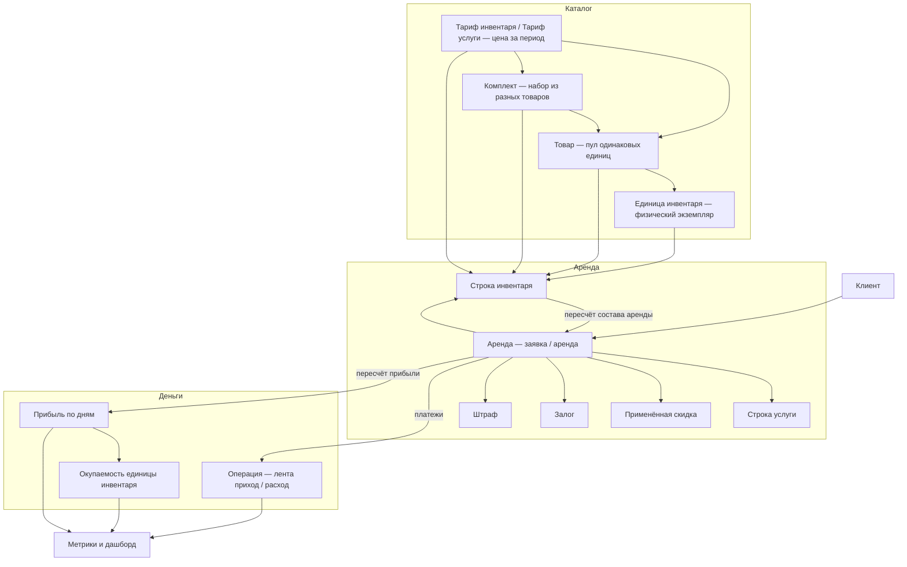
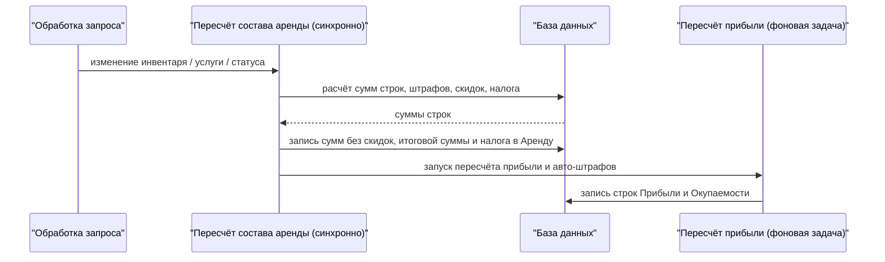

Этот раздел — **разбор бизнес-логики** модуля аренды Yume: как связаны инвентарь, товары и комплекты, аренда, тарифы, скидки, штрафы, операции, метрики и прибыль, и по каким правилам считается каждая величина. Материал рассчитан на продакт-менеджеров и разработчиков, которым нужно понять реальную логику системы, а не только её пользовательский интерфейс.

<Note>
Все проблемы и ограничения, выявленные при разборе логики, собраны на отдельной странице [Известные особенности и ограничения](/ru/logic/known-issues) — сгруппированы по модулям. Ниже — карта модуля и сводная таблица находок с приоритетами.
</Note>

## Карта модуля

Модуль аренды работает в отдельной изолированной области данных каждой компании. Центральная сущность — **Аренда**, вокруг которой собраны инвентарь, деньги и аналитика.

## Как считаются деньги (сквозной поток)

Ключ к пониманию модуля — **пересчёт состава аренды**. Это синхронная операция, которая при каждом изменении состава аренды заново пересчитывает всю её арифметику: суммы строк, скидки, налог и штрафы. Расчёт выполняется целиком на стороне базы данных.

<Warning>
Важно не путать две денежные величины аренды: **Сумма без скидок** — это стоимость **до** применения скидок и налога, а **Итоговая сумма к оплате** — это финальная сумма после скидок, со штрафами, налогом и доставкой (это не «размер скидки»). См. [Тарифы и расчёт стоимости](/ru/logic/tariffs-pricing).
</Warning>

## Страницы раздела

<CardGroup cols={2}>
<Card title="Инвентарь" icon="boxes-stacked" href="/ru/logic/inventory">
Физический экземпляр, вычисляемый статус (статус не хранится в базе, а вычисляется), доступность с буфером, субаренда, страховка, авто.
</Card>
<Card title="Товары (группы единиц)" icon="layer-group" href="/ru/logic/inventory-groups">
Товар = пул взаимозаменяемых единиц; доступность вычисляется на лету, единица подбирается автоматически при аренде.
</Card>
<Card title="Комплекты" icon="puzzle-piece" href="/ru/logic/inventory-sets">
Комплект = набор из разных товаров со своей ценой и тарифами; цена собирается из позиций, число комплектов ограничено дефицитной позицией.
</Card>
<Card title="Аренда: жизненный цикл" icon="diagram-project" href="/ru/logic/rent-lifecycle">
Аренда, семь статусов (включая отдельный «Просрочена»), паузы, расписания, доставки.
</Card>
<Card title="Тарифы и расчёт стоимости" icon="calculator" href="/ru/logic/tariffs-pricing">
Ядро ценообразования: сумма за инвентарь = цена тарифа × округлённое вверх число периодов; налог, штрафы, «заморозка» тарифа.
</Card>
<Card title="Скидки" icon="percent" href="/ru/logic/discounts">
Справочник скидок и применённые скидки; процент / фиксированная сумма, отдельная позиция / весь заказ.
</Card>
<Card title="Депозиты, штрафы, транзакции" icon="money-bill-transfer" href="/ru/logic/deposits-penalties">
Залоги, авто-начисление пени, лента операций, расчёт долга и баланса.
</Card>
<Card title="Метрики и аналитика" icon="chart-line" href="/ru/logic/metrics">
Каталог метрик только для чтения поверх Прибыли, фильтр периода, дашборд.
</Card>
<Card title="Прибыль и окупаемость" icon="coins" href="/ru/logic/profit-payback">
Прибыль по дням (плановый заработок и фактическая прибыль по каждому дню), Окупаемость и её процент, линейная амортизация.
</Card>
<Card title="Фоновые процессы" icon="gears" href="/ru/logic/background-tasks">
Что действительно фоновая задача, а что синхронная операция; учёт компании в фоновых задачах, расписание запусков.
</Card>
<Card title="Клиенты, бонусы, рефералы" icon="users" href="/ru/logic/clients-loyalty">
Карточка клиента, документы (проверка личности), бонусы / кэшбэк, лояльность, реферальные агенты, чёрный список.
</Card>
<Card title="Известные особенности и ограничения" icon="triangle-exclamation" href="/ru/logic/known-issues">
Технический долг, потенциальные баги и ограничения по всем модулям — в одном месте, сгруппировано по страницам.
</Card>
</CardGroup>

## Сводка замечаний

Ниже — консолидированные находки со всех страниц. Полное описание и контекст каждого пункта — на странице [Известные особенности и ограничения](/ru/logic/known-issues).

### 🔴 Высокий приоритет

| Находка | Страница |
| --- | --- |
| Утечка внутренних данных: при ошибке импорта инвентаря в ответ API попадают внутренние значения (в том числе закупочная цена единицы) | [Инвентарь](/ru/logic/inventory) |
| Применение или редактирование скидки **не** пересчитывает итоговую сумму к оплате — суммы и метрики остаются устаревшими до следующего полного сохранения аренды | [Скидки](/ru/logic/discounts) |
| При применении скидки к аренде не проверяются срок действия, активность и лимит использований — можно применить просроченную или исчерпанную скидку | [Скидки](/ru/logic/discounts) |
| Права на скидку «из справочника» и «ручную» объявлены, но фактически **нигде не проверяются** | [Скидки](/ru/logic/discounts) |
| Дата и срок окупаемости не заполняются ни одним путём расчёта → «срок окупаемости» в интерфейсе всегда пуст | [Прибыль и окупаемость](/ru/logic/profit-payback) |
| Доля оплаты может превышать 100% → дневная прибыль позиции выходит за плановую сумму | [Прибыль и окупаемость](/ru/logic/profit-payback) |
| Начальный и конечный баланс в отчёте о движении денег фактически не работают: ключ агрегации и расчётные суммы названы по-разному → всегда возвращается ноль | [Метрики](/ru/logic/metrics) |
| Пересчёт состава аренды при автопродлении рекурсивно вызывает сам себя без ограничения глубины | [Фоновые процессы](/ru/logic/background-tasks) |
| Два разных порога перехода аренды в статус «Завершена»: при обработке запроса учитывается штраф, а при прямом сохранении — нет | [Аренда](/ru/logic/rent-lifecycle) |
| Присвоение рейтинга клиента сравнивает число аренд с денежным порогом по обороту вместо суммы оборота | [Клиенты](/ru/logic/clients-loyalty) |
| Метрика удержания клиентов захардкожена в ноль; отток считает текущий период равным предыдущему — динамика получается бессмысленной | [Метрики](/ru/logic/metrics) |

### 🟠 Средний приоритет

| Находка | Страница |
| --- | --- |
| В ядре вычисления статуса инвентаря захардкожен конкретный идентификатор одной компании | [Инвентарь](/ru/logic/inventory) |
| Дублирование формулы стоимости услуги: строка услуги при сохранении считается без учёта скидок и нерабочих дней → расхождение с основным пересчётом состава аренды | [Тарифы](/ru/logic/tariffs-pricing) |
| Авто-штраф округляется «к ближайшему», из-за чего настройка способа округления (вниз / вверх) на итог не влияет | [Депозиты и штрафы](/ru/logic/deposits-penalties) |
| Автоматический штраф пишут два источника с разной логикой → рассинхрон суммы штрафов | [Депозиты и штрафы](/ru/logic/deposits-penalties) |
| Лимит переплаты (итоговая сумма плюс штрафы) не совпадает с определением долга (итоговая сумма минус оплаченное) | [Депозиты и штрафы](/ru/logic/deposits-penalties) |
| Возврат залога не создаёт компенсирующую операцию — деньги остаются на балансе счёта | [Депозиты и штрафы](/ru/logic/deposits-penalties) |
| Расчёт окупаемости агрегирует прибыль без единого фильтра → «накопленный заработок» расходится с «прибылью за период» | [Прибыль и окупаемость](/ru/logic/profit-payback) |
| Тяжёлые операции (пересчёт состава аренды, пересчёт оплаты, пересчёт продажи, генерация расписаний) выполняются **синхронно** прямо в ходе обработки запроса, а не в фоне | [Фоновые процессы](/ru/logic/background-tasks) |
| Логика скидок смешивает два разных перечня значений и работает только из-за случайного совпадения их числовых кодов | [Скидки](/ru/logic/discounts) |

### 🟡 Прочие наблюдения

| Находка | Страница |
| --- | --- |
| Расхождение в доступности единицы в ремонте между карточкой комплекта и списком позиций | [Комплекты](/ru/logic/inventory-sets) |
| Мёртвые / легаси поля у комплекта и товара, а также неиспользуемая сущность субаренды | [Товары](/ru/logic/inventory-groups) |
| Автор скидки связан отношением «один к одному» (пользователь может создать лишь одну скидку); вероятно, должна быть связь «один ко многим» | [Скидки](/ru/logic/discounts) |
| Максимальная сумма бонусов не проверяется на положительность при переплате → отрицательная сумма раздувает баланс бонусов | [Клиенты](/ru/logic/clients-loyalty) |
| Модульные метрики (магазин, воронка, мастерская, доставка) используют лишь проверку авторизации вместо полноценных прав на метрики | [Метрики](/ru/logic/metrics) |
| Триггеры воронки и алертов при сохранении аренды обёрнуты в перехват ошибок без логирования — ошибки молча теряются | [Аренда](/ru/logic/rent-lifecycle) |
| Опечатки в названиях полей контракта API («duriation», «efficency»); переименование рискованно, поэтому оставлено как есть | [Тарифы](/ru/logic/tariffs-pricing), [Метрики](/ru/logic/metrics) |

<Tip>
Начать чтение удобнее с [Инвентаря](/ru/logic/inventory) и [Аренды](/ru/logic/rent-lifecycle), затем перейти к [Тарифам](/ru/logic/tariffs-pricing) — они образуют смысловое ядро модуля.
</Tip>
