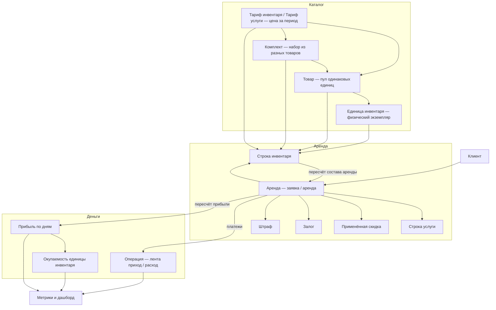
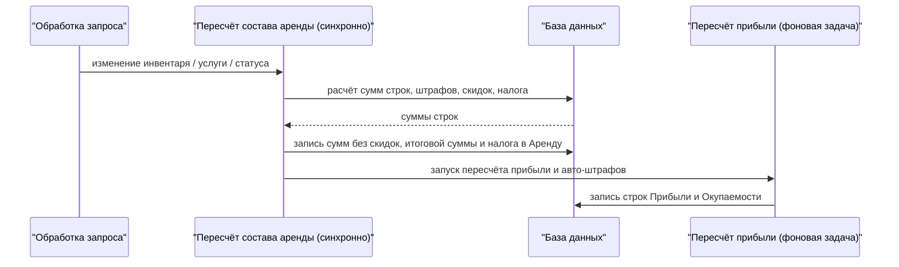

Этот раздел — **разбор бизнес-логики** модуля аренды Yume: как связаны инвентарь, товары и комплекты, аренда, тарифы, скидки, штрафы, операции, метрики и прибыль, и по каким правилам считается каждая величина. Материал рассчитан на продакт-менеджеров и разработчиков, которым нужно понять реальную логику системы, а не только её пользовательский интерфейс.

<Note>
Ниже — карта модуля, сквозной поток денег и список страниц раздела. Каждая страница описывает штатное поведение своей подсистемы.
</Note>

## Карта модуля

Модуль аренды работает в отдельной изолированной области данных каждой компании. Центральная сущность — **Аренда**, вокруг которой собраны инвентарь, деньги и аналитика.

## Как считаются деньги (сквозной поток)

Ключ к пониманию модуля — **пересчёт состава аренды**. Это синхронная операция, которая при каждом изменении состава аренды заново пересчитывает всю её арифметику: суммы строк, скидки, налог и штрафы. Расчёт выполняется целиком на стороне базы данных.

<Warning>
Важно не путать две денежные величины аренды: **Сумма без скидок** — это стоимость **до** применения скидок и налога, а **Итоговая сумма к оплате** — это финальная сумма после скидок, со штрафами, налогом и доставкой (это не «размер скидки»). См. [Пересчёт сумм и цен](/ru/logic/rent/pricing).
</Warning>

## Страницы раздела

<CardGroup cols={2}>
<Card title="Инвентарь" icon="boxes-stacked" href="/ru/logic/inventory">
Физический экземпляр, вычисляемый статус (статус не хранится в базе, а вычисляется), доступность с буфером, субаренда, страховка, авто.
</Card>
<Card title="Товары (группы единиц)" icon="layer-group" href="/ru/logic/inventory/inventory-groups">
Товар = пул взаимозаменяемых единиц; доступность вычисляется на лету, единица подбирается автоматически при аренде.
</Card>
<Card title="Комплекты" icon="puzzle-piece" href="/ru/logic/inventory/inventory-sets">
Комплект = набор из разных товаров со своей ценой и тарифами; цена собирается из позиций, число комплектов ограничено дефицитной позицией.
</Card>
<Card title="Аренда: жизненный цикл" icon="diagram-project" href="/ru/logic/rent/lifecycle">
Аренда, семь статусов (включая отдельный «Просрочена»), паузы, расписания, доставки.
</Card>
<Card title="Пересчёт сумм и цен" icon="calculator" href="/ru/logic/rent/pricing">
Ядро ценообразования: сумма за инвентарь = цена тарифа × округлённое вверх число периодов; скидки, налог, штрафы, «заморозка» тарифа.
</Card>
<Card title="Депозиты и штрафы" icon="shield-halved" href="/ru/logic/rent/deposits-penalties">
Залоги (текстовые и денежные), ручные и авто-штрафы по заявке и по позициям, формула пени за просрочку и фоновое начисление.
</Card>
<Card title="Финансы и оплаты" icon="money-bill-transfer" href="/ru/logic/finances">
Лента операций (приход / расход), счета и балансы, оплаты и расчёт долга, переводы между счетами и возвраты.
</Card>
<Card title="Метрики и аналитика" icon="chart-line" href="/ru/logic/metrics">
Каталог метрик только для чтения поверх Прибыли, фильтр периода, дашборд.
</Card>
<Card title="Прибыль и окупаемость" icon="coins" href="/ru/logic/profit-payback">
Прибыль по дням (плановый заработок и фактическая прибыль по каждому дню), Окупаемость и её процент, линейная амортизация.
</Card>
<Card title="Фоновые процессы" icon="gears" href="/ru/logic/background-tasks">
Что действительно фоновая задача, а что синхронная операция; учёт компании в фоновых задачах, расписание запусков.
</Card>
<Card title="Клиенты, бонусы, рефералы" icon="users" href="/ru/logic/clients-loyalty">
Карточка клиента, документы (проверка личности), бонусы / кэшбэк, лояльность, реферальные агенты, чёрный список.
</Card>
</CardGroup>

<Tip>
Начать чтение удобнее с [Инвентаря](/ru/logic/inventory) и [Аренды](/ru/logic/rent/lifecycle), затем перейти к [Тарифам](/ru/logic/rent/pricing) — они образуют смысловое ядро модуля.
</Tip>
