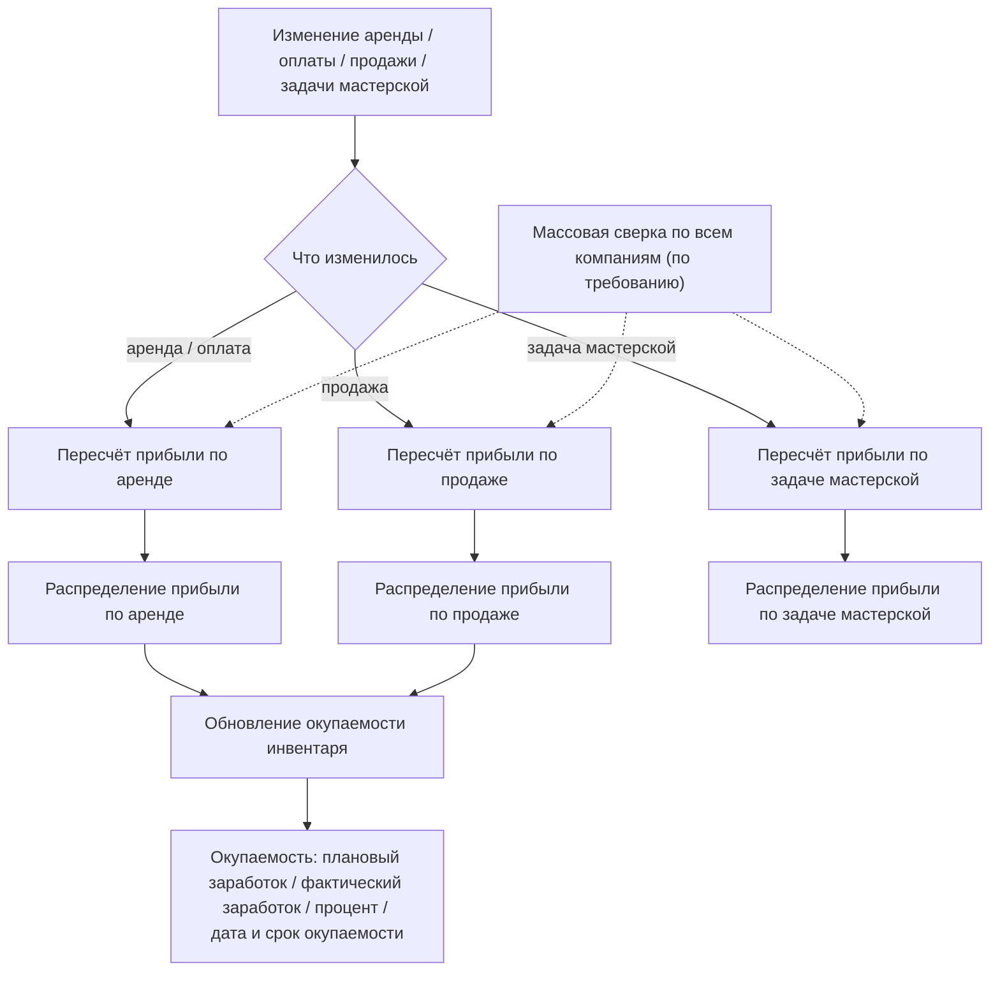

Модуль «Прибыль и окупаемость» отвечает за то, чтобы каждая оплаченная сумма по аренде, продаже или задаче мастерской была
разложена **по дням и по конкретным позициям** (инвентарь, услуга, доставка, штраф) в разбивке «Прибыль (по дням)», а затем
свёрнута в накопленную **окупаемость** инвентаря. Поверх этих двух наборов данных строятся метрики: доходность
инвентаря, амортизация и эффективность (простой техники).

Ключевая идея: «Прибыль (по дням)» — это не «прибыль минус затраты», а **распределённая по дням выручка**, ограниченная
фактически полученной оплатой. Затраты (расходы на инвентарь) учитываются отдельно, через статьи расхода, и в фактическую
прибыль **не вычитаются**.

<Note>
Три ключевых значения дневной разбивки: **Плановый заработок (со скидкой)** — плановая (ожидаемая) сумма к получению за день;
**Фактическая прибыль** — фактически «закрытая» оплатой сумма за этот день; **Ожидаемый заработок (без скидок)** — базовое
распределение цены до применения скидок. «Прибыль» в интерфейсе — это сумма фактической прибыли, а «прогноз/ожидание» — сумма
планового заработка.
</Note>

## Модель данных

### «Прибыль (по дням)» — дневная разбивка выручки

Эта разбивка ведётся отдельно для каждой компании.

| Поле | Тип | Назначение |
| --- | --- | --- |
| Аренда, Строка инвентаря, Строка услуги, Доставка, Штраф | связь, необязательное | Привязка строки к аренде и её составляющим |
| Продажа, Позиция продажи | связь, необязательное | Привязка к продаже |
| Задача мастерской, Ресурс, Услуга мастерской | связь, необязательное | Привязка к задаче мастерской |
| Единица инвентаря, Товар, Комплект, Ключ комплекта в аренде, Категория | связь / текст, необязательное | Денормализованные ссылки для группировки в метриках |
| Тариф инвентаря, Тариф услуги | связь, необязательное | Тариф, по которому посчитана строка |
| Начало периода, Конец периода | дата/время | Период позиции (не путать с полем «Дата») |
| Ожидаемый заработок (без скидок) | число (2 знака) | Базовое распределение цены по дню (до вычета скидки) |
| Плановый заработок (со скидкой) | число (2 знака) | Ожидаемая сумма за день (после скидки, до ограничения оплатой) |
| Фактическая прибыль | число (2 знака) | Фактически закрытая оплатой сумма за день |
| Номер дня, Всего дней, Дата | целое / дата | Индекс дня внутри позиции, всего оплачиваемых дней, календарная дата |

<Info>
Одна позиция аренды (например, инвентарь на 5 дней) порождает **несколько** строк разбивки — по одной на каждую дату.
Выходные дни исключаются из знаменателя «Всего дней» и получают нулевой плановый заработок и нулевую фактическую прибыль.
</Info>

### «Окупаемость» — накопленная окупаемость инвентаря

Одна строка на каждую единицу инвентаря.

| Поле | Тип | Назначение |
| --- | --- | --- |
| Единица инвентаря | связь один-к-одному | Единица инвентаря |
| Плановый заработок | число (2 знака) | Заработок до подключения в систему + сумма планового заработка по всем дневным строкам инвентаря |
| Фактический заработок | число (2 знака) | Заработок до подключения в систему + сумма фактической прибыли по всем дневным строкам инвентаря (накопленный заработок) |
| Окупаемость, % | число (2 знака) | Процент окупаемости: 100 × фактический заработок ÷ закупочная цена |
| Дата окупаемости | дата/время, необязательное | День, в который накопленный фактический заработок впервые покрыл закупочную цену |
| Срок окупаемости | длительность, необязательное | Разница между датой окупаемости и датой покупки единицы |

<Note>
Дата и срок окупаемости заполняются тем же пересчётом окупаемости, что и плановый/фактический заработок: дневные строки
инвентаря суммируются по датам начиная с заработка до подключения в систему, и день, в который нарастающий итог впервые
достигает закупочной цены, фиксируется как дата окупаемости; срок окупаемости — это разница между этой датой и датой покупки.
Пока единица не окупилась (или не заданы закупочная цена / дата покупки), соответствующие поля остаются пустыми.
</Note>

## Как это работает

### Общий поток



### Когда пересчитывается прибыль

<Steps>
  <Step title="Аренда">
    После пересчёта аренды запускается пересчёт прибыли, но только если состояние изменилось: аренда в статусе «Должник» или
    «Завершена», либо есть расхождение планового/фактического заработка с фактической ценой или оплатой. Отдельно — при
    изменении оплаты, там уже без пересчёта штрафов.
  </Step>
  <Step title="Продажа">
    При изменении составляющих продажи запускается пересчёт прибыли по продаже.
  </Step>
  <Step title="Задача мастерской">
    При сохранении завершённой задачи мастерской запускается пересчёт прибыли по задаче мастерской.
  </Step>
  <Step title="Фоновые проверки по расписанию">
    Два фоновых процесса не пересчитывают прибыль напрямую, но затрагивают аренды, а значит попутно запускают тот же
    пересчёт, что и обычное изменение аренды: ежеминутное начисление штрафов по просроченным арендам, и ежесуточная (в 5 утра)
    проверка активных аренд с включённым посуточным списанием оплаты (для компаний с подключённым балансом Kaspi).
  </Step>
  <Step title="Массовая сверка (по требованию)">
    Массовая сверка проходит по всем компаниям и пересчитывает те аренды, продажи и задачи, где сумма планового заработка в
    разбивке расходится с эталонной ценой более чем на 1. Это не периодическая задача — она не входит в расписание фоновых
    процессов и запускается вручную.
  </Step>
</Steps>

<Note>
Все пересчёты — обёртки. Пересчёт по аренде дополнительно может пересчитать штрафы (если это явно запрошено), а вся
логика распределения лежит в общей модели прибыли.
</Note>

<Info>
Пересчёт, вызванный изменением самой оплаты (создание, изменение, удаление), выполняется **всегда**, без дополнительных
проверок. А пересчёт, вызванный изменением состава или статуса аренды, сначала сверяет текущую разбивку прибыли с
фактической ценой и оплатой аренды — и если расхождения нет, пересчёт **пропускается**, чтобы не выполнять лишнюю работу.
</Info>

### Распределение прибыли по аренде

Распределение прибыли по аренде — центральная и самая сложная часть модуля.

**1. Коэффициент оплаты.** Определяет, какую долю плановой суммы считать «закрытой», если клиент оплатил больше плановой
стоимости (переплата сверх скидочной цены; трактуется как частичное погашение штрафов):

```text
Коэффициент оплаты =
    если Оплачено > Итоговая сумма к оплате и Итоговая сумма к оплате ≠ 0:
        max( min(Оплачено − Стоимость доставки; Итоговая сумма к оплате);
             Оплачено − Стоимость доставки − Сумма штрафов )
        ÷ Итоговая сумма к оплате
    иначе:
        1
```

<Warning>
Обратите внимание: коэффициент оплаты может быть **больше 1**. Если сумма «Оплачено − Стоимость доставки − Сумма штрафов»
превышает Итоговую сумму к оплате, числитель превышает знаменатель. В этом случае дневная фактическая прибыль считается как
«min(Итоговая сумма к оплате; остаток) × коэффициент оплаты» и может превысить плановую сумму. Это выглядит намеренно
(переплата разносится на позиции), но требует проверки при аудите цифр.
</Warning>

**2. Распределение скидок по дням.** Скидки раскладываются на дни и позиции пропорционально в зависимости от того, куда они
применяются (весь заказ / инвентарь / услуга) или от привязки к конкретной позиции.

**3. Дневная разбивка инвентаря:**

```text
Ожидаемый заработок (без скидок) = округлить(Сумма за инвентарь ÷ Всего дней, 2)   # Всего дней — рабочие дни (без выходных)
Плановый заработок (со скидкой)  = округлить(Ожидаемый заработок − Размер скидки, 2)   # 0 в выходной день
Фактическая прибыль              = округлить(min(Плановый заработок; остаток) × Коэффициент оплаты, 2)
остаток                          = остаток − Фактическая прибыль   # остаток нераспределённой оплаты
```

Остаток инициализируется суммой «Оплачено» и последовательно «расходуется» на инвентарь → услуги → доставку → штрафы. Именно
так фактическая оплата ограничивает прибыль: как только остаток исчерпан, фактическая прибыль следующих дней и позиций
становится 0.

**4. Услуги, доставка, штрафы** считаются аналогично из того же остатка. Для штрафов плановый заработок ненулевой только
если штраф ручной или привязан к позиции инвентаря.

**5. Идемпотентность.** Метод строит желаемое состояние и сравнивает с существующими строками, формируя списки на обновление,
удаление и вставку. Повторный запуск при неизменных данных ничего не пишет.

**6. Обновление окупаемости.** В конце запускается обновление окупаемости для затронутых единиц инвентаря.

<AccordionGroup>
  <Accordion title="Числовой пример: аренда инвентаря">
    Инвентарь сдан на 4 рабочих дня, Сумма за инвентарь = 4000, скидок нет, коэффициент оплаты = 1, клиент оплатил
    полностью (остаток заведомо больше суммы позиции).

    ```text
    Всего дней                       = 4
    Ожидаемый заработок (без скидок) = 4000 / 4 = 1000  (на каждый из 4 дней)
    Плановый заработок (за день)     = 1000 − 0 = 1000
    Фактическая прибыль (за день)    = min(1000; остаток) × 1 = 1000
    ```

    Итого 4 дневные строки с фактической прибылью 1000 каждая → сумма фактической прибыли = 4000.

    Если клиент оплатил только 2500, то остаток иссякнет на 3-м дне:
    `1000 + 1000 + 500 + 0 = 2500`. Первые два дня закрыты полностью, третий частично, четвёртый — 0.
  </Accordion>
  <Accordion title="Числовой пример: окупаемость">
    Закупочная цена = 100000, заработок до подключения в систему = 20000, накопленная сумма фактической прибыли по
    инвентарю = 55000.

    ```text
    Фактический заработок = заработок до подключения + сумма фактической прибыли = 20000 + 55000 = 75000
    Окупаемость, %        = округлить(100 × 75000 / 100000, 2)                    = 75.00 %
    ```

    Инвентарь окупится, когда процент окупаемости достигнет 100 % (накопленный заработок сравняется с закупочной ценой).
  </Accordion>
</AccordionGroup>

### Прибыль по продаже

Распределение прибыли по продаже проще: продажа не разбивается по дням, вся строка привязана к дате создания продажи,
«Номер дня» и «Всего дней» равны 1. Для каждой позиции ожидаемый заработок равен цене позиции, плановый заработок равен цене
позиции со скидкой, а фактическая прибыль = «min(плановый заработок; остаток)», где остаток начинается с оплаченной суммы по
продаже.

### Прибыль по задаче мастерской

Распределение прибыли по задаче мастерской считается только для завершённых задач. Для ресурсов и услуг мастерской ожидаемый
заработок, плановый заработок и фактическая прибыль равны цене — то есть здесь оплата не ограничивает прибыль, берётся полная
цена ресурса или услуги.

### Окупаемость: обновление накопленных значений

Обновление окупаемости агрегирует по инвентарю суммы планового заработка и фактической прибыли, добавляет заработок до
подключения в систему и записывает или обновляет строку окупаемости:

```text
Плановый заработок     = заработок до подключения + сумма планового заработка по дневным строкам
Фактический заработок  = заработок до подключения + сумма фактической прибыли по дневным строкам
Окупаемость, %         = округлить(100 × (заработок до подключения + сумма фактической прибыли) ÷ закупочная цена, 2)   если закупочная цена > 0, иначе 0
Дата окупаемости       = день, в который нарастающий фактический заработок (по датам, начиная с заработка до подключения) впервые ≥ закупочной цены   иначе пусто
Срок окупаемости       = дата окупаемости − дата покупки   (не меньше нуля; пусто, если дата окупаемости или дата покупки не заданы)
```

Запись окупаемости обновляется, если изменились округлённые до целого плановый или фактический заработок, либо дата или срок окупаемости.

<Note>
Накопленная окупаемость суммирует **все** дневные строки по инвентарю без учёта статуса аренды — фильтр «зачётных» строк
здесь не применяется. Фильтрация по «успешным» арендам работает только в метриках чтения (см. ниже), но не в накопленной
окупаемости.
</Note>

### Что происходит при удалении

- **Полное (безвозвратное) удаление аренды** суперпользователем компании удаляет вместе с ней и все её строки в разбивке
  «Прибыль (по дням)» — они физически стираются из журнала.
- **Обычное («мягкое») удаление аренды** (архивация, см. [«Архивация записей»](/ru/logic/disable-archiving)) строки
  прибыли не трогает: они остаются в журнале как есть, но больше никогда не пересчитываются и исключаются из отчётов
  для чтения отдельным фильтром на каждой странице метрик.
- Если из аренды убрали **все** позиции одного типа (например, весь инвентарь или все услуги), лишние строки прибыли по
  этому типу удаляются автоматически при следующем пересчёте — в журнале не остаётся строк без реальных позиций аренды.
- **Удаление или возврат оплаты** не удаляет и не обнуляет строки прибыли напрямую — вместо этого запускается обычный
  пересчёт, который заново распределяет уменьшившуюся сумму «Оплачено» по дням. Поскольку остаток «тратится» по
  порядку (сначала самые ранние дни аренды), уменьшение оплаты в первую очередь снимает фактическую прибыль с самых
  **поздних** дней и позиций — более ранние дни сохраняют то, что им уже было засчитано.

<Warning>
Если по одной и той же аренде выполняются два действия почти одновременно (например, два сотрудника параллельно вносят
оплату), в редких случаях промежуточные цифры разбивки могут временно разойтись. Это самоисправляется при следующем
пересчёте — специального ручного вмешательства не требуется.
</Warning>

### Метрики чтения: амортизация, эффективность и доходность

Поверх построчной «Прибыли» и накопленной «Окупаемости», описанных выше, построены отдельные отчёты для чтения — они
ничего не пересчитывают, а только читают и агрегируют то, что уже посчитано этим механизмом. Подробно они разобраны на
своих страницах в разделе «Метрики и аналитика»:

- [Амортизация и окупаемость инвентаря](/ru/logic/metrics/depreciation-payback) — линейная амортизация по месяцам (независимый от прибыли бухгалтерский расчёт) и доходность групп/единиц инвентаря за произвольный период поверх накопленной окупаемости.
- [Эффективность инвентаря](/ru/logic/metrics/efficiency) — простой и загрузка инвентаря за период, на уровне единиц, групп и комплектов.

<Info>
Общий фильтр «зачётных» строк дохода (аренды в статусах «В аренде», «Завершена», «Должник» либо отменённые с оплатой;
проданные продажи; задачи мастерской «Завершена»/«В работе») используется в этих отчётах для чтения, но **не** применяется
при обновлении накопленной окупаемости — там суммируются все дневные строки без исключений (см. предупреждение выше).
</Info>

## Связанные страницы

<CardGroup cols={2}>
  <Card title="Метрики и аналитика" icon="chart-simple" href="/ru/logic/metrics">
    Хаб раздела аналитики со ссылками на все отчёты, которые читают эти данные.
  </Card>
  <Card title="Обзор и общая сводка" icon="gauge" href="/ru/logic/metrics/overview">
    Как дневная сводка и детализация читают и группируют журнал «Прибыли», описанный на этой странице.
  </Card>
  <Card title="Амортизация и окупаемость инвентаря" icon="arrow-trend-down" href="/ru/logic/metrics/depreciation-payback">
    Отчёты по амортизации и доходности, построенные поверх «Окупаемости» и «Прибыли» с этой страницы.
  </Card>
  <Card title="Эффективность инвентаря" icon="gauge-high" href="/ru/logic/metrics/efficiency">
    Простой и загрузка инвентаря — отчёт для чтения поверх того же журнала «Прибыли».
  </Card>
  <Card title="Пересчёт сумм и цен" icon="tags" href="/ru/logic/rent/pricing">
    Откуда берутся сумма за инвентарь и итоговая сумма к оплате, которые распределяет прибыль по дням.
  </Card>
  <Card title="Скидки" icon="percent" href="/ru/logic/rent/pricing">
    Применённые скидки и их разнос по дням внутри распределения прибыли.
  </Card>
  <Card title="Депозиты, штрафы и транзакции" icon="money-bill-transfer" href="/ru/logic/rent/deposits-penalties">
    Штрафы в дневной прибыли и расходы через статьи расхода.
  </Card>
  <Card title="Инвентарь" icon="boxes-stacked" href="/ru/logic/inventory">
    Закупочная цена, заработок до подключения в систему, срок службы — влияют на окупаемость и амортизацию.
  </Card>
  <Card title="Фоновые процессы (Celery)" icon="gears" href="/ru/logic/background-tasks">
    Задачи пересчёта прибыли и их триггеры.
  </Card>
</CardGroup>
