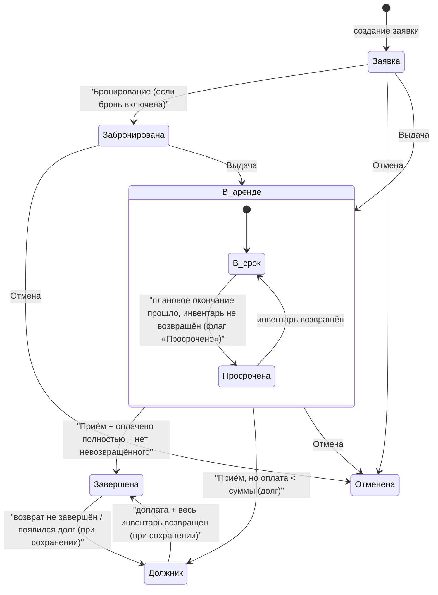

**Аренда** — центральная сущность модуля CRM. Одна запись описывает полный цикл: от заявки клиента до завершения или долга. Вокруг неё вращаются позиции инвентаря, услуги, доставки, штрафы, залоги, скидки, платёжный график и журнал действий.

Эта страница разбирает **реальную** машину состояний и логику пересчёта, а не «идеальную» модель из ТЗ. Ключевой факт, который надо усвоить сразу: **отдельного статуса «просрочено» не существует** — просрочка это флаг «Просрочено» поверх статуса «В аренде».

<Note>
Смежные страницы: [Тарифы и расчёт стоимости](/ru/logic/tariffs-pricing), [Скидки](/ru/logic/discounts), [Депозиты, штрафы и транзакции](/ru/logic/deposits-penalties), [Фоновые процессы (Celery)](/ru/logic/background-tasks), [Прибыль и окупаемость](/ru/logic/profit-payback).
</Note>

## Модель данных

### Аренда — заголовок

| Поле | Назначение |
| --- | --- |
| Статус | Статус жизненного цикла (см. ниже). По умолчанию «Заявка». |
| Статус оплаты | «Ожидает оплаты» / «Оплачена» / «Частично оплачена». Пересчитывается при каждом сохранении. |
| Клиент | Клиент аренды. |
| Плановое начало / Плановое окончание | Плановый период аренды. |
| Фактическая выдача / Фактический возврат | Фактические моменты выдачи и приёма. |
| Длительность / Исходная длительность / Оплачиваемая длительность | Длительности; длительность = плановое окончание − плановое начало, пересчитывается при сохранении. |
| Сумма без скидок / Итоговая сумма к оплате | Итог до и после скидок (сохранённое значение). |
| Сумма за инвентарь / Сумма за услуги / Стоимость доставки / Реферальное вознаграждение | Сохранённые составляющие суммы. |
| Размер скидки / Скидка на инвентарь / Скидка на услуги / Дополнительная скидка | Сохранённые скидки. |
| Суммировать скидки | Складывать скидки в одну формулу или считать раздельно (устаревшая ветка). |
| Оплачено | Сумма успешных оплат (пересчитывается). |
| Сумма штрафов / Автоматический штраф / Ручной штраф | Итоговый штраф = автоматический + ручной. |
| Шаг начисления штрафа | Шаг начисления автоматического штрафа (по умолчанию 1 час). |
| Штрафы отключены | Полностью отключить автоматические штрафы для аренды. |
| Просрочено | Флаг просрочки (используется как «виртуальный» статус). |
| Ставка налога, % / Налог включён в цену / Сумма налога | Налог. |
| Автопродление | Автопродление посуточно. |
| Точка выдачи / Точка возврата | Точка выдачи и возврата. |
| Корзина | Связь с корзиной витрины (генерация заявки). |
| Номер заказа Yume Plus | Внешний номер заказа маркетплейса. |
| Удалена / Активна | Мягкое удаление / «настоящая» аренда (не черновик). |

<Warning>
У аренды **нет** понятия «родительская аренда» и нет связи «родитель — потомок». Функции «пересчёта итогов» относятся к **той же самой аренде**, а не порождают дочерний заказ; их названия в системе исторически вводят в заблуждение (см. [Известные особенности и ограничения](/ru/logic/known-issues)). Отдельная «ссылка на аренду» — это на самом деле ссылка на оплату, а не связь между заявками.
</Warning>

### Статусы

**Статус аренды**:

- «Заявка»
- «Забронирована»
- «В аренде»
- «Отменена»
- «Завершена»
- «Должник»

Дополнительно есть «цветовой» ярлык статуса для интерфейса, который **не хранится в базе** как отдельное значение. В нём, помимо перечисленных, присутствует ярлык «Просрочена».

**Статус оплаты**: «Ожидает оплаты» / «Оплачена» / «Частично оплачена».

**Действие по аренде** (журнал): «Создание», «Бронирование», «Сборка», «Выдача», «Приём», «Отмена», «Архивирование», «Забор доставкой», «Выдача доставкой».

<Info>
«Цветовой» ярлык статуса — это **не** отдельное значение статуса, а вычисляемый атрибут, который добавляется при выборке аренд. Значение «Просрочена» появляется в этом ярлыке только когда включён флаг «Просрочено» — реального статуса «просрочено» в базе нет.
</Info>

### Дочерние сущности заявки

| Сущность | Роль |
| --- | --- |
| Позиция инвентаря | Позиция инвентаря или комплекта: тариф, плановые и фактические даты начала и окончания, тип «Аренда» / «Продажа», признак обмена. |
| Действие по аренде | Журнал: «Создание», «Бронирование», «Сборка», «Выдача», «Приём», «Отмена», «Архивирование», доставки. Связан с позициями инвентаря. |
| Пауза аренды | Пауза (заморозка) аренды: начало и окончание (пустое окончание = пауза ещё идёт). |
| Рабочие и выходные дни | Рабочие и выходные дни: число рабочих дней, число выходных дней, конкретные выходные дни недели (пн–вс). Один набор на аренду. |
| Рабочие условия | Рабочие условия (комиссия): процент / фиксированная сумма / разделение (доля клиента + доля компании = 100). |
| Строка платёжного графика | Строка **платёжного графика по дням**: сумма, оплачено, разнесённая оплата, дата, признаки «выходной» / «изменена вручную». |
| Доставка | Доставка или самовывоз с геоточками, статусом и ценой. |
| Реферальное вознаграждение | Вознаграждение реферальному агенту: сумма и статус «Оплачено» / «Ожидает оплаты». |
| Вознаграждение персонала | Проценты вознаграждения менеджеру за этапы: создание, бронирование, сборка, выдача, приём. |

## Как это работает

### Машина состояний

Переходы инициируются двумя путями: (1) через действие по аренде из интерфейса, (2) автоматически при сохранении аренды на основе фактического состояния инвентаря и оплат.



<Warning>
«Просрочена» на диаграмме — это **не** отдельный статус, а флаг «Просрочено» при статусе «В аренде». Он не хранится как значение статуса; его выставляет пересчёт итогов, и он влияет только на «цветовой» ярлык статуса, уведомления и счётчики.
</Warning>

### Действия и переходы

Каждое действие по аренде выполняется целиком в рамках одной транзакции.

<Steps>
<Step title="Валидация">
Если указанный момент времени в будущем — ошибка. Нельзя стартовать аренду задним числом, если плановое окончание уже прошло, а переход идёт из «Заявки» в «В аренде».
</Step>
<Step title="Бронь (в статус «Забронирована»)">
Только при действии «Бронирование», переходе из «Заявки» в «Забронирована» и включённой брони. Создаётся запись действия «Бронирование».
</Step>
<Step title="Сборка">
При действии «Сборка» и статусе «Забронирована» / «В аренде» фиксируется сборка выбранных позиций. Статус не меняется.
</Step>
<Step title="Выдача (в статус «В аренде»)">
При переходе в «В аренде» и текущем статусе не выше «В аренде»: позиции типа «Продажа» без даты продажи помечаются проданными (проставляются цена и дата продажи); создаётся действие «Выдача», проставляется фактическая выдача, у позиций без фактического начала ставится фактическое начало = сейчас, статус → «В аренде». Если бронь выключена, бронирование сразу трактуется как выдача.
</Step>
<Step title="Приём (в статус «Завершена» или «Должник»)">
Только из «В аренде». Возвращаемым арендным позициям ставится фактический возврат = сейчас. Аренда считается завершённой, если нет арендных позиций без фактического возврата. Если всё возвращено, оплачено (оплачено ≥ сумма штрафов + итоговая сумма к оплате) и нет несобранного → «Завершена»; если оплата меньше → «Должник».
</Step>
<Step title="Отмена (в статус «Отменена»)">
Создаётся действие «Отмена», статус → «Отменена», с проданных позиций снимаются дата и цена продажи.
</Step>
<Step title="Пересчёт">
В конце запускается полный пересчёт всех сумм и сохранение аренды, а также регистрация автоматических штрафов.
</Step>
</Steps>

### Реконсиляция статуса при сохранении

Сохранение аренды — это второй, «сторожевой» слой логики. При каждом сохранении (кроме частичных сохранений отдельных полей) система:

1. Пересчитывает статус оплаты, сравнивая оплаченную сумму с итоговой суммой к оплате:

   - оплачено ≥ итоговой суммы → «Оплачена»;
   - оплачено больше нуля, но меньше итога → «Частично оплачена»;
   - оплачено ноль → «Ожидает оплаты».

2. Агрегирует по действиям и позициям инвентаря (арендные позиции, проданные позиции, ожидающие выдачи без факта, выданные, но не принятые) и «доводит» статус:
   - есть выдача и статус не финальный, есть арендные позиции → «В аренде»;
   - «Завершена», но остался несобранный или невозвращённый инвентарь → откат в «Должник»;
   - всё возвращено и оплачено → «Завершена» (проставляет фактический возврат);
   - всё возвращено, но не оплачено → «Должник»;
   - появились невозвращённые позиции → обратно «В аренде», фактический возврат очищается.

3. Пересчитывает признак «Активна» (это «настоящая» аренда, а не пустой черновик): активна, если есть услуги, арендные или проданные позиции, клиент, оплата, залоги или доставки.

4. Дёргает связанные процессы: начисление вознаграждения персонала, начисление бонусов, обновление статуса клиента, а также триггеры воронки и уведомлений.

<Warning>
Сохранение перезаписывает статус, вычисленный при обработке действия. Логика в сохранении и в обработке действий частично дублируют друг друга и должны сходиться — это хрупкое место (см. [Известные особенности и ограничения](/ru/logic/known-issues)).
</Warning>

### Пауза аренды (заморозка тарификации)

Пауза работает как переключатель: если есть открытая пауза (окончание пустое) — она закрывается (окончание = сейчас), иначе создаётся новая с началом = сейчас. Суммарная длительность пауз вычитается из времени просрочки при расчёте штрафа:

- длительность пауз = сумма по каждой паузе интервала «(окончание паузы или сейчас) − начало паузы»;
- период просрочки = (фактический возврат или сейчас) − плановое окончание − длительность пауз.

То есть пауза не влияет на базовую цену аренды, а **уменьшает штрафную длительность** (время, на которое инвентарь считается просроченным).

### Рабочие дни и выходные

Набор рабочих и выходных дней задаёт цикл (сколько рабочих дней подряд, сколько выходных) и/или конкретные выходные дни недели (пн–вс). Эти дни используются только когда включён платёжный график по дням: система раскладывает период аренды по календарным дням и помечает часть как «выходные», которые исключаются из тарификации.

Логика выбора выходных:
- **Циклический режим** (рабочих + выходных = 7): выходные = заданные дни недели (или последние дни недели в количестве, равном числу выходных).
- **Скользящий режим** (сумма ≠ 7): день считается выходным, если он попадает во «второй полупериод» скользящего цикла из рабочих дней.
- Строки графика, изменённые вручную, могут форсировать конкретный день как рабочий или выходной.
- При включённом автоопределении выходного система сама выставляет один выходной = день недели, предшествующий плановому началу.

Суммарные выходные = число дней-выходных (при не-полуночном плановом окончании из результата дополнительно вычитается «хвост» суток). Эта длительность затем вычитается из исходной длительности, давая оплачиваемую длительность = исходная длительность − суммарные выходные.

### Платёжный график

<Info>
Платёжный график — это **разбивка суммы аренды по дням**, а не «повторяющаяся аренда, порождающая дочерние заказы». Никаких новых аренд он не создаёт. Строки существуют только когда включён платёжный график по дням.
</Info>

При каждом пересчёте система:
1. Строит соответствие «день → дата» из раскладки периода аренды по календарным дням.
2. Разносит цену каждой позиции по дням: дневная цена = цена позиции ÷ число дней аренды позиции.
3. Вычитает скидки, распределённые по дням: сумма на день = сумма скидки ÷ (число дней действия скидки, но не больше числа дней аренды).
4. Штрафы «прибиваются» к дню создания штрафа (в пределах периода) либо к последнему дню.
5. Создаёт новые дни, обновляет изменившиеся и удаляет лишние.
6. Разносит успешные оплаты по дням «с конца» с переносом остатка на следующий день, не превышая суммы дня.

Ручное редактирование строки графика доступно из интерфейса: можно пометить день как выходной (тогда сумма дня = 0) или как изменённый вручную. Остальные поля доступны только для чтения.

### Пересчёт итогов

Пересчёт итогов — сердце модуля: пересчитывает цены, скидки, штрафы, налоги, оплаченную сумму, график, прибыль и сохраняет аренду. Ключевые формулы:

**Базовая цена одной позиции:**
- для аренды: базовая цена = цена тарифа × округлённое вверх число тарифных периодов (длительность ÷ длительность тарифного периода);
- для продажи или при нулевой длительности тарифного периода: базовая цена = цена тарифа.

**Автоматический штраф позиции** (только если штрафы включены):
- период просрочки = (фактический возврат или сейчас) − плановое окончание − длительность пауз;
- число шагов в тарифном периоде = округлённое вверх (длительность тарифного периода ÷ шаг начисления штрафа);
- множитель = (период просрочки − буфер) ÷ шаг начисления штрафа, округлённое вниз, а при включённом начислении штрафа «после периода» — вверх;
- сумма штрафа позиции = округление (цена тарифа × множитель ÷ число шагов) по правилу округления штрафов.

**Итоги на уровне аренды:**

```text
Сумма за инвентарь              = Σ базовых цен позиций (округление до целого)
Инвентарь со скидкой            = Σ цен позиций со скидкой
Сумма за услуги                 = Σ услуг
Оплачено                        = Σ успешных оплат без статьи (округление до целого)
Дополнительная скидка           = ручные скидки на весь заказ
Автоматический штраф            = Σ штрафов позиций (0, если штрафы отключены)
Ручной штраф                    = Σ ручных штрафов
Сумма штрафов                   = автоматический штраф + ручной штраф
Сумма без скидок                = Сумма за инвентарь + Сумма за услуги + Стоимость доставки
Сумма налога                    = округление ((итоговая сумма + сумма штрафов) × ставка налога) до целого

# если налог включён в цену:
Итоговая сумма к оплате = округление (итог + сумма штрафов + стоимость доставки) до целого
# иначе (налог сверху):
Итоговая сумма к оплате = округление ((итог + сумма штрафов) × (1 + ставка налога) + стоимость доставки) до целого
```

где промежуточный итог = Инвентарь со скидкой + Услуги со скидкой − Дополнительная скидка.

Флаг «Просрочено» выставляется, когда период просрочки больше нуля и статус = «В аренде».

<Tip>
Пересчёт итогов вызывается практически отовсюду: при обработке действий, при изменении условий, рабочих дней и графика (иногда без пересчёта инвентаря и услуг), при генерации заявок и при автоматических штрафах.
</Tip>

### Автопродление

Если включено автопродление и статус «В аренде», пересчёт итогов двигает плановое окончание на «конец текущих суток + 1 день» и, если текущий момент уже позже нового окончания, продлевает позиции инвентаря и **рекурсивно** повторяет пересчёт. Продление ограничено минимумом из максимальной длительности аренды и одних суток.

### Генерация заявок из витрины и Yume Plus

- Из корзины витрины система собирает аренду: подбирает свободный инвентарь, создаёт позиции инвентаря и услуг, доставку, комментарии, затем запускает пересчёт итогов и регистрацию автоматических штрафов.
- Для заказов маркетплейса Yume Plus работает аналогичная генерация с подбором периода тарификации и тарифа под длительность.

Порядок подбора инвентаря управляется настройкой приоритета: случайный порядок либо приоритет собственного или субарендного инвентаря.

### Фоновые задачи

| Задача | Расписание | Что делает |
| --- | --- | --- |
| Автоматические штрафы | каждую минуту | Пересчитывает аренды в статусе «В аренде», начисляет штрафы и шлёт уведомление «Аренда просрочена». За один проход обрабатывается не более 100 штрафов. |
