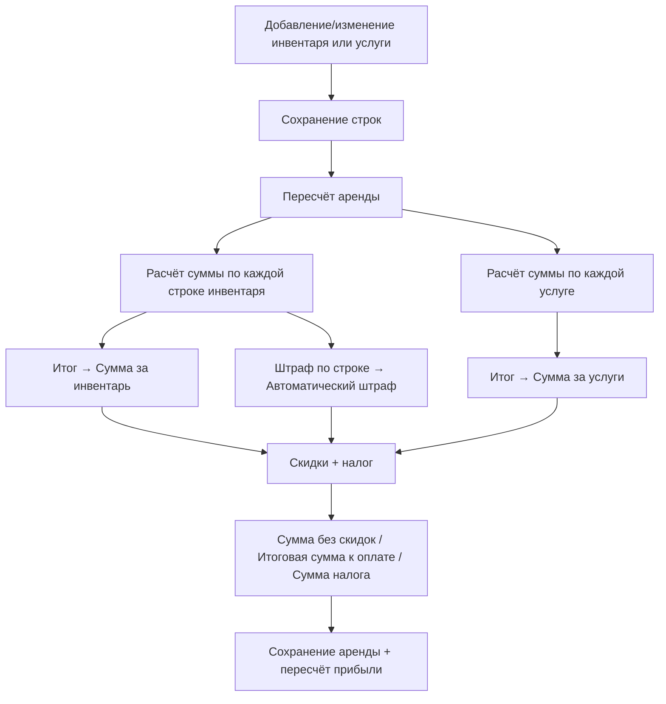

Этот раздел описывает **ядро ценообразования** системы: как хранится тариф (цена за интервал времени), как выбранный на аренду период сопоставляется тарифу и как из этого рассчитываются суммы аренды, штрафы и налог. Практически вся арифметика сосредоточена в едином механизме пересчёта, который заново вычисляет суммы аренды при любом изменении её состава.

<Note>
Расчёт выполняется **на стороне базы данных** одним запросом, а не пошагово в приложении. Это важно понимать при разборе: суммы, которые вы видите в аренде, — это сохранённый результат последнего пересчёта, а не «живая» формула, вычисляемая на лету.
</Note>

## Модель данных

| Сущность | Ключевые характеристики | Назначение |
| --- | --- | --- |
| Интервал времени | Длительность (час/день/неделя/месяц — любой промежуток), дни недели, начало и конец времени | Интервал тарификации: единица времени, за которую назначается цена. |
| Тариф инвентаря | Цена за период, период тарификации, привязка к единице инвентаря / товару / позиции комплекта / цене комплекта, дни недели, признак публикации, порядок | Тариф единицы инвентаря, товара или позиции комплекта: цена за один интервал тарификации. |
| Тариф услуги | Цена, период тарификации, признак разового платежа, признак публикации | Тариф услуги: цена за интервал тарификации либо разовый платёж. |
| Цена комплекта | Комплект, период, цена за период | Итоговая цена комплекта за период (сумма тарифов позиций с учётом их количества). |
| Строка инвентаря в аренде | Тариф, цена тарифа, длительность тарифа, начало и конец, суммы (без скидок и со скидкой), сумма штрафов, тип (аренда/продажа) | Строка аренды: **снимок** тарифа на момент добавления плюс рассчитанные суммы. |
| Строка услуги в аренде | Тариф, цена тарифа, длительность тарифа, суммы (без скидок и со скидкой) | Строка услуги в аренде. |
| Аренда | Сумма без скидок, итоговая сумма к оплате, сумма за инвентарь, сумма за услуги, стоимость доставки, сумма налога, ставка налога, признак «налог включён в цену», сумма штрафов | Аренда целиком: агрегированные итоги. |

<Warning>
У тарифа услуги «период тарификации» — это ссылка на **интервал времени** (а не число). А в строках аренды «длительность тарифа» — это уже конкретный промежуток времени (длительность выбранного интервала, скопированная в строку аренды в момент её создания).
</Warning>

### Ключевой инвариант: тариф «замораживается» в строке аренды

Тариф не читается динамически при каждом пересчёте. При добавлении инвентаря в аренду цена тарифа и длительность тарифа **копируются** из действующего тарифа и его интервала времени в строку инвентаря. Если у тарифа не задан интервал времени, длительность по умолчанию — **1 день**. Дальнейшее изменение прайса компании на уже созданную аренду не влияет.

Для услуги заморозка происходит аналогично при сохранении строки: при смене тарифа в строку записываются цена тарифа и длительность тарифа (длительность соответствующего интервала времени, а при её отсутствии — 1 день).

## Как это работает

Общий поток: изменение состава аренды → строки сохраняются → запускается механизм пересчёта → база данных считает суммы одним запросом → результат записывается в строки инвентаря и в итоговые суммы аренды.



### Формула стоимости одной строки инвентаря

Ядро расчёта — стоимость одной строки инвентаря. Правило такое:

<Info>
**Словами:** количество оплачиваемых периодов = длительность аренды, делённая на длительность тарифа, с округлением **вверх**. Стоимость строки = цена тарифа × количество оплачиваемых периодов. Продажа и тариф с нулевой длительностью оплачиваются один раз по цене тарифа. Итоговая стоимость строки не может быть отрицательной.
</Info>

где:

- **Длительность аренды строки** измеряется в секундах. В режиме по умолчанию это точная разница между плановым (или фактическим) окончанием и началом, не меньше нуля; во включённом режиме расписания транзакций это число оплачиваемых календарных суток, умноженное на длину суток.
- **Округление вверх** означает, что неполный период всегда тарифицируется как полный.
- **Длительность тарифа** — это длительность одного интервала тарификации.

<Warning>
«Количества» как отдельного множителя в формуле **нет**. Каждая физическая единица инвентаря — это отдельная строка аренды со своей ценой; несколько единиц = несколько строк. Итог по аренде — это сумма стоимостей всех строк.
</Warning>

#### Два режима расчёта: непрерывное время и посуточный график

Ключевая развилка ценообразования — флаг функции **«Посуточный график платежей»** (по умолчанию **выключен**). Он определяет, как измеряется длительность аренды и появляется ли у аренды план платежей по дням. Полный перечень настроек — на странице [Флаги функций](/ru/logic/feature-flags).

<AccordionGroup>
<Accordion title="Непрерывное время (по умолчанию, флаг выключен)">
Длительность аренды — это **точная разница во времени** в секундах между окончанием и началом (не меньше нуля). Число оплачиваемых периодов округляется вверх исходя из точного хронометража, неполный период тарифицируется как полный.

- Нет понятия «нерабочих дней»: оплачивается всё время подряд.
- План платежей по дням **не создаётся**.
- Посуточные списания не выполняются.

Пример: тариф «сутки» (86400 секунд), аренда на 25 часов (90000 секунд) → округление вверх (90000 / 86400) = 2 периода.
</Accordion>
<Accordion title="Посуточный график (флаг включён)">
Длительность = число оплачиваемых **календарных суток** × длина суток. Считаются календарные даты в диапазоне аренды (по часовому поясу Asia/Tashkent) за вычетом нерабочих дней. Окончание ровно в полночь не засчитывает последний день. Здесь важен не хронометраж, а количество затронутых календарных дней.

Дополнительно к смене способа подсчёта включаются:

- **Нерабочие (выходные) дни.** Задаются недельным циклом рабочих/выходных дней аренды либо автоматически — флагом **«Авто‑выходной день»** (тогда система выводит один недельный выходной по дню начала аренды). В нерабочие дни плата не начисляется.
- **Бесплатный первый день.** Если аренда длиннее одного дня, её первый день по умолчанию делается нерабочим (бесплатным). Чтобы первый день был платным, включают флаг **«Плата за первый день»**.
- **Оплачиваемая длительность** аренды = полный срок минус нерабочие и бесплатные дни.
- **План платежей по дням.** Для аренды создаётся по одной строке на каждую календарную дату. Цена дня = стоимость строки инвентаря ÷ число оплачиваемых суток, равномерно распределённая по рабочим дням; скидки и штрафы также раскладываются по дням (рабочие дни получают сумму, нерабочие — ноль).
- **Распределение оплат.** Внесённые платежи «жадно» заполняют дни, начиная с самых ранних рабочих; переплата за день переносится на более ранние дни, а платёж вне графика — на последний день.
</Accordion>
<Accordion title="Пример: одна и та же аренда в двух режимах">
Аренда одной единицы с тарифом **10 000 / сутки**, с понедельника 00:00 по субботу 00:00 (окончание в полночь → суббота не считается, остаётся 5 дней: Пн–Пт). Выходных по графику нет, «Плата за первый день» выключена.

**Непрерывное время (по умолчанию):** длительность = 5 × 86400 секунд → 5 периодов → стоимость = 10 000 × 5 = **50 000**. Плана по дням нет.

**Посуточный график:** первый день (Пн) становится бесплатным → оплачиваемых суток 4 (Вт–Пт) → стоимость = 10 000 × 4 = **40 000**. Создаётся 5 дневных строк: Пн — 0 (нерабочий), Вт/Ср/Чт/Пт — по 10 000. Если клиент внёс 25 000, оплата ложится на ранние рабочие дни: Вт 10 000, Ср 10 000, Пт 5 000.

Итог: тот же тариф даёт **50 000** в режиме непрерывного времени и **40 000** в посуточном графике — из‑за бесплатного первого дня и посуточного счёта.
</Accordion>
</AccordionGroup>

### Формула стоимости услуги

Правило для услуги такое же по смыслу:

- Если тариф услуги — **разовый платёж**, стоимость равна цене тарифа.
- Если длительность тарифа равна нулю, стоимость также равна цене тарифа (разовая оплата).
- Иначе стоимость = цена тарифа × округлённое **вверх** число периодов (длительность услуги, делённая на длительность тарифа).

Длительность услуги = разница между её окончанием и началом (по умолчанию — период всей аренды) за вычетом нерабочих дней, но не меньше нуля.

<Note>
Существует **упрощённая** копия той же формулы (без учёта скидок и нерабочих дней): при смене тарифа услуги число периодов считается как 1 для разового платежа, иначе — длительность всей аренды, делённая на длительность тарифа, с округлением вверх. Она нужна для мгновенного отображения цены при смене тарифа, но «источником истины» остаётся полный пересчёт аренды.
</Note>

### Как строки складываются в итог аренды

После суммирования строк заполняются итоговые суммы аренды. Ключевые шаги:

<Steps>
<Step title="Базовые суммы">
Сумма за инвентарь = сумма стоимостей всех строк инвентаря, округлённая до целого. Сумма за услуги = сумма стоимостей всех строк услуг, округлённая до целого. Их скидочные версии — «Инвентарь со скидкой» и «Услуги со скидкой» (см. [Скидки](/ru/logic/discounts)).
</Step>
<Step title="Штрафы">
Автоматический штраф = сумма штрафов по строкам (0, если штрафы отключены); ручной штраф — штрафы, добавленные вручную; сумма штрафов = автоматический штраф + ручной штраф.
</Step>
<Step title="Сумма без налога">
Сумма без скидок = сумма за инвентарь + сумма за услуги + стоимость доставки. Это «грязная» сумма **до скидок и налога**.
</Step>
<Step title="Скидочная база">
Скидочная база = инвентарь со скидкой + услуги со скидкой − дополнительная скидка, округлённая до целого, где дополнительная скидка не может быть отрицательной.
</Step>
<Step title="Налог и итог к оплате">
Ставка налога применяется как доля (для 12% это 0,12). Сумма налога = (скидочная база + сумма штрафов) × доля налога, округлённая до целого. Итоговая сумма к оплате зависит от признака «налог включён в цену»:

- **Налог включён в цену:** итоговая сумма к оплате = скидочная база + сумма штрафов + стоимость доставки (округлённая до целого). Налог уже сидит внутри цен, отдельно не добавляется.
- **Налог не включён в цену:** итоговая сумма к оплате = (скидочная база + сумма штрафов) × (1 + доля налога) + стоимость доставки (округлённая до целого). Налог начисляется сверху.
</Step>
</Steps>

<Warning>
«Итоговая сумма к оплате» — это **итоговая сумма к оплате клиентом** (после скидок, со штрафами, налогом и доставкой), а «Сумма без скидок» — сумма до скидок и налога. Не путайте «Итоговую сумму к оплате» с размером скидки: размер скидки хранится отдельно, в поле «Размер скидки».
</Warning>

### Штраф за просрочку

Автоматический штраф считается только для выданного (есть фактическая выдача), не проданного инвентаря, срок возврата которого уже прошёл с учётом буфера (по умолчанию 1 час):

```text
Шаг начисления штрафа = настраиваемый шаг (по умолчанию 1 час)
Шагов просрочки  = (просрочка − буфер) / Шаг начисления штрафа   (округление вниз или вверх)
Шагов в тарифе   = длительность тарифа / Шаг начисления штрафа    (округление вверх)
Штраф = квант округления × округление( max( цена тарифа × Шагов просрочки / Шагов в тарифе, 0 ) / квант округления )
```

Внутреннее округление числа шагов просрочки выполняется **вверх**, если в настройках компании включён режим начисления штрафа после наступления шага, иначе — **вниз**. Просрочка = (фактический возврат или текущий момент) − срок возврата − время пауз.

<Note>
Внешнее округление штрафа — это округление **к ближайшему** кратному кванта округления (а не «вниз»). Поэтому конструкция «квант округления × округление(… / квант округления)» даёт округление штрафа до ближайшего значения, кратного кванту округления. Только внутренние «шаги просрочки» и «шаги в тарифе» считаются с округлением вниз/вверх.
</Note>

Подробнее — [Депозиты, штрафы и транзакции](/ru/logic/deposits-penalties).

### Числовые примеры

<AccordionGroup>
<Accordion title="Пример 1. Посуточная аренда, 3 суток, тариф 5000">
Цена тарифа = 5000, длительность тарифа = 1 день (86400 секунд), аренда ровно 72 часа (259200 секунд).
Округление вверх (259200 / 86400) = 3 → стоимость строки = 5000 × 3 = 15000.
Без скидок и налога: сумма за инвентарь = 15000, сумма без скидок = 15000, итоговая сумма к оплате = 15000.
</Accordion>
<Accordion title="Пример 2. Неполный период округляется вверх">
Тот же тариф (сутки, 5000), аренда 25 часов (90000 секунд).
Округление вверх (90000 / 86400) = 2 → стоимость строки = 5000 × 2 = 10000. За «лишний» час клиент платит как за полные сутки.
</Accordion>
<Accordion title="Пример 3. Две единицы + услуга + налог 12% (не включён в цену)">
Два одинаковых инвентаря по 15000 (2 строки) → сумма за инвентарь = 30000.
Услуга «доставка», разовый платёж 3000 → сумма за услуги = 3000.
Скидок нет: скидочная база = 33000, штрафов нет.
Сумма без скидок = 30000 + 3000 + 0 (доставка) = 33000.
Сумма налога = округление(33000 × 0,12) = 3960.
Налог не включён в цену → итоговая сумма к оплате = округление(33000 × 1,12) = 36960 — это итог к оплате.
</Accordion>
<Accordion title="Пример 4. Продажа">
Тип строки — продажа, цена тарифа = 20000. Длительность игнорируется — стоимость строки = цена тарифа = 20000 вне зависимости от периода.
</Accordion>
</AccordionGroup>

### Что доступно снаружи

<CardGroup cols={2}>
<Card title="Сводка сумм по списку аренд" icon="sigma">
Это **не** калькулятор одной аренды, а агрегатор по списку аренд: суммирует сумму без скидок, итоговую сумму к оплате, сумму налога, оплачено, а также долг (итоговая сумма к оплате минус оплачено) с фильтрами по точке и периоду.
</Card>
<Card title="Предпросмотр смены периода" icon="clock">
Подбирает подходящий тариф инвентаря под новый интервал времени и возвращает для каждой единицы её тариф, цену тарифа и длительность тарифа — **не сохраняя** их. Это предпросмотр для интерфейса.
</Card>
</CardGroup>

<Warning>
Предпросмотр смены периода только **возвращает** список тарифов, но ничего не записывает и не запускает пересчёт аренды. Фактическое применение нового периода происходит отдельной массовой операцией обновления инвентаря. Не путайте предпросмотр с сохранением.
</Warning>

<Tip>
Связанные разделы: [Инвентарь](/ru/logic/inventory), [Товары](/ru/logic/inventory-groups), [Комплекты](/ru/logic/inventory-sets), [Скидки](/ru/logic/discounts), [Депозиты, штрафы и транзакции](/ru/logic/deposits-penalties), [Аренда: заявка и жизненный цикл](/ru/logic/rent-lifecycle).
</Tip>
